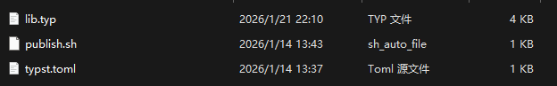

# 武汉大学计算机学院 操作系统笔记

我不得劲……我不得劲……我不得劲……我不得劲……我不得劲……我不得劲……我不得劲……我不得劲……我不得劲……我不得劲……我不得劲……我不得劲……我不得劲……我不得劲……我不得劲……我不得劲……我不得劲……我不得劲……我不得劲……我不得劲……我不得劲……我不得劲……我不得劲……我不得劲……我不得劲……我不得劲……我不得劲……我不得劲……我不得劲……我不得劲……我不得劲……我不得劲……我不得劲……我不得劲……我不得劲……我不得劲……我不得劲……我不得劲……我不得劲……我不得劲……我不得劲……我不得劲……我不得劲……我不得劲……我不得劲……我不得劲……我不得劲……我不得劲……我不得劲……我不得劲……我不得劲……我不得劲……我不得劲……我不得劲……我不得劲……我不得劲……我不得劲……我不得劲……我不得劲……我不得劲……我不得劲……我不得劲……我不得劲……我不得劲……我不得劲……我不得劲……我不得劲……我不得劲……
yyl神了
ysz神了

关于ysz创建的模版文件如何使用：
把压缩包的内容放在这里

C:\Users\30413（换成你自己的）\AppData\Local\typst\packages\local\ysz_tools\0.1.0

（如果有些目录下没有文件夹，那就自行创建）

确保0.1.0文件夹内是：
