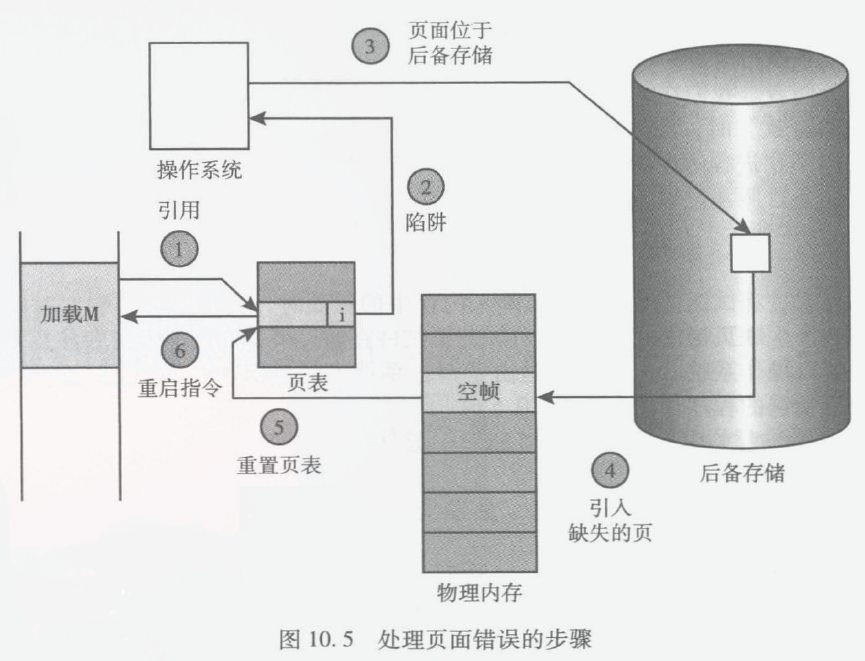
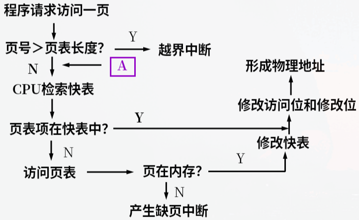
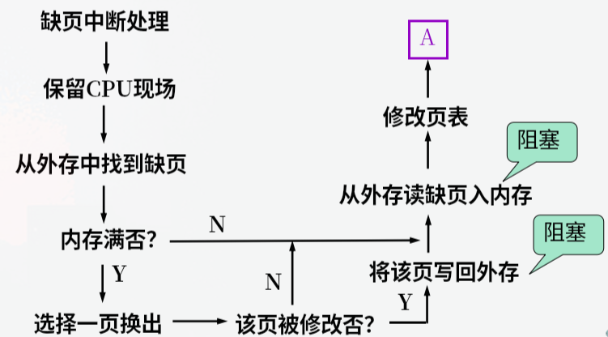
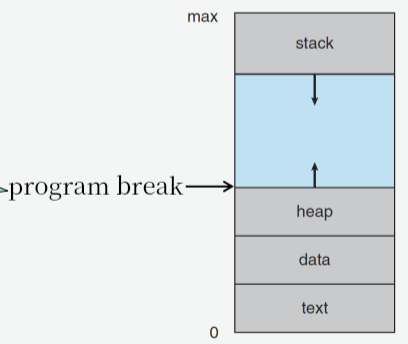
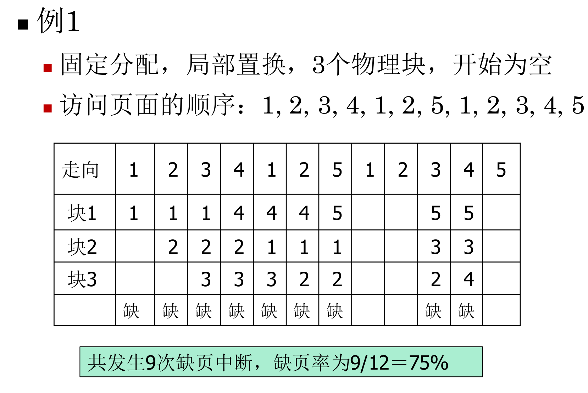
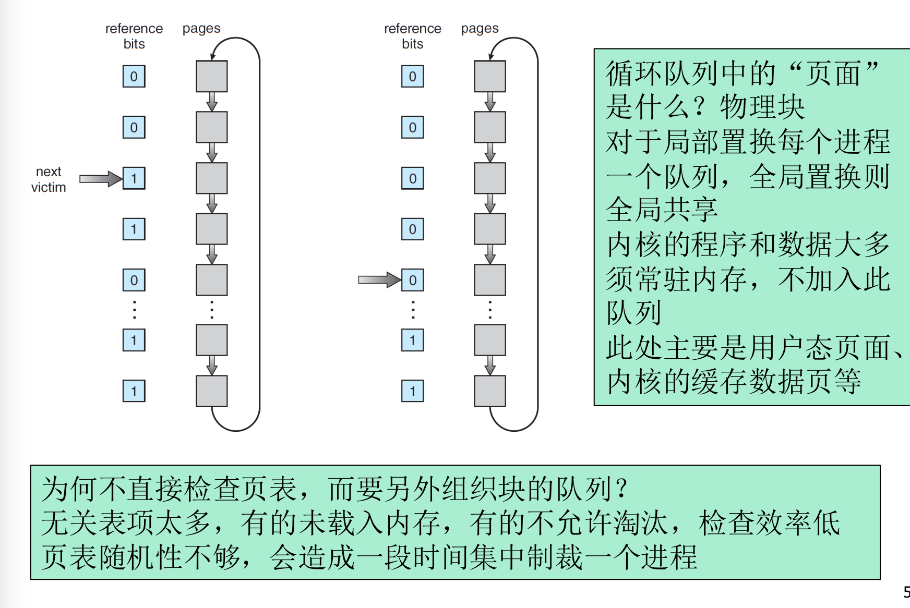
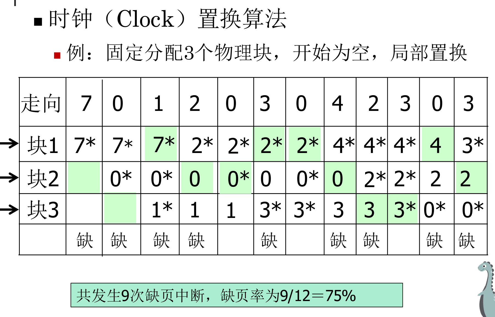
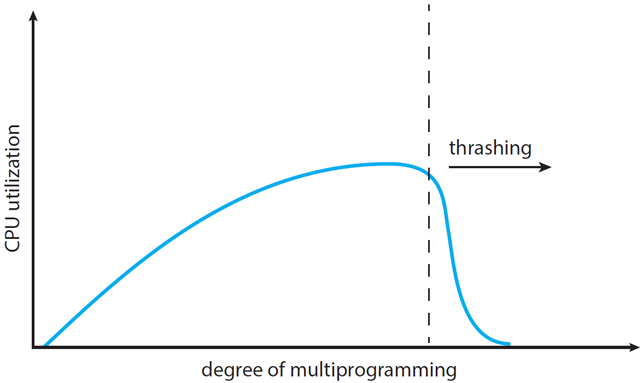
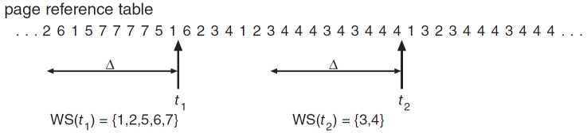

# Chapter10 虚拟内存

# 背景：虚拟存储器

**传统存储器管理****：**

- 要求作业运行前全部装入内存，一直驻留内存直至运行结束

- 不活跃内容占据物理内存，使用效率低下，阻碍大程序运行，阻碍更多进程进入内存

- 作业启动速度慢

**虚拟内存**：将用户逻辑内存与物理内存分开，只有部分运行的程序需要在内存中

特点：

1. 逻辑地址空间能够比物理地址空间大

2. 允许若干个进程共享地址空间

3. 允许更多有效进程创建


## 理论基础：程序执行时的局部性原理

指程序在执行过程中一个较短时间内，程序所执行的指令地址和操作数地址分别局限于一定区域内

时间局部性：如果一个程序在某个时刻访问了某个存储位置，那么在不久的将来很可能再次访问同一存储位置或指令

空间局部性：\.\.\.在不久的将来很可能访问与其存储位置相邻的数据或指令

## 虚拟存储器的基本原理

- 在程序运行前，将程序的一部分放入内存后就启动程序执行

- 执行过程中，当所访问的信息不在内存时，OS将其**调入内存**；将内存中暂时不用的内容**换出到外存**，腾出空间

> 这类似“懒加载”的思路，从效果上看，这样的计算机系统好像为用户提供了一个存储容量比实际内存大得多的存储器，将这个存储器称为虚拟存储器
> 
> 

## 定义

具有请求调入和置换功能，能从逻辑上对内存容量加以扩充的一种存储器系统

虚拟存储器的特征：

- 离散性：不连续内存分配

- 多次性：一个作业分多次装入内存

- 对换性：允许运行中换进换出

- 虚拟性：逻辑上扩充内存

虚拟存储器的容量受限于地址结构和外存容量。

# 按需调页

## 实现思想

- 在分页存储管理的基础上增加了**请求调页**和**页面置换**功能。

- 运行前只装入当前需要的部分页面便启动运行 ；若发现所要访问的页面不在内存，硬件产生缺页中断，请求OS将缺页调入内存。

事实上,虚拟内存就是请求分页。

**支持机构**：页表/缺页中断机构/地址变换机构/请求调页和页面置换软件

## 页表


- 存在位：表示该页是否在主存中（valid\-invalid bit\)

- 访问字段：记录本页在一段时间内被访问的次数，或最近已有多长时间未被访问\(涉及淘汰\)

- 修改位：表示该页调入内存后是否被修改过

- 这些东西应该是硬件修改而不是软件

> 不要试图把所有东西都放到页表里面。
> 
> 

## 页错误

也称缺页中断，缺页异常

在通过页表做地址转换时，若发现该页invalid，会产生页错误。

### 处理方式



1. 检查这个进程的内部表（通常与 PCB 一起保存），以确定该引用是有效的还是无效的内存访问。

2. 如果引用无效，那么终止进程。如果引用有效但是尚未调入页面，那么现在就应调入。

3. 找到一个空闲帧（例如，从空闲帧链表上得到一个）。

4. 调度一个外存操作，以将所需页面读到刚分配的帧。如果内存中无空闲物理块，则需要先淘汰内存中的某些页； 若淘汰页曾被修改过，则还要将其写回外存。

5. 当存储读取完成时，修改进程的内部表和页表，以指示该页现在处于内存中。

6. 重新启动被陷阱中断的指令。该进程现在能访问所需的页面，就好像它总是在内存中。

### Page Fault与一般中断的区别

1. 产生缺页后，PC 寄存器仍指向“要取的指令”或“正在执行的指令”

    - **般中断：** 指令已经执行完了。硬件保存的是下一条指令的地址，返回时就能顺着往下走。

    - **缺页错误：** 硬件（MMU）在地址转换失败的瞬间，会立即打断流水线。此时当前的指令其实是“执行失败”的。

2. 需要立刻处理，一条指令也可以产生多个缺页

3. 在取指令或指令执行期间产生\(而区别于中断可能在任何时间产生\)。

### Linux中，缺页中断处理的几种情况

1. 内容在外存文件上，尚未载入：页表项为Null

2. 匿名页，如堆或栈新开拓的内存，首次访问：页表项为Null

3. 内容被换出到交换区：页表项不为Null，但存在位为0

4. 写时复制：页表项不为Null，存在位为1，但页表项表明为共享页，触发写错误

## 地址变换





1. 访存时间：

    - 页在主存中，页表项在快表中：访问时间 = 查快表时间 \+ 访问内存时间

    - 页在主存中，页表项不在快表中：访问时间 = 查快表时间 \+ 查页表时间 \+ 修改快表时间 \+ 访问内存时间

    - 页不在主存中：访问时间 = 查快表时间 \+ 查页表时间 \+ 处理缺页中断时间t1 \+ 查快表时间 \+ 访问内存时间

2. **有效访问时间**（effective access time）：假设内存访问时间（用 ma（memory\-access）表示）是 10ns。只要没有出现缺页错误，有效访问时间就等于内存访问时间。但如果出现缺页错误，那么就应先从磁盘中读入相关页面，再访问所需要的字。

设 $ p $ 为缺页错误的概率（$ 0 \leqslant p \leqslant 1 $）。我们希望 $ p $ 接近于 0，即缺页错误很少。那么有效访问时间为：

$\text{有效访问时间} = (1 - p) \times \text{ma} + p \times \text{缺页错误时间}$


# 写时复制

fork\(\)要复制进程，但完整复制的代价太大，不可接受。写时拷贝允许父子进程在内存中共享页面。

执行fork\(\)时在页表中将各页面标记为只读。如果任一进程需要对页面进行写，那么就创建一个共享页的副本。

写操作时发生页错误，引发复制。

只有可能修改的页才需要标记为写时拷贝。




# 补充内容

## malloc\(\)做了什么

- 堆：属于逻辑空间，用户程序自己管理、分配

- 调用 `malloc(size)` 时，如果堆中有足够空间，内核不会参与malloc的过程。

- 若预设的堆用完，扩容需要找OS登记，内核收到申请后，会去修改该进程的 **PCB（进程控制块）** 里的一个成员——`program break` 指针，非法页面转为合法。

- 堆的内部有管理数据结构，malloc\(\)只是做了分配的登记，并返回指针；内核**仅仅是改了一个数字**，并没有真的在 RAM 里给你找位置，也没有修改页表映射。

    - 新分配的内存可能延伸到新扩容的页（尚未映射到物理块）

- 用户侧分配后即可使用，一旦访问到新扩容的页，触发页错误，OS分配、映射物理块


## 内核进程

### 什么是内核进程？（The "Pure" Kernel Thread）

- **无用户空间：** 这种进程只在内核逻辑地址空间（高一半）活动。它没有用户态的代码段、数据段，也没有用户堆栈。

- **权限恒定：** 它始终运行在特权级（Supervisor Mode），直接操作硬件资源。

- **典型任务：**

    - **kswapd（页面置换）：** 周期性检查内存压力，决定把哪些物理块踢到交换区（Swap）里。

    - **磁盘 I/O 调度：** 异步处理块设备的读写请求，不让用户进程死等。

### 为什么切换成本低？

#### 机制 A：免除“地址空间”切换的重负

普通用户进程切换（A 切换到 B）需要：

1. **切换页表根指针：** 修改 RISC\-V 的 `satp` 寄存器。

2. **刷新 TLB（地址翻译缓存）：** 这是一个极其昂贵的操作。如果不刷新，进程 B 可能会用到进程 A 的地址翻译缓存，导致内存乱套。

**内核进程切换：**

因为所有的内核进程都共享同一套内核地址映射，它们在切换时：

- **不需要修改页表根指针**，也**不需要刷新 TLB**。

#### 机制 B：精简的“栈”切换

每个内核进程都有自己独立的**内核栈（Kernel Stack）**，本质上就是一次特殊的函数调用，只是顺便把堆栈指针改了。

- **执行路线：** 指的是 `PC` 指针跳转到不同的内核函数入口。

- **切换过程：**

    1. 保存当前内核进程的少量寄存器（如 callee\-saved 寄存器）。

    2. 将堆栈指针寄存器（`sp`）指向新内核进程的栈顶。

    3. 恢复新进程的寄存器，继续运行。

### 总结：内核进程的“纯粹性”

# 物理块分配

## 最小物理块数

硬件执行一条指令的**物理刚需。**

- **单地址指令：** 至少需要 2 块（1 块存指令本身，1 块存操作数地址）。

- **间接寻址：** 至少需要 3 块（指令 \-\> 指针地址 \-\> 最终操作数数据）。

## 页面分配算法

**平均分配：** 简单粗暴，但不科学（比如 1KB 的后台脚本和 10GB 的渲染器分得一样多）。

**按比例分配：** 根据进程的虚拟地址空间大小分配。你“吹的牛”越大，OS 认为你越需要内存。

**按优先级分配：** 

1. 将可供分配的物理块分为两部分，一部分按比例分配，另一部分根据进程的优先级适当增加物理块

2. 先按比例为进程分配，当高优先级进程发生缺页时，允许它从低优先级进程处获得物理块

## 页面置换策略

局部置换：仅淘汰进程自身的物理块。意味着淘汰这件事因具体进程的需求发起，或因具体进程的某种状况（如缺页率低）发起

全局置换：全局范围内淘汰物理块，可能因具体进程发起，可能由OS整体考虑而发起

## 分配策略和置换策略组合

#### A\. 固定分配 \+ 局部置换（Fixed/Local）

- **逻辑：** 给你 100 块，你就只能用这 100 块。缺页了？只能把自己现有的那一页踢走。

- **难点：** 很难确定到底该给 100 块还是 200 块。给多了浪费，给少了会疯狂“抖动”（Thrashing）。

#### B\. 可变分配 \+ 局部置换（Variable/Local）

- **逻辑：** 还是只能踢自己的页，但 OS 会观察你的**缺页率**。如果你缺页太频繁，OS 可能多给你分 50 块”；如果很久没缺页，OS 就收回一点。

- **优点：** 动态适应，不会让一个进程拖垮全场。

#### C\. 可变分配 \+ 全局置换（Variable/Global）—— **现代系统最常用**

- 系统本身也维护一个空闲物理块队列

- **逻辑：** 每个进程初始有一点额度，一旦缺页，OS 会从**全局空闲队列**里拿一个块给你。

- **残酷性：** 如果空闲队列空了，内核选择系统中任何一个进程（通常是不活跃的）的页面踢走，然后分给你。


# 页面置换

## FIFO（first in first out）

选择调入主存时间最长的页面予以淘汰

如果全局置换太粗鲁，谁早启动谁倒霉；

可能产生**Belady异常**：分配给进程的页面数增多，缺页次数反而增加 



## 最佳置换算法，OPT

> 或者说,这是oracle\~神谕
> 
> 

选择未来最长时间不会被使用的页面予以淘汰。

无法实现，因为不可能预测未来的访问顺序

> 那在这说个damn呢
> 
> 

该算法效果可证明最优，**具有理论指标意义**，可用来评价其它算法。适用于局部置换或全局置换。

## 最近最久未使用置换算法，LRU \(Least Recently Used\)

选择最近一段时间内最久未被访问过的页面予以淘汰。适用于局部置换或全局置换。

应赋予每个页面一个访问字段，用于记录页面上次被访问的时间。

问题：记录各页面上次访问的时间并不容易，且检查最小值代价太大。

栈算法

用 $M(n, t)$ 表示在时刻 $t$，分配 $n$ 个物理块时内存里的页面集合。栈算法始终满足：

$M(n, t) \subseteq M(n + 1, t)$

这行公式的意思是：**在任何时刻，如果给 **$n$** 块物理内存能装下的东西，给 **$n+1$** 块内存一定也能装下。**

最佳置换和LRU都没有belady异常，均属于栈算法。

## LRU近似替换算法

算法基础：页表引用位（也称访问位\)。每个页表项都关联一个引用位，初始值为0；当页被访问时将引用位设为1。如果存在引用位为0的页，则置换它。

### 以Clock为例

**Clock置换**是一种具体实现方案。

具体来说，先将页面排成一个循环队列；当需要一个帧时，指针向前移动直到找到一个reference bit为0的页面，移动指针过程中清空遇到的reference bits。一旦找到一个reference bit为0的页面，就置换，并在循环队列的这个位置加上新的页面。



KRS：“又是好学生，诶tmd个个都好啊？”



### 改进的CLock算法

淘汰修改过的页面需要写磁盘，开销大于未修改页面。

将引用位R和修改位U作为有序对来改进二次机会算法。对于每个页面有下面四种可能的类型：

1. $(0, 0)$，最近没有使用且没有修改的页面——最佳的页面置换。

2. $(0, 1)$，最近没有使用但修改过的页面——不太好的置换，因为在置换之前需要将页面写出。

3. $(1, 0)$，最近使用过但没有修改的页面——可能很快再次使用。

4. $(1, 1)$，最近使用过且修改过的页面——可能很快再次使用，并且在置换之前需要将页面写出到磁盘。

$\sim R \land \sim U$优先\.不满足的时候寻找$R = 0 \land U = 1 $的淘汰。其余的和CLock一致，本质就是在一大堆R=0的时候优先找U=1的滚蛋。

请注意，可能需要多次扫描循环队列才会找到要置换的页面。

这种算法与更为简单的时钟算法的主要区别在于：为那些已修改页面赋予更高级别，从而降低了所需 I/O 数量。

## 基于计数的页面置换

### 最不经常使用算法，LFU

为每页设置一个访问计数器，每当页访问就\+1；置换时淘汰计数值最小的页面。

### 页面缓冲算法，PBA（Page Buffering Algorithm）

**1\. 概念**

页面缓冲算法 PBA 是一种页面置换优化方法。它的核心思想是：**被淘汰的页面不立即真正清除，而是先放入缓冲链表中暂存**。如果该页面很快又被访问，就可以直接从缓冲链表中取回，避免重新从磁盘读入。

**2\. 两个重要链表**

PBA 通常维护两个链表：

```Plain Text
未修改页 → 空闲链
已修改页 → 修改链
```

**3\. 重点作用**

PBA 的重点不是决定“淘汰哪个页面”，而是决定“页面被淘汰后怎么处理”。

它的主要作用是：

1. **减少磁盘读操作**：页面若还在缓冲链中，再次访问时可直接取回。 

2. **减少磁盘写等待**：脏页先放入修改链，之后批量写回磁盘。 

3. **提高缺页处理效率**：提前维护可用物理块，避免每次缺页都临时等待 I/O。 

> PBA 通过“暂存被淘汰页面”和“批量写回脏页”，减少磁盘 I/O，提高页面置换效率。
> 
> 

你最好把它删减一下，我觉得没必要这么多字。

## Linux内存回收

### 回收对象分类

Linux 会把物理内存里的页面分为三类：

1. 文件映射页（File\-backed Pages）

    - **代表：** 程序的代码段（`text`）、读取的文件缓存（Page Cache）。

    - **回收策略：** **直接丢弃（扔掉即可）**。因为在磁盘上有外存对应。如果修改过，就先异步刷回磁盘再丢弃。**绝对不会进入 Swap 区域**。

2. 匿名页（Anonymous Pages）

    - **代表：** 进程的堆（`heap`）、栈（`stack`）、进程间通信的 `pipe` 等。

    - **回收策略：** **必须写入 Swap**。因为它们是程序运行中凭空产生的数据，一旦丢弃程序就崩溃了。Swap 区主要是在为它们服务。

3. slab 缓存（Slab Caching）

    - **定义：** 内核代码（如驱动、系统调用、子系统）经常需要大量同一种类型、大小固定的小对象。（如进程控制块 `task_struct`、文件节点 `inode`）。直接给一页太浪费，为了防止频繁申请页以及带来大量内存碎片，在内核进程与伙伴系统之间添加一个代理（slab）。工作流程如下：

        1. Slab 先向伙伴系统申请几张完整的页；在这些页内部，按照特定结构体的大小，切成一格一格的空位（称为 **Object，对象**）。

        2. 当内核需要这个结构体时，Slab 拿一个现成的空格子给它；释放时，格子归还给 Slab，并不释放给伙伴系统。

    - 回收时，Linux 会调用专门的 `slab shrinker`（收缩器）机制来释放这些未使用的缓存。

### 回收基本原则

- **用户空间内存：** 只要没被进程用 `mlock()` 锁定，**原则上全都可以回收**。

- **内核空间内存：** **绝大部分不可回收**。内核的代码段、数据段，以及通过 `kmalloc()` / `vmalloc()` 申请的内核核心数据、内核线程占用的内存，都是“钉”在物理内存里的。

- **唯一例外：** 内核里的各种**缓存**（如前面提到的未使用的 slab 缓存）是可以被回收的。

### 回收触发机制

> 致敬传奇占用50G内存的计算器。——kiwiizzz
> 
> 

# 抖动（颠簸/颤动）

## 抖动的概念

如果进程的大部分时间都用于页面换入/换出，几乎不能完成任何有效工作，则称其处于抖动状态



成因：进程分配的物理块太少；置换算法选择不当；全局置换使抖动传播。

后果：

1. CPU 利用率下降。 

2. 系统误以为进程数量不足。 

3. 操作系统增加新的进程。 

4. 内存更加紧张。 

5. 缺页更频繁。 

6. 形成恶性循环。

## 工作集模型

工作集窗口 Δ 指固定数量访存所覆盖的时间窗口。

例如： Δ = 1,000，表示最近 1000 次访存构成一个窗口。

工作集 $WSS_i$（Working Set Size）： 在最近这 $\Delta$ 次访存中，进程 $P_i$ 真正踩过的**去重后**的页面集合。



如果进程分配的物理块数量不足以容纳工作集，则会造成抖动。

操作系统会动态监测每一个进程的工作集大小 $WSS_i$，然后做出一道简单的数学加法：

$\text{Total Demand} = \sum WSS_i$

- **如果 **$\text{Total Demand} \le \text{系统总物理块数}$：安全。如果还有空闲，OS 可以再启动一个新的用户进程。

- **如果 **$\text{Total Demand} > \text{系统总物理块数}$：**危险！系统即将抖动。** 此时现代 OS 会**挂起（Suspend）****某一个进程，**把它的物理块全部剥夺，挪给其他进程，确保剩下的进程能喂饱自己的工作集。被挂起的进程则被扔到磁盘上“挂起休眠”，等内存宽裕了再唤醒。

> 现实中无法做到，但可以考考你啊。——gghh
> 
> 


> 在底层硬件上，要实时统计“最近 $\Delta$ 次访存到底去了哪些去重的页”，硬件开销和算力损耗大得吓人。因此，工业级系统（如 Linux）更倾向于使用缺页率（PFF, Page Fault Frequency）机制来进行直接的宏观调控。
> 
> 


# 其它考虑

预调页：~~（访存）来都来啦，~~将未来可能需要的页一起调入内存。

必然有许多页被调入却未被使用。

TLB范围：从TLB 可访问的存储器数量，TLB Reach = \(TLB Size\) × \(Page Size\)

理想情况，每进程的工作集容纳在TLB中。

增加TLB范围的方法：增加TLB的条目数；增加页大小或提供多种页大小；ARMv8的TLB提供连续位，表示映射连续多个页面


# 聊天板

蝴蝶飞不过沧海,又有谁忍心去责怪?

苍蝇飞不过臭水沟,又有谁忍心去责怪\.\.\.$$

md这太好笑了

```Plain Text
给我一双手 对你倚赖
给我一双眼 看你离开
给我一双脚 让你带派

就像蝴蝶飞不过沧海 没有谁忍心责怪

——王菲《蝴蝶》
```


哪个sb在搬屎


zxz无法保证写的东西简洁明了

那你将失去阅读笔记的资格\.

大构教是人类能想出来的名字吗

我怎么记得定动机打狗叫是海南话

