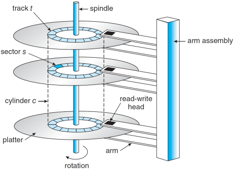
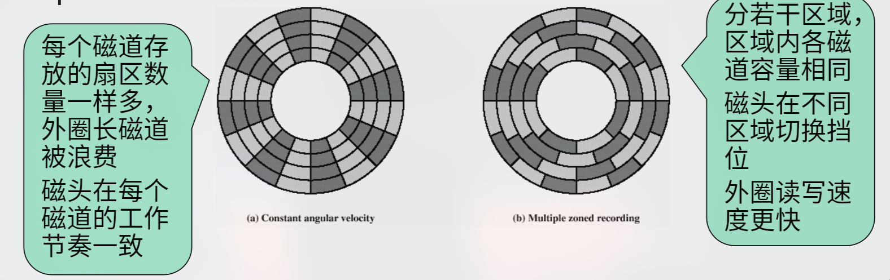
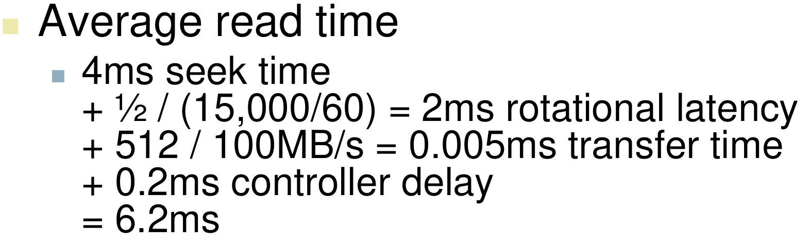
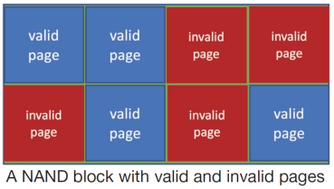
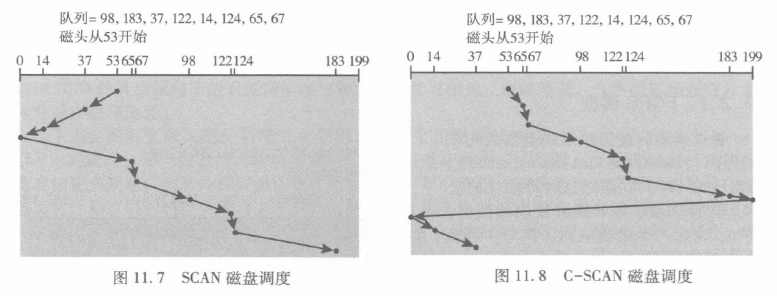

# Chapter11 大容量存储器结构

# 硬盘\(HDD\)

硬盘的读写单位是扇区，不能定位到字节。

每个扇区地址可用柱面号，磁头号和扇区号表示

- 磁盘由若干磁盘片组成，可沿固定方向高速旋转。每个盘面对应一个磁头，磁臂可沿半径方向移动；磁头号也就是盘面号。

- Cylinder \(柱面\)：所有盘片上相同半径的磁道组成的“柱体”。比如一个硬盘有 3 个盘片，那么第 5 个磁道在每个盘片上都有，它们合起来就是一个柱面。

- Track \(磁道\)：盘片上一圈一圈的同心圆，每个磁道是一个环形的数据带。

- Sector \(扇区\)：一个磁道被分成多个小段，每个段就是一个扇区。传统硬盘每个扇区是 512 字节。

现有硬盘采用右侧设计：

区域（Zone）： 它是由几十甚至几百个相邻的磁道（圈）组合而成的一个“环带”。同一个 Zone（区域）内部的所有磁道保持相同的扇区数，跨区域时才改变数量。

机械硬盘的转速是恒定的，在外圈的时候转一圈能读取更多扇区。

为了性能，大文件通常优先存满一个柱面，因为**磁头是联动移动的**，这样可以减少寻道次数。对于那些不得不拆分的情形，存在对面的那个磁道，这是因为自己和对面的磁道是同进同出的。

HDD 写入数据的四个步骤：

1. 寻道（Seek）：把读写磁头移动到目标数据所在的磁道（Track） 上。

2. 旋转（Rotational Latency）：等待盘片旋转，使得目标扇区（Sector） 正好转到磁头下方。

3. 读写（Read/Write）

4. 传输（Data Transfer）—— 在“读”操作中，把从盘片读出的数据传回内存；在“写”操作中，把 CPU 要写的数据传给硬盘缓存。

同一时间一个硬盘只能响应一次*物理的*访问请求**\.**

### 关于HDD访存时间的计算

HDD 访问一个扇区的总时间 ≈ 排队延迟 \+ 寻道时间 \+ 旋转延迟 \+ 数据传输时间 \+ 控制器开销\.

请听题：

> Given 512B sector\(扇区大小\), 15,000rpm, 4ms average seek time\(平均寻道时间\), 100MB/s transfer rate\(数据从盘片传到缓存的速度\), 0\.2ms controller overhead\(控制器处理命令、ECC 等的时间\), idle disk, Average read time?
> 
> 

Idle disk是磁盘空闲的意思。平均磁盘旋转时间是磁盘转半圈的时间。

# 固态硬盘，Flash（闪存）

## 特点

disk 分为 flash 和 magnetic。Flash（闪存）是作为一种“固态”存储技术，相对于传统的“磁性”存储（Magnetic Disk）而存在的。

- magnetic disk → 传统硬盘（HDD）

- flash disk → 固态硬盘（SSD）、U盘、SD卡等

固态硬盘特点：

1. 基于闪存，无机械部件，不易损。

2. 更快，对总线要求更高

    1. 没有寻道时间和旋转延迟，适合随机访问

    2. 多个闪存芯片可并行工作

3. 可读，初始状态全1时可写入，要将0恢复为1须通过擦除操作：

读写单位： 按 Page（页） 进行（常见 $2\text{ KB} - 16\text{ KB}$）。

擦除单位： 按 Block（块） 进行（常见 $128\text{ KB} - 8\text{ MB}$，一个 Block 包含几十个 Page）。

物理规则： 闪存初始状态全是“1”。要写入数据，只能把“1”变成“0”（按页写）；如果要修改数据，把“0”变回“1”，必须施加高压进行“擦除”操作，且只能整个 Block 顺带着一起擦除。

## 硬件内部算法

磁盘对外展示逻辑盘块，内部映射到物理page。

### 垃圾回收（Garbage Collection, GC）

当你要改写某个 Page 的数据时，SSD 不会立刻擦除整个 Block（因为代价太大），它的核心行为是：

1. **异地更新：** 找一个干净的空闲 Page，把新数据写进去。

2. **标记失效：** 把原本那个旧 Page 标记为“无效（Invalid）”（如 Slide 7 左下角的红格子）。

3. **腾挪与擦除：** 当系统闲下来或干净块不够用时，GC 机制启动。它把一个 Block 里所有零散的“有效页（Valid Page）”全部复制到另一个全新的 Block 去，然后把原来那个装满红格子的旧 Block **整体一刀切擦除**。

### 磨损均衡（Wear Leveling）

Flash 的每个存储单元（bit cell）只能被擦写有限次数。这是因为每次写入/擦除都会对存储单元的绝缘层造成物理损伤。

FTL 会监控每个 Block 的擦除次数。它会刻意把那些不怎么变动的冷数据（比如系统内核代码）搬到擦除次数多的 Block 里，把空出来的、擦除次数少的 Block 留给高频写入的写请求。

# 逻辑块寻址 LBA

LBA，即 **Logical Block Addressing，逻辑块寻址**。

它将存储设备看作一个逻辑块的一维数组：

> 0号逻辑块，1号逻辑块，2号逻辑块，……
> 
> 

LBA 的作用是屏蔽底层复杂结构。操作系统只需要按逻辑块号访问磁盘，不必关心真实的柱面、磁头、扇区位置。

传统的磁盘寻址方式是：*CHS = Cylinder \+ Head \+ Sector*

即柱面号、磁头号、扇区号。

现在主流方式是 **LBA**，CHS 主要为了兼容旧系统。

# 磁盘调度

备注：都是机械硬盘

## 先来先服务调度（FCFS）

FCFS 按请求到达的先后顺序进行服务。

特点：简单合理，但死板，不考虑磁头当前位置，寻道距离可能很大，效率不高

## 最短寻道时间优先调度（SSTF）

选择距离当前磁头位置最近的磁道开展下一次服务

特点：

- 寻道性能比FCFS好，最大化磁盘效率

- 无视公平，见利忘义，可能使某些请求总也得不到服务，导致磁臂来回摆动，可能效率并不高

> 这个队列不断有新人加入，你老送一个小区的外卖，别人吃不上饭了——KRS
> 
> 

## 扫描调度（SCAN）

又称电梯调度算法，在磁头当前移动方向上选择与磁头距离最近的磁道开展下一次服务。

特点：

- 具有较好的寻道性能，基本兼顾了效率与公平，能避免进程饥饿

- 但不利于两端磁道的请求，短时间内被两次光顾，然后要等很久得到下一次访问

> 摇头电风扇只有坐在最中间的人才最舒服，你坐在两端的，刚吹到你一次马上又吹到你一次，然后又要等很久——KRS
> 
> 

LOOK调度：改进，当磁头的前进方向上没有待完成的请求，则立刻调转方向

## 循环扫描算法（C\-SCAN）

SCAN算法的变种。磁头只在一个移动方向上响应请求，一旦抵达另一端就立即返回，返回途中不响应任何请求

特点：进一步消除了对两端磁道请求的不公平，但是效率下降。

> 就像坐电梯上去的时候有人按电梯就开门，但是到顶了立刻回到底部——KRS
> 
> 
> 
> 

C\-LOOK调度：改进，当磁头的前进方向上没有待完成的请求，则立刻调转方向

- C\-SCAN/C\-LOOK还有什么问题

请求是不断到来的，极端情况下，同一个磁道上连续出现新的请求，仍会导致垄断

- N\-Step\-SCAN

将磁盘请求队列分成若干个长度为N的子队列，磁盘调度轮流处理这些子队列

- FSCAN

N\-Step\-SCAN的简化，只分两个子队列A、B

一旦开始处理队列A，则新的请求全部加入B

## 硬盘调度

不包含移动的磁盘磁头，通常采用简单的先进先出（FCFS）策略

例如，Linux NOOP调度器使用FCFS策略，但对其进行了修改以合并相邻的请求

闪存的读取速度均匀，但写速度并不均匀，一些固态硬盘调度器利用这一特性，仅合并相邻的写请求，而所有读取请求则按FCFS顺序处理

# Linux案例

## 硬件的主要改进

读写速度越来越快，尤其是SSD，对CPU的处理延迟越来越敏感。

- 以前：不论 CPU 有多少个核心，内核为每一个硬盘**只维护一个全局的请求队列**。

> 这里说的是驱动层面的请求队列，本章讨论的调度队列中的请求最终发往驱动的请求队列
> 
> 

但当换上读写速度极快的 SSD 后，多核CPU访问同一个请求队列，常需要加锁，造成延迟

- Linux 从 4\.11 版本开始引入多队列架构：

    - **软件队列（Software Queues）：** **每个 CPU 核心分配一个独立的队列**。CPU 核心提交 I/O 时，直接往自己的本地队列里塞，实现**零锁竞争**。

    - **硬件队列（Hardware Queues）：** 存储设备（如现代 NVMe SSD）自身提供多个硬件接收通道。内核的多队列映射机制会把成百上千个软件队列均匀映射到这几个硬件队列中，数据吞吐量瞬间爆发。

（zxz处理一下这部分话）

## 现代SSD的调度算法

### NOOP（No Operation，无操作）

一个纯粹的 FIFO（先进先出）队列。**唯一的优化：** **合并相邻的写请求**。

### None

不做任何调度，无队列。请求直接从进程的上下文“直通”到设备的硬件驱动队列中，将 CPU 的处理延迟降到最低。

在 4\.11 之后的内核中，专门用于高性能的 NVMe 固态硬盘。

## 现代机械硬盘的算法优化

机械臂寻道极其缓慢，我们就必须用复杂的算法来算计每一份访问请求。

### Deadline（截止时间调度器）

解决传统电梯算法（SCAN）导致的进程饥饿问题。

- **四队列机制：** 为读和写各维护了两套队列：

    - **LBA 队列：** 按照逻辑块地址排序（像电梯一样，磁头顺路就顺便带上），用来追求极限的物理吞吐量。

    - **FIFO 队列：** 按照请求到达的时间戳排序，用来充当**计时器**。

- **防饥饿机制：** 每一个请求都有一个严格的“过期截止时间”（读请求 500ms，写请求 5s）。调度器平时都从 LBA 队列里批量捞请求，每送一批检查 FIFO 队列，一旦发现 FIFO 队列头部的某个请求快超时了，调度器会**立刻放弃地址优化，直接强行切过去执行这个过期请求**。

> **为什么读的截止时间比写短 10 倍？** 因为读操作通常是同步的，程序在等数据返回，不读完程序就卡死了；而写操作通常是被内核攒在缓冲区里异步刷盘，程序自己早就跑去干别的事了，所以写请求可以多饿一会儿。
> 
> 

### CFQ（Completely Fair Queuing，完全公平队列）

老版本 Linux 内核对机械硬盘的默认策略，核心追求是**尽量保证进程之间的 I/O 公平**。

- **按进程分蛋糕：** 

    - 系统里的每个进程都有自己专属的一个 FIFO 队列。如果有两个硬盘就设置两个 FIFO 队列。

    - CFQ 采用轮询（Round\-Robin）的方式，给每个进程分配一个小的时间片（Time Slice）。在这个时间片内，磁头只为这一个进程服务，时间片用完了，请求队列被挂起

- **异步的处理方式（比如后台默默刷盘的进程）：** 不会给每个进程发队列，而是把所有进程的异步写请求合流到全局的 17 个共享队列中，按照 I/O 优先级分批处理，防止后台的大规模写操作霸占磁头，导致前台交互卡顿。

- 缺陷：在高负载或对延迟敏感的场景中，CFQ可能会出现请求饥饿的问题。

# 存储设备管理

## 磁盘格式化

低级格式化：

- HDD：划分扇区。 

- SSD：建立逻辑盘块与 page 的映射。 

- 通常出厂前已经完成，普通用户一般不需要执行。 

高级格式化包括两步：

1. 划分分区。 

2. 创建文件系统，也叫逻辑格式化。

## 引导块

### 传统方式（MBR\+BIOS）

MBR（Master Boot Record，主引导记录） ：一块物理区域。占据着整块磁盘的最开头第一个扇区（第 0 块，共 512 字节）。

划分为三个部分：

1. 引导程序（约 446 字节）： 一段极其精简的机器码。它的唯一任务就是：去找操作系统在哪里，并把控制权交出去。

2. 分区表（DPT，64 字节）： 记录这块硬盘是怎么分区的（比如C盘从哪个扇区开始到哪个扇区结束）。每个分区记录占用 16 字节，所以 $64 \div 16 = 4$。这就是 MBR 硬盘最多只能有 4 个主分区的底层物理物理原因。

3. 结束标志（2 字节）： 固定为 `0x55AA`，用来向 CPU 证明：“我是一个合法的引导扇区，不是一堆乱码”。

引导过程：CPU执行ROM中的BIOS程序

1. 自检：你按下电源键，CPU 自动跳转到主板固化 ROM 芯片里的 BIOS 程序 执行。BIOS 进行硬件自检（看内存、显卡对不对）。

2. 读MBR：BIOS 根本不懂什么是 `ext4` 或 `NTFS` 文件系统。它把MBR的 512 字节读入内存 `0x7C00` 处，然后让 CPU 跳转过去执行。

3. 找激活分区：MBR 里的那段 446 字节的代码开始运行，找到后面的 64 字节分区表，找到哪个分区被标记为“激活（Active）”，然后去那个分区的开头，把操作系统的真正引导程序读入内存。

4. OS引导程序：真正的操作系统引导程序接管，这才开始有了“文件”的概念，把内核加载起来，屏幕亮起系统图标。

### 现代方式（GPT\+UEFI）

磁盘布局：

- LBA 0：保护MBR（第一扇区依然留着一个假的 MBR），防止旧版BIOS错误识别操作

- LBA 1\-33：GPT头和分区表，支持最多128个分区

- EFI系统分区（ESP）：以文件形式存放EFI引导程序

- 常规分区

- 磁盘末尾：备份GPT头和分区表

引导过程：CPU执行ROM中的UEFI程序

它具备访问文件系统的能力！ 能直接看懂 FAT32 文件系统，会直接去 **ESP 分区** 下面找特定的文件（例如 `/EFI/BOOT/BOOTX64.EFI` 或者 Linux GRUB 的引导文件）。

## 坏块

部分扇区或page可能损坏

### 硬件转寄（Sector Reallocation）的运作

假设物理扇区 `LBA 1024` 损坏了：

1. 当硬盘控制器的固件在读写时发现 `LBA 1024` 校验错误（CRC 失败），它会把这个扇区列入黑名单。

2. 从秘密备用池里挑出一个完好的物理扇区（假设是 `Spare 1`）。

3. 在硬盘内部的映射表上建立一条物理映射：`LBA 1024` $\rightarrow$ `Physical Spare 1`。

4. **结果：** 以后操作系统（不管是 Linux 还是 Windows）发指令要求“读写 LBA 1024”时，硬盘控制器在硬件电路里悄悄把信号转寄给了 `Spare 1`。

操作系统完全被蒙在鼓里，它以为自己访问的依然是连续、健康的 LBA 数组。

