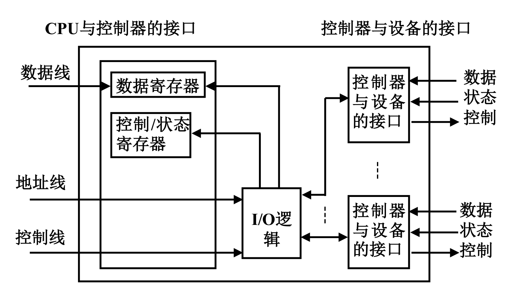
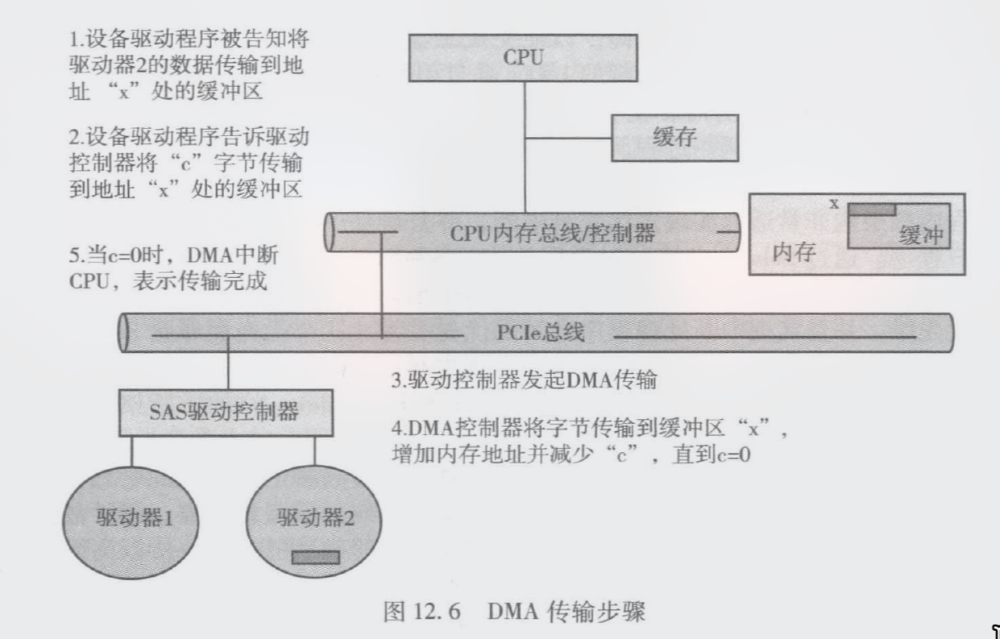
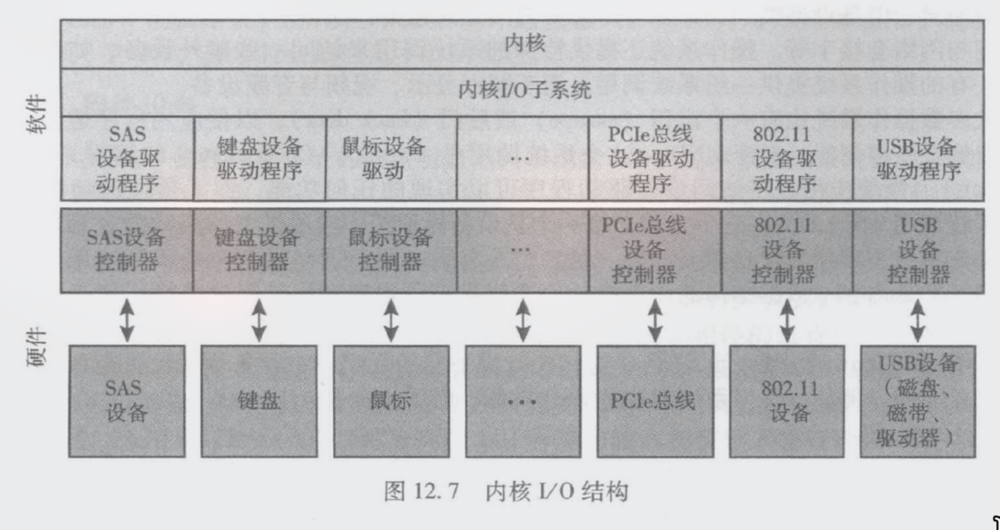
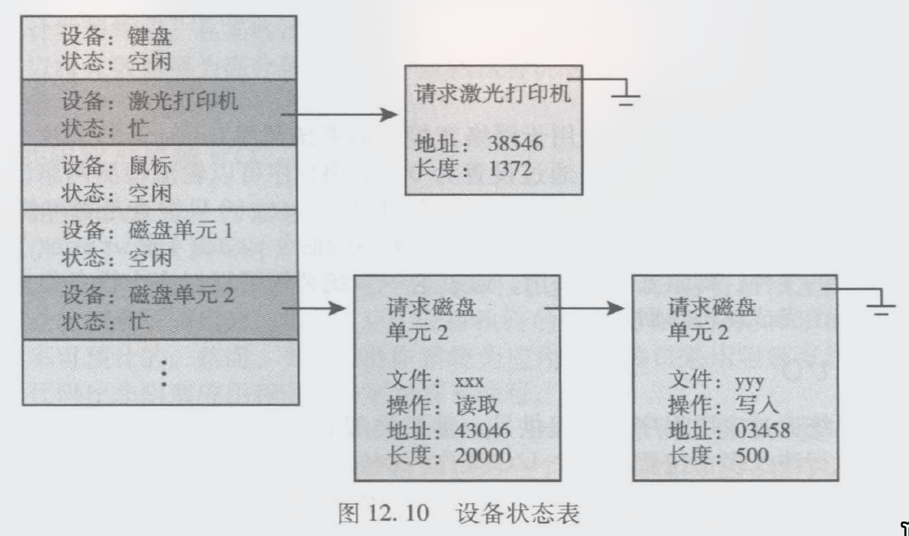
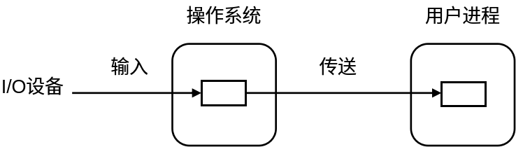
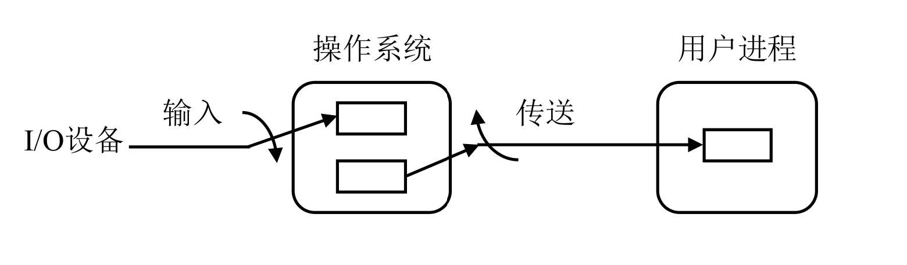
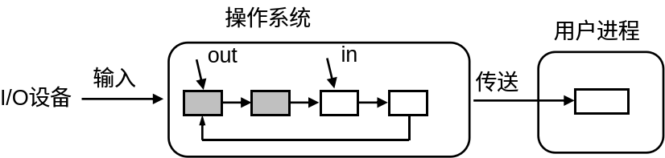
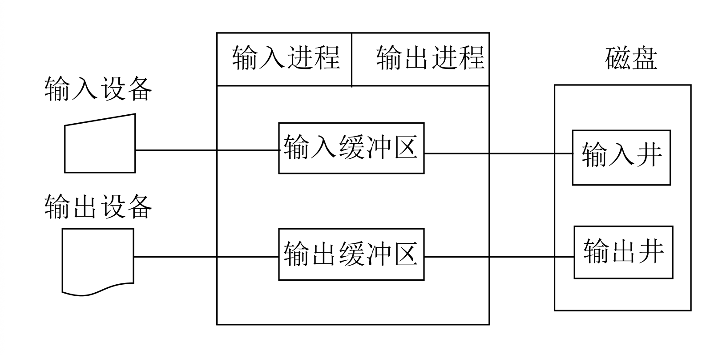

# Chapter12 I/O系统

# 设备管理的任务和功能

I/O子系统的存在使内核其他部分不必涉及I/O设备管理。

应具备以下功能：

- 设备分配：根据用户的I/O请求，为之分配设备。

- 设备处理：负责启动设备及I/O操作完成时的中断处理。

- 缓冲管理：为缓和CPU与I/O速度不匹配的矛盾常设置缓冲区。缓冲管理负责缓冲区的分配和释放及有关管理工作。

- 设备独立性：又称设备无关性，是指用户编制程序时所使用的设备与物理设备无关。

# IO硬件

## 基本架构

用于操作总线或设备的一组电子器件。

处于CPU与I/O设备之间，它接收从CPU发来的命令，并去控制I/O设备工作。在微型计算机中，又称为接口卡。

控制器由三部分组成

1. 设备控制器与处理机的接口：实现CPU与设备控制器之间的通信。

2. 设备控制器与设备的接口：实现设备与设备控制器之间的通信。

3. I/O逻辑：实现对设备的控制，它负责接收命令、对命令进行译码、再根据译出的命令控制设备。

## 四种寄存器

控制寄存器（Control Register）：

- 操作系统（驱动程序）向这里写入特定的数值，代表给硬件下达的指令。例如，写入 `0x01` 代表“启动磁盘旋转”，写入 `0x02` 代表“开始读取”。

状态寄存器（Status Register）：硬件仪表盘。

- 控制器将外设当前的状态（如：正在忙碌 Busy、数据准备就绪 Ready、发生错误 Error）写在这里，供 CPU 随时读取和查询。

数据输入寄存器（Data\-in Register）：

- 外设准备好数据后，控制器把数据暂时存在这里，等 CPU 把它读走。

数据输出寄存器（Data\-out Register）：缓存输出缓冲区。

- CPU 想发送给外设的数据（比如要打印的字符、要写入磁盘的扇区），先写到这里，由控制器负责后续的发送。

## IO端口与编址方式

### IO端口的定义

I/O 端口是设备控制器中 CPU 可以**直接访问**的寄存器。也就是说，CPU 实际上并不是直接访问外设，而是访问控制器中的 I/O 端口。

### I/O 端口的两种编址方式

1. 独立编址

I/O 地址空间和内存地址空间分开，有独立地址空间。CPU 需要使用专门的 I/O 指令访问设备端口。

这种方式下，I/O 指令必须是 **特权指令**，只能由操作系统内核执行。

2. 存储器映射 I/O

存储器映射 I/O 中，设备端口被映射到内存地址空间中的某些地址\(物理地址\)。

CPU 可以使用普通访存指令访问这些地址，但操作系统会把这些地址映射到内核空间，防止用户程序随意访问。

无论哪种方式，用户程序都不能直接操作 I/O 设备，必须通过操作系统。

## 总线

总线 = 物理导线 \+ 通信协议\.

### 系统总线（System Bus）

可以“简单粗暴地理解为 CPU 引脚的延伸”。CPU 发出的每一个电信号，都会毫无延迟地同步传导到系统总线的每一台设备上。

### 扩展总线（Expansion Bus）

高层世界（系统总线）：CPU 只能看到挂在 PCIe 总线上的 SAS 控制器 或 扩展总线接口。

底层世界（扩展总线）：在扩展总线接口的另一侧，延伸出一条慢速的扩展总线（Expansion Bus），上面挂着键盘和 USB 接口。

例如：

- 当用户敲击键盘时，键盘把数据发给 USB/键盘控制器。

- 该控制器把数据打包、缓存，并**转换协议格式**。

- 控制器代表该外设去向系统总线“申请发言权”，最终把数据递交给 CPU。

把大量慢速、杂乱的外设信号**隔离**在了外部，确保了系统总线的高速与纯净。

## 外设控制方式

### 轮询（一直问好了没）

早期计算机系统中无中断机构，设备控制采用程序直接控制方式，也称为轮询方式。工作方式简单，但CPU的利用率低。

### 中断

不多说了。*不会的和****crab taste****坐一桌\.*

### DMA（直接内存访问）

在外设和内存之间建立直接数据通路，由DMA控制器控制成批数据传输，CPU不再逐字节参与数据搬运。

在DMA控制器中设置如下寄存器：

> DMA中的MAR保存的通常是**物理内存地址**，因为DMA控制器直接访问内存，不经过普通进程的虚拟地址转换。
> 
> 

**Step 1 \& 2（初始化）**：操作系统调用设备驱动。CPU 分别向磁盘控制器和 DMA 控制器写入控制参数（目标内存地址 $X$，传输字节数 $C$）。此时，CPU 就可以转去执行其他进程，不再理会这次 I/O。

**Step 3 \& 4（硬件准备）**：磁盘控制器启动硬件层面的读取，将扇区数据加载到它自己的内部缓冲区。准备好后，它向 DMA 控制器发出 **DMA 请求（DRQ 信号）**，并将字节发送给 DMAC。

**Step 5（接管与数据传输）**：DMA 控制器向系统总线申请**总线控制权（Bus Mastering）**。总线批准后，CPU 的引脚暂时与总线“脱离”，由 DMAC 全权接管。DMAC 将数据直接写入内存物理地址 $X$，然后自动让 $MAR \leftarrow MAR + 1$，$DC \leftarrow DC - 1$。这个步骤在硬件层面上反复循环，完全没有 CPU 的指令参与。

**Step 6（收尾）**：当 $DC = 0$ 时，DMAC 功成身退，交还总线控制权，并向 CPU 发出一个**硬件中断信号**。CPU 收到中断后，知道整块数据已经安全躺在内存里了，通知上层进程直接读取。

（先放在这）

所有系统总线都携带“DMA控制器”，DMA控制器是系统总线的一部分。

DMA控制器有访问内存的能力，但并不了解千奇百怪的设备控制器的工作细节，只能周期性的向其发送读/写信号。

CPU 需要对 DMA 控制器和设备控制器两方面均做好设定：

- **对磁盘控制器说**：准备好第 1024 号扇区的数据（读）

- **对 DMA 控制器说**：写到内存物理地址 `0x00200000` 处，总共搬运 4096 字节（写\+地址）

DMA工作过程

1. CPU设置DMA控制器参数，包括MAR、DC、传输方向等； 

2. CPU启动DMA； 

3. DMA控制器接管总线，直接在设备与内存之间传输数据； 

4. 每传输一个数据块，内存地址递增，计数器递减； 

5. DC减为0时，DMA传输完成； 

6. DMA控制器向CPU发出中断； 

7. CPU处理中断，确认I/O完成。

### IO通道

> *现实已经亖了*，选择题可能出一两分
> 
> 

I/O通道就是一个“CPU的副手”——一台弱化但专职的处理器。 CPU太忙，因为它要亲自处理每次按键、每次读盘这类琐碎的I/O中断，导致计算效率极低。

系统给CPU配了一个副手：有自己的指令集，能独立执行通道程序，专门负责管理外部设备与内存之间的数据传输。它虽不能像CPU那样做复杂运算，但足以独立完成“把磁盘某处的数据读到内存”这类整个任务，办完后再用一次中断汇报。这样，CPU只需下达命令即可转向其他进程，实现了CPU计算与I/O传输的真正并行。

# 应用程序IO接口

## 软件层次结构

**内核 I/O 子系统**：通用的**标准化接口**（万物皆文件，无论是硬盘、网卡还是串口，在上层看来都是通过 `open()`、`read()`、`write()`、`close()` 来操作）。

针对每一款具体的硬件编写**设备驱动程序**。独自吞下某种特定硬件的所有古怪细节，而只把标准化的接口展现给内核。

## 设备驱动程序

### 接收、执行来自上层的请求

接收来自上层的与设备无关的抽象请求（如：“向 2 号块设备写入 100 字节”），把请求转换成设备控制器可以接收的具体命令，将命令发送给设备控制器，监督命令的执行。

设备驱动层对内核隐藏了I/O控制器的不同细节。执行命令期间，根据执行周期的长短，进程可能阻塞，可能不阻塞。

### 处理设备中断

当硬件通过总线向 CPU 递交中断信号时，软件层面的处理机制：

1. **统一接收**：所有的硬件中断首先由内核的**通用中断处理程序**统一拦截。这样可以第一时间保存 CPU 的现场信息（寄存器上下文），确保系统不崩溃。

2. **动态分发**：不同的驱动程序在加载进内核时，会调用内核接口来**注册登记自己关心的中断号（IRQ）**。内核拦截到中断后，查一下表，发现是 802\.11 网卡发来的，就会顺着线索调用网卡驱动提前登记好的**回调函数（ISR, Interrupt Service Routine）**。

3. **收尾与通知**：驱动程序在回调函数里快速读取外设的状态寄存器，清除硬件的中断标志，并在必要时将这个硬件事件通知给上层 I/O 子系统（例如：“网络包已收齐，可以唤醒等待的进程了”），最后恢复被中断程序的现场。

## I/O系统调用的标准化封装

### 字符设备接口

字符设备以字符为单位传输数据。

典型接口：`get()``，``put()`

例子：键盘,显示器,打印机

特点：通常顺序访问； 不支持随机定位； 常配合缓冲和编辑功能。

### 块设备接口

负责访问磁盘驱动器和其他面向块的设备

须实现针对随机存取设备的read\(\)、write\(\)及seek\(\)等命令

例子： 磁盘,U盘,SSD

### 网络设备接口

使用socket接口实现网络操作。

创建socket；connect \& listen；send \& receive；select\(\)，管理一组套接字并消除轮询和忙等

### 时钟和定时器

功能:给出当前时间 ,给出流逝的时间,和设置定时器，在T时间执行X操作\.

可以模拟虚拟时钟\(操作系统来干\)\.系统可以支持比硬件通道数更多的定时器请求\.

### 阻塞IO、非阻塞IO、异步IO

1. **阻塞IO**：进程发出I/O系统调用后，如果数据未准备好，进程阻塞，直到I/O完成\(类比`cin` 和`cout`\) 

2. **非阻塞IO**：只看一眼立刻返回,返回值指示传输了多少字节\(类比C语言里的`readbuf`\(or whatever it called\)\)。即使数据传输没有真正结束，也直接返回。

> 非阻塞IO不会**真正**读磁盘\.
> 
> 

3. **异步IO**：立即返回，无需等待I/O完成。I/O在将来某个时间完成，然后通过一些变量、信号、软中断或回调函数传达给应用程序

**区分**：

- 非阻塞read立即返回的是“当前已有数据”；

- 异步read立即返回的是“请求已经被系统接受，将来完成”。

### Vectored I/O，也称为scatter–gather

加强版的DMA传输。内存中多片不连续的缓冲区，一次性批量传输。

> 驱动程序接口和系统调用接口并非都是标准化的。
> 
> 一些特殊设备，提供非标准化的驱动程序接口和系统调用接口，仅供特殊应用程序使用
> 
> 例：智能手环/手表，仅供同品牌的特定App访问
> 
> 非标准系统调用相关API：ioctl\(\)、deviceIoControl\(\)
> 
> 

# IO子系统

## IO调度

调度一组I/O请求就是确定一个好的顺序来执行这些请求。调度目标：吞吐量、公平、响应速度

对阻塞I/O请求，为每个设备维护一个等待队列，可能会重新安排顺序。

对异步I/O请求，为每个设备维护一个请求队列

## 缓冲

设备间传输数据的时候，暂时存放在内存中。

解决设备速度不匹配/大小不匹配；提高处理机与外设并行度，减少设备对CPU的中断频率，放宽CPU对中断响应时间的限制。

维持“拷贝语义”：数据首先从用户缓冲提交给内核缓冲；I/O期间，用户程序修改用户缓冲，不影响I/O。

在块设备输入时，先从磁盘把一块数据输入至缓冲区，然后OS将缓冲区中的数据送到用户区。在块设备输出时，先将要输出的数据从用户区复制到缓冲区，然后再将缓冲区中的数据写到设备。

在字符设备输入时，缓冲区用于暂存用户输入的一行数据。在输入期间，用户进程阻塞以等待一行数据输入完毕；在输出时，用户进程将一行数据送入缓冲区后继续执行计算。当用户进程已有第二行数据要输出时，若第一行数据尚未输出完毕，则用户进程阻塞。

双缓冲：进一步提高处理机与设备的并行操作程度。

在块设备输入时，可先将第一个缓冲区装满，之后便装填第二个缓冲区，与此同时OS可将第一个缓冲区中的数据传到用户区；当第一个缓冲区中的数据处理完后，若第二个缓冲区已装满，则处理机又可处理第二个缓冲区中的数据，而设备又可装填第一个缓冲区。输出与此类似。

在字符设备输入时，若采用行输入方式和双缓冲，则用户在输入完第一行后，CPU执行第一行中的命令，而用户可以继续向第二个缓冲区中输入一行数据。

循环缓冲

循环缓冲中包含多个大小相等的缓冲区，每个缓冲区中有一个指针指向下一个缓冲区，最后一个缓冲区的指针指向第一个缓冲区，由此构成一个环形。

循环缓冲用于输入/输出时，还需要两个指针in和out。

对于输入而言，in指向下一个可用的空缓冲区，out指向下一个可以提取数据的满缓冲区。显然，对输出而言正好相反。

### 核心底座：集装箱的三种状态（3个队列）

仓库里所有的集装箱，根据里面装没装东西、谁装的东西，被归类到三个队列里：

1. **空缓冲队列（emq）**：全是空箱子，谁需要装货就去这里拿。

2. **输入队列（inq）**：里面已经装满了**从外设（如磁盘）读进来**的数据，正等着用户进程来领走。

3. **输出队列（outq）**：里面已经装满了**用户进程写出来**的数据，正等着被冲刷送到外设。

“收容”与“提取”本质上就是“装箱”**与**“开箱”的动作：

- **收容（Take in / Pack）** = **装箱**。把散装数据放进一个**空箱子**，然后把箱子挂到对应的队伍里。

- **提取 \(Extract / Unpack\)** = **开箱**。从一个**满箱子**里把数据拿出来用，用完之后把箱子变回**空箱子**。

因为 I/O 只有“输入（读）”和“输出（写）”两个方向，所以组装起来就只有 4 种工况：

### 工况 1：收容输入（设备 $\rightarrow$ 内存装箱）

- **大白话**：外设（比如网卡、磁盘）有数据进来了，得找地方放。

- **流向**：从**空队列**拿一个空箱子 $\rightarrow$ 外设把数据填满这个箱子（收容） $\rightarrow$ 填满后，把这个箱子挂到**输入队列**。

### 工况 2：提取输入（内存开箱 $\rightarrow$ 用户进程）

- **大白话**：用户程序调用了 `read()`，想要读数据。

- **流向**：从**输入队列**头部摘下一个满箱子 $\rightarrow$ 把里面的数据拷贝给用户进程（提取） $\rightarrow$ 掏空之后，这个箱子变回空箱，挂回**空队列**。

### 工况 3：收容输出（用户进程 $\rightarrow$ 内存装箱）

- **大白话**：用户程序调用了 `write()`，要把数据写到文件或网络里。

- **流向**：从**空队列**拿一个空箱子 $\rightarrow$ 用户进程把要写的数据填满这个箱子（收容） $\rightarrow$ 填满后，把箱子挂到**输出队列**，等设备有空时来拿。

### 工况 4：提取输出（内存开箱 $\rightarrow$ 设备）

- **大白话**：磁盘或网卡准备好了，可以真正执行物理写入了。

- **流向**：从**输出队列**摘下一个满箱子 $\rightarrow$ 把里面的数据吐给硬件设备（提取） $\rightarrow$ 设备吐完数据后，箱子变空，挂回**空队列**。

> 高速缓存：存放数据副本的高速存储器。
> 
> **缓冲与高速缓存的差别**
> 
> 

> - 缓冲是为了应对数据传输而设置的中转站，用完作废
> 
> 

> - 缓存是为了应对未来重复的读取，而保留的一个副本，长时间驻留，但须处理与原始数据的一致性问题
> 
> 

## SPOOLing（Simultaneous Peripheral Operation On\-Line）

“外部设备同时联机操作”，又称假脱机操作。它利用**高带宽的磁盘**作为中转站，在内存和外设之间搭起了一座高大的桥梁。

由三部分构成:1\)输入/输出**井**;2\)输入/输出**缓冲区**;3\)输入/输出**进程\.**

> 输入/输出井：在**高速磁盘**上开辟的两块巨大的专用存储区域。
> 输入/输出缓冲区：内存上的缓冲区,准备送到井\.因为,打印的时候必须要送到硬盘上\(内存装不下300dpi的高精度数据\)
> 
> 

打印机是常用的独享设备，但利用Spooling技术可以将它改造成供多个用户共享的设备。 当用户进程请求打印时，Spooling系统不将打印机真正分配给它，而是： 

1. 由输出进程在输出井中为之申请一空闲磁盘区，并将要 打印的数据送入其中； 

2. 输出进程再为用户进程申请一张空白的用户请求打印表， 并将用户的打印要求填入其中，再将该表挂到请求打印队列上。 

下面来看详细过程。

### 步骤 A：欺骗用户进程（收容输出）

当进程 A 发起打印请求时，操作系统并没有真的去向物理打印机申请权限，而是做了两件事：

1. 在磁盘的**输出井**里给进程 A 申请一个专属文件。

2. 进程 A 以为自己直接连上了打印机，把自己要打印的 10MB 数据写进了这个磁盘文件里。写完后，进程 A 觉得“我已经打印完了”，直接返回去干别的事了。

紧接着，进程 B 也发起了打印请求。操作系统在磁盘输出井里给 B 也建了一个文件，B 也迅速写完脱身。

> **此时**物理打印机可能连一页纸都还没吐出来，但在 A 和 B 看来，它们已经**同时且成功**地使用了打印机。此即**假*****脱机******。***
> 
> 

### 步骤 B：后台默默干活（提取输出）

当用户进程把任务都扔进输出井后，输出进程（SPOOLing 守护进程）开始接管战场：

1. 它会在输出井里维护一张**打印请求表**（排队队列）。

2. 当打印机空闲时，输出进程从队列首部取出一张任务表（比如进程 A 的文件）。

3. 输出进程把 A 的文件数据从磁盘输出井读入**内存输出缓冲区**，再由缓冲区通过总线发送给物理打印机真正印刷。

4. A 印完了，输出进程释放 A 的磁盘空间，接着去输出井里调出 B 的文件继续印。

## I/O保护

必须剥夺用户程序直接触碰硬件的权利。

1. 针对独立编址：为防止用户执行非法I/O，CPU 硬件在设计电路时规定：所有IO指令，`IN` 和 `OUT` ，属于**特权指令（Privileged Instructions）**，只能在 CPU 的内核态（如 Ring 0 / Supervisor Mode）下执行。

2. 针对统一编址：外设被伪装成了内存，全用普通的 `MOV` 或 `sw` 指令来访问。操作系统在建立页表映射时，故意把那些对应硬件寄存器的物理地址（MMIO 区），映射到**内核态专属的高地址虚拟空间**里。并且，在这些页表项（PTE）的权限控制位中，将用户位（`U` 位）清零，意味着**仅限内核态访问**。

> 当用户程序尝试执行 `MOV eax, [I/O高地址]` 时，虽然 `MOV` 是普通指令，但 CPU 内部的 **MMU（内存管理单元）** 在翻译地址时，发现当前是用户态，却试图触碰 `U=0` 的内核页面，硬件会在信号发出前瞬间拦截，触发 **Page Fault（缺页错误/访问违例异常）**。
> 
> 

## 打开文件表

每个进程也有自己的打开文件表（指针），指向全局打开文件表。fd=open相当于给一个下标。其中0是标准输入，1是标准输出。

# 转换I/O请求为硬件操作

## I/O软件的层次结构

将设备管理软件组织成一种层次结构。低层软件与硬件相关，高层软件则为用户提供一个友好的、清晰而统一的接口。

I/O设备管理软件一般分为四层：

- 中断处理程序

- 设备驱动程序

- 与设备无关的软件（或设备独立性软件）

- 用户空间的软件

### 与设备无关的软件

1. 狭义：即I/O子系统，执行设备命名、设备保护、缓冲管理、独占设备的分配与释放、错误处理等

2. 广义：I/O子系统及内核中的其它子系统，对设备做进一步抽象、虚拟化

例：文件子系统把磁盘抽象为文件、盘块

例：网络子系统把网卡抽象为套接字

## I/O与设备无关的从夯到拉三个层次

### 拉完了：不具备通用性，未做到设备无关

提供驱动程序，但驱动程序提供的接口是非标准的，仅供特殊应用程序调用

例：智能手环/手表

### 人上人：标准化、通用化

1. 驱动程序的接口是通用的，可供一般应用程序调用，设备是实在的。

    - 例如，操作系统规定了统一的驱动接口（比如 Linux 的字符设备驱动规范）。无论你买的是惠普还是爱普生的扫描仪，驱动都必须向内核注册统一的 `open`, `read`, `ioctl` 函数。

2. 用户程序心里很清楚自己在操作哪个物理设备，逻辑设备与物理设备一一对应。

    - 程序打开的是一个明确的逻辑设备文件，比如 `/dev/usb/scanner0`

3. 缺乏虚拟化切分，通常是”独占“的。无法同时影分身给多个程序用。

例：扫描仪、刻录机、打印机

### 夯爆了：接受内核中其它子系统的管理，虚拟化

不仅统一定义了接口，还在驱动之上盖了一层巨大的**子系统（Subsystem）：虚拟化**，把让成百上千个程序同时用一个物理设备（逻辑设备与物理设备多对一，用户程序只见逻辑设备，不关心物理设备），并且每个程序都以为自己独占了资源。

使用前对逻辑设备进行分配。

- 例：

    - 屏幕（窗口）：平铺窗口管理器会在内核的 DRM（Direct Rendering Manager）子系统之上，为每个终端和编辑器分配一个独立的“虚拟屏幕”（逻辑设备）。程序只管往自己的窗口里画图，根本不知道物理屏幕长什么样。

    - 磁盘（文件）：物理磁盘（或者 SSD 的 LBA）只有一个。但 VFS 子系统把这一个物理设备虚拟化成了无数个“文件”。你用 `fd = 3` 去读写时，看到的是一个从 0 字节开始的、连续的逻辑文件。你根本不关心物理磁头在哪，也不用管别的程序是不是也在同时读写这块磁盘。

    - 网卡（套接字）、定时器（软件定时器对象）

