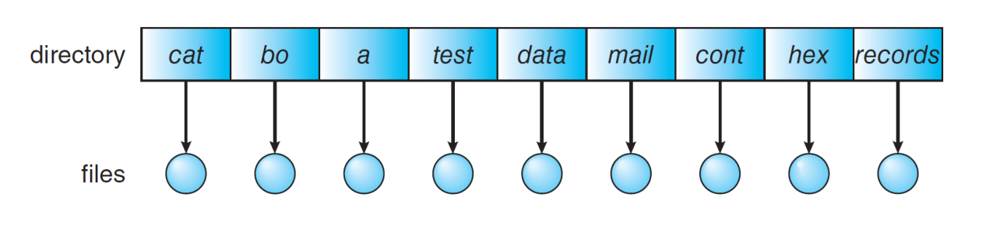
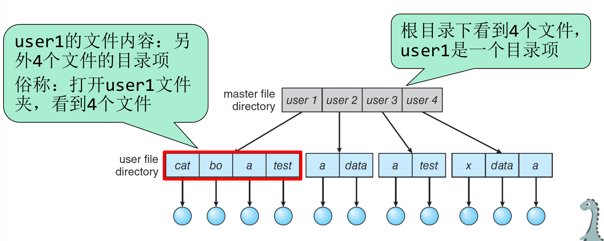
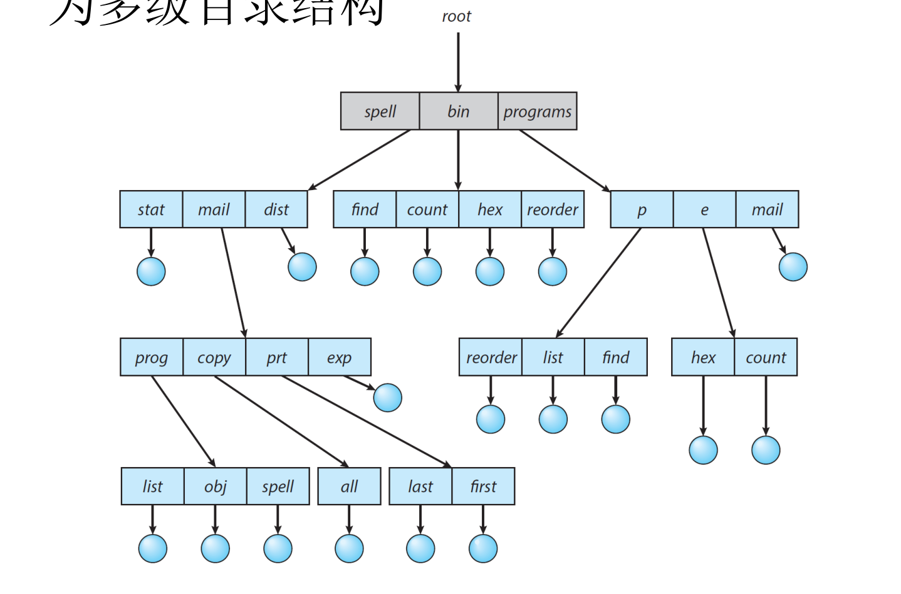

# Chapter13 文件系统

# 文件概念

## 文件系统的概念

具有文件名的一组相关信息的集合，存放在外存

由若干记录组成：记录是一些相关数据项的集合，数据项是数据组织中可以命名的最小逻辑单位

记录和数据项，是文件内部数据的组织方式，多数情况下，OS把文件看作数据流（字节数组），不关心组织。

## 文件的结构

### 逻辑结构

文件内部数据的组织结构，每个应用程序必须有自己的代码对文件进行合适的\*解释\*。

多数情况下os仅仅把文件视作数据流。必须至少看懂可执行文件结构/文件夹结构。

文件夹也是文件，其内容就是下级文件的目录信息。

关键词：

ELF magic number\!

ELF，PE

### 物理结构

文件在外存上的存储组织方式。盘块大多数散乱存放，如何组织成一个文件？

## 目录结构

文件属性等价于元数据，等价于FCB，等价于目录项。

文件目录是FCB的集合。

## 单机目录结构

## 二级

## 多级/树形目录结构

硬链接、软连接、符号链接。

## 内存映射文件

# 聊天板

***D\# Major***

**可爱勾**

不太像人类

我突然觉得这一章没必要我们手动记录了。因为krs很显然在读ppt。

我们只需要等课后把ppt弄成markdown即可，记录他重点讲的部分就行了。

所以本节课大家听课，只需要记录关键词就行。

**感觉这一章很水\.**

