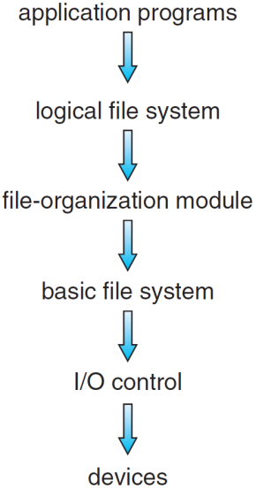
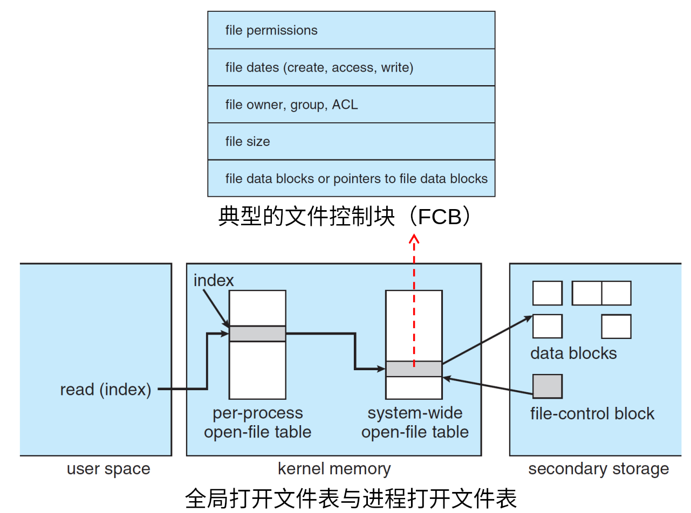
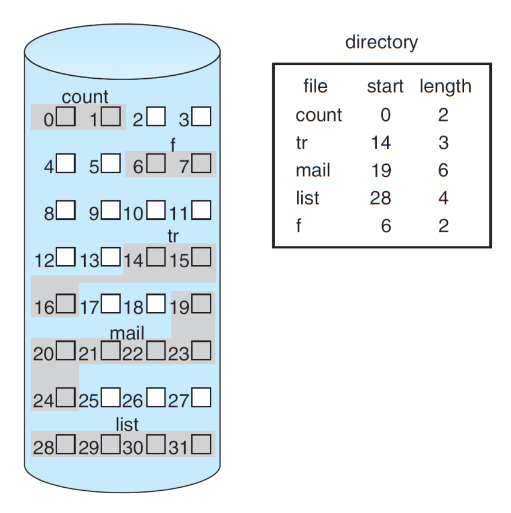
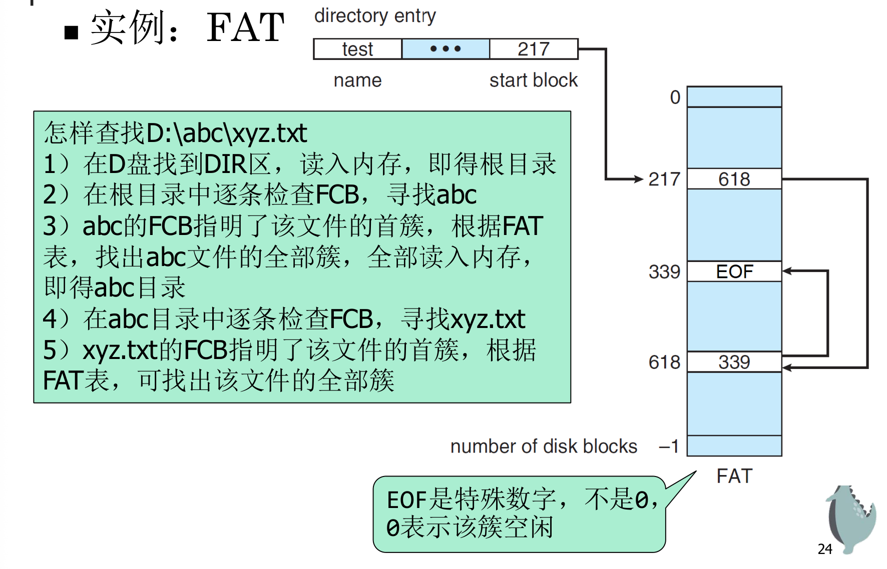
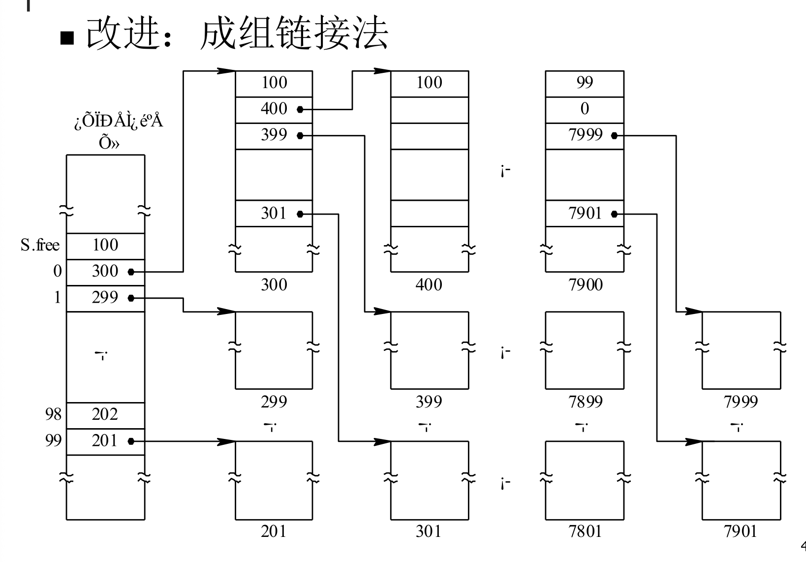

# Chapter14 文件系统实现

# 文件系统结构



本章重点：basic fs, f\-org, logical fs

当一个应用程序想要读取文件中的某段数据时，请求会从上至下穿过整个文件系统；而从设计和依赖的角度来看，我们从最底层的硬件逐层往上构建。

## 硬件层与 I/O 控制层 \(Devices \& I/O Control\) — 驱动与中断（非本章重点）

属于IO子系统，可被看作与文件系统并列的子系统，本身也非常复杂，内部细分为多个模块多个层次

**它依赖谁**：直接与物理磁盘、闪存颗粒（SSD）或 NVMe 控制器打交道。

**它做什么**：这一层由**设备驱动程序**和**中断处理程序**组成。它的核心任务是将高层的通用命令（如“读取某个扇区”）翻译成硬件能懂的底层低级指令（例如往特定的硬件寄存器里写特定的位，或者触发 DMA 传输）。

## 基本文件系统层 \(Basic File System\) — 匿名数据块的搬运工

又称物理I/O层，也属于IO子系统。不仅服务文件系统，也服务内存管理。

**它依赖谁**：依赖 I/O 控制层提供的底层读写能力。

**它做什么**：向合适的设备驱动程序发送通用命令，负责在内存和磁盘（或缓冲区）之间交换匿名的物理数据块。

**关键特性**：

- **没有“文件”的概念**，不知道手里的数据块属于哪个文件，这些数据是文本、图片还是可执行代码。

- 关注的是**数据块在磁盘上的物理位置**。决定磁盘读写效率的磁盘调度算法（Disk Scheduling）运行在这一层。

## 文件组织模块层 \(File\-Organization Module\) — 逻辑到物理的翻译官

**它依赖谁**：依赖基本文件系统层提供的匿名块读写能力。

**它做什么**：这一层开始有了“文件结构”的概念。核心任务：

1. **地址翻译**：将文件内部的**逻辑块地址**（例如：某个文件的第 3 个数据块）翻译成磁盘的**物理块地址**（如 LBA：磁盘上的第 1024 个扇区）。

    > - LBA:硬盘内部的物理地址,抽象的索引柱面、磁道等更底层的盘块信息\.仍然是物理地址***而不是逻辑地址\.***
    > 
    > 

2. **空闲空间管理 \(Free\-Space Management\)**：知道磁盘上哪些块是空的，哪些是满的，从而决定新数据应该写在哪里。

**通俗理解**：这一层负责管理一个“卷（Volume）”：如何把盘块组织成文件，如何管理空闲盘块？如果没有这一层，你就只能通过绝对的物理位置去读写磁盘，而有了它，你就可以按“某个文件的第几段”这种相对概念来思考了。

## 逻辑文件系统层 \(Logical File System\) — 用户眼中的文件与元数据

**它依赖谁**：依赖文件组织模块提供的逻辑块到物理块的映射。

**它做什么**：离用户和应用程序最近的一层。它管理所有关于文件结构的“高级概念”：

- **目录结构与路径解析**：把诸如 `/home/user/doc.txt` 的路径一步步解析出来。

- **文件控制块 \(FCB, File Control Block\)**：在 Unix/Linux 世界里，这就是著名的 **inode**。它记录了文件的权限、大小、所有者、修改时间以及数据块的索引表。

- **安全与权限控制**：检查当前用户有没有权限读取或修改这个文件。


核心好处：

1. **解耦：更换硬件很简单。**如果你的电脑从 SATA 固态硬盘换成了 NVMe 固态硬盘，操作系统只需要更换最底层的 **I/O 控制层**（驱动程序），上层的逻辑文件系统、目录管理完全不需要变动。

- **复用：支持多种文件系统格式。**Linux 可以同时支持 ext4、xfs、btrfs，Windows 支持 NTFS 和 FAT32。这些不同文件系统的核心差异主要集中在**逻辑文件系统层**和**文件组织模块层**（比如它们如何组织 inode，如何管理空闲空间），但它们可以共享同一套基本文件系统层和 I/O 驱动。


# 文件系统操作

## 文件系统在磁盘上的数据

计算机关机时，文件系统在磁盘上必须有一套完整的自愈和索引结构。磁盘上主要有四类数据块：

- **引导控制块 \(Boot Control Block\)**：每个卷（分区）的开头。如果这个分区装了 OS，它就包含引导加载程序（如 Unix 的盘头引导块、Windows 的 DBR）。

- **卷控制块 \(Volume Control Block / 超级块 Superblock\)**：文件系统的“总管”。它记录了整个分区的元数据：总块数、空闲块数、块大小、空闲块指针等。如果超级块损坏，整个分区的文件系统就瘫痪了。

- **目录结构**：组织文件树的数据。在 Unix 下，它只建立 **文件名 **$\rightarrow$** inode 编号** 的映射；而具体的物理块信息不归目录管。

- **文件控制块 \(FCB / inode\)**：**文件的灵魂**。包含文件权限、大小、创建时间，以及最核心的——**数据块索引表**（指明这个文件的数据具体存在磁盘的哪些物理块上）。

## 用于文件系统管理的内存信息

OS 不可能每次都去读磁盘元数据，那太慢了。于是 OS 在内存中建立了一个**三级结构**。

### 进程打开文件表 \(Per\-process Open\-file Table\)

- **存在维度**：每个进程独有一份（存在进程的 `task_struct` 或 PCB 中）。

- **内部结构**：一个简单的指针数组。数组的下标就是 **文件描述符 \(File Descriptor, fd\)**，打开文件时返回。

- **它存什么**：它不存文件内容、大小，只存一个**指向“系统打开文件表”对应条目的指针**，以及少量的控制标志（如 `close-on-exec`）。

### 系统打开文件表 \(System\-wide Open\-file Table\)

- **存在维度**：整个操作系统只有一份，所有进程共享。

    - **为什么不把信息直接放进程表里？**：因为多个进程可能打开同一个文件（比如父子进程共享，或者两个独立进程同时读一个日志）。

- **它存什么**：

    - **当前文件偏移量 \(File Offset\)**：每个打开实例的读写光标走到哪了。

    - **访问模式**：只读、只写或读写。

    - **引用计数 \(Reference Count\)**：有多少个进程的 fd 指向我？当计数清零时，这个条目才会被销毁。

### 内存 inode 表 \(In\-memory inode Table\)

- **存在维度**：全局唯一。是磁盘上 inode/FCB 的内存缓存。

- **它存什么**：文件的物理拥有者、文件大小、磁盘块分配信息。

- **作用**：不管有多少个进程、以什么模式打开了这个文件，在内存 inode 表里**永远只有唯一的一个条目**。它负责跟磁盘同步数据。



## IO重定向的本质

1. **最小分配原则**：当进程打开新文件时，内核在进程文件表中搜索，总是分配**当前未使用的、最小的那个下标（fd）**。

2. **标准 I/O 约定**：每个进程初始化时，默认 fd 0 是标准输入（终端键盘），**fd 1 是标准输出（终端屏幕）**，fd 2 是标准错误。

```Go
pid = fork();
if (pid == 0) { // 子进程（即将运行 java 的进程）
    close(1);   // 1. 强行关闭标准输出。此时，fd 1 空闲出来了，且是当前最小的空闲 fd
    
    open("log.txt", ...); // 2. 打开目标日志文件。根据最小分配原则，内核自动把 fd 1 分配给 log.txt！
    
    execvp("java", ...);  // 3. 替换进程映像，执行真正的程序
}
```

子进程的 `fd = 1` 已经在外层被指向了 `log.txt` 在系统文件表中的条目，原本应该在屏幕上的控制台日志，就被悉数写入了磁盘文件。


# 目录实现

1. 线性表：最简单的实现方法，但查找文件费时。

2. 用线性表存储目录项，使用哈希表加速文件名查找\.

    - 根据文件名得到哈希值，并返回一个指向线性表中元素的指针

    - 速度快，但要避免冲突，不同文件夹的文件数量差异巨大，要求哈希表的桶数适配有困难

NTFS以文件名为key用B\+输存储;ext4以hash\(文件名\)为key,用哈希索引树存储


# 分配方法

文件的盘块组织方法有以下三类：连续分配、链接分配、索引分配

存储空间的分配方式：

- 静态分配：文件建立时一次分配

- 动态分配：根据需要进行分配。通常以块或簇为单位。几个连续物理块构成簇，固定大小

## 连续分配

1. 定义：要求每个文件在磁盘上占有一组连续的簇。

2. 分配方式：用户必须在分配前说明待创建文件所需的存储空间大小；文件目录只需其起始位置（簇号）及长度。

3. 特点：

    - 顺序访问速度快，目录中文件存储位置信息简单

    - 容易产生碎片，需要定期对磁盘空间进行整理

    - 为新文件找空间比较困难

    - 文件很难增长



4. 改进方法：基于扩展的系统

    - 开始时还是分配一块连续空间。如果空间不够用了，文件系统不再强求整体搬家，而是去磁盘的其他地方再找一块连续空间分配给它，这第二块连续空间就称为一个 **Extent（扩展）**。（即，每个学校这一生有唯一一次扩建分校的机会），文件存储位置信息中相应增加扩展的信息

## 链接分配

1. 定义：文件可以散落在磁盘的任何角落，只要有空闲块就能塞。

2. 分配方式：

    - 目录项只需要记录：**起始块号 \(Start\)** 和 **结束块号 \(End\)**。

    - 每个物理块内部，除了存文件数据外，都要强行挖出最后几个字节，作为一个**指针**，指向该文件的下一个物理块。最后一个块的指针写一个特殊符号（如 `-1` 或 `EOF`）。

3. 特点：

    - 简单直观，文件创建与增长容易。

    - **随机访问性能雪崩。**

    - **可靠性极差**：链表是一条单线联系。一旦磁盘某处发生坏道，导致第 500 个块的指针损坏，那么从第 501 个块到文件结束的所有数据，在物理上就彻底“失联”了。

    - **有效容量非 2 的幂**：块内指针占用了空间，导致用户可用的实际块大小变成了类似 508 字节这种尴尬的数字，严重拉低了内存对齐和位移计算的效率。


例子:FAT

- FAT区:一个大数组,序号就是块号,集中记录所有的下一个簇的位置

- DIR区:根目录,格式化规定了容量大小

- DATA:自由分配



例1：假定磁盘块的大小为1KB，对于1\.2MB的软盘，其文件分配表FAT需要占用多少存储空间？

1\.2M/1K=1\.2K\(个盘块\)；$10<\log_2(1.2K)<11$，1\.2K \* 每个条目的大小\(11bits可以向上取整到2字节\)即可得到答案。


## 索引分配

在链接分配中，指针散落在各个数据块里；而**索引分配**把一个文件所有数据块的物理地址，集中写进一个专门的磁盘块中，这个块被称为**索引块（Index Block）**。

> 很像页表。
> 
> 

### 单级索引块（Single\-Level Index）

- 假设一个标准磁盘块大小为 **4KB**。磁盘里的物理块号（指针）占用 **4 字节**（32 位寻址）。

- 那么，一个 4KB 的索引块里面最多只能塞下：$4\text{KB} / 4\text{B} = 1024 \text{ 个指针}$

- 每个指针对应一个 4KB 的数据块，所以单级索引允许的**最大文件体积**只有：$1024 \times 4\text{KB} = 4\text{MB}$

**太小了。**

### 多级索引（Multi\-Level Index）

一级索引块里存的不再是数据块地址，而是**下一级索引块的地址**。

以**两级索引**为例：

- 一级索引块包含 1024 个指针，每个指针指向一个二级索引块。每个二级索引块再包含 1024 个指针，每个指针指向真正的数据块。

- 总指针数达到 $1024 \times 1024 = 1\text{M}$ 个。

- 此时最大文件体积跃升为：$1\text{M} \times 4\text{KB} = 4\text{GB}$

**新痛点（工程权衡）**：如果整个文件系统**一刀切**，所有文件都强行规定使用两级索引。当用户创建了一个只有 1 字节的空配置文件时，为了读写它，操作系统必须在磁盘上开辟：`1个一级索引块 + 1个二级索引块 + 1个数据块 = 3个块`。不仅白白浪费了 8KB 的元数据空间，每次读写还要平白遭受 3 次磁盘 I/O（如果没命中缓存的话）。

### 实例：ext4 混合索引分配（Mixed Index）

#### inode设计

inode 中设计了一个长度为 **15 的非对称指针数组**。

这 15 个指针的分工极其精妙，形成了一个非对称的动态树状结构：

#### 磁盘格式化后形成的格局

格式化：把原始的物理扇区擦干净，并按照该文件系统的规则，在磁盘上强行划分出不同的功能区。

磁盘分区经格式化，划分为4片区域：数据块位图、inode位图、inode表、数据

1. 数据块位图记录数据块的空闲/占用情况

2. inode表即索引节点的数组，每个文件对应一个inode

3. inode位图记录inode数组的空闲/占用情况

4. 数据即自由分配的区域

1\-11号inode（没有0号）有特殊含义，其中2号表示根目录

【正在施工】


# 空闲空间管理

1. 位示图

2. 空闲块链

    - 成组链接

    - 记录连续空闲区

## 位示图

- 朴素方法:用一个bitmap存每个簇是否分配，1表示已分配，0表示空闲。

- 优点:小,缺点:需要进行位示图中的位置与盘块号之间的转换 

## 空闲块链

- 将所有空闲块链接起来，设置一个头指针指向第一块。

- 实现简单，效率极低

- 改进:成组链接法,分治,将N空闲盘块归一组,选一块作为组长\.组长构建链表,组长记录组员



- 另一种改进:记录连续空闲区

    - 建立$\langle S,R \rangle$,S为第一个空闲块号,R为连续空闲块个数

    - 然后构建大链表\.其实本质差不多


