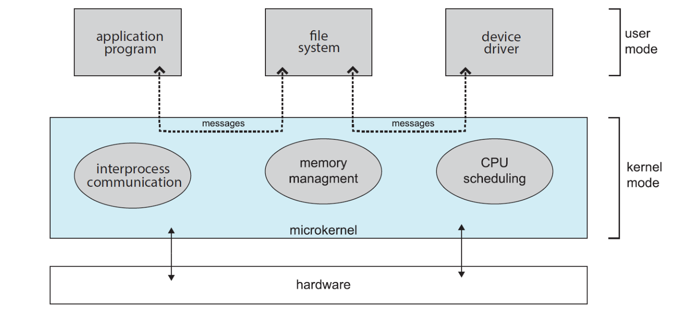
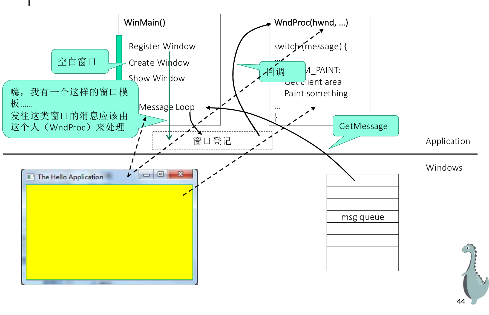

# Chapter2 操作系统结构

# 功能概述

操作系统提供的核心功能主要包括以下几个方面：

- **用户接口**：包括命令行接口、批处理接口及图形用户接口。

- **程序执行**：将程序装入内存并运行程序。

- **I/O操作**：操作系统必须提供完成I/O操作的手段。

- **文件系统操纵**：让程序能够读、写、创建和删除文件。

- **通信**：负责进程间交换信息。

- **错误检测**：通过检测错误确保正确运算。

- **资源分配**：把资源分配给同时运行的作业。

- **统计**：记录用户使用资源的类型及数量。

- **保护和安全**：确保所有对资源的访问是受控的且系统不受外界侵犯。

# 操作系统接口

操作系统向用户提供了各种使用其服务功能的手段，即提供了操作系统接口。

1. **命令接口**：命令解释程序是用命令接口进行作业控制的主要方式：

    - **脱机控制方式**：用户将对作业的控制要求以作业控制说明书的方式提交给系统，由系统按照规定控制作业的执行。（比如 WHU 超算的 SBATCH）

    - **联机控制方式**：指用户利用系统提供的一组键盘命令或其他操作命令和系统会话，交互

    - 式地控制程序的执行。

    - **键盘命令**：

        - 常驻内存的内部命令：功能简单、程序短小、使用频繁，系统启动时即加载。

        - 独立驻留在磁盘上的外部命令：功能复杂，独立作为文件驻留磁盘，需要时再调入内存。

    - 我们用环境变量来存储命令的路径，例如我们敲击 `ls` 而不是 `/bin/ls`。

2. **图形用户接口 \(GUI\)**：提供基于鼠标的窗口和菜单系统作为接口，通过对屏幕对象直接操作来控制程序。

# Syscall \& Stack

系统调用的本质是软中断，使 CPU 进入内核态。栈和 CPU 寄存器共同决定了当前程序的执行状态。应用程序和系统拥有**各自的栈**：用户栈、内核栈。在系统调用时需要进行栈切换。

## x86/x64：半自动机制

在 x86 架构中，CPU 硬件在触发中断时会执行部分自动化操作：

- 通过 **TSS \(Task State Segment\)** 找到内核栈位置；

- 自动将用户程序的 `EIP`、`CS`、`EFLAGS` 以及用户态的 `ESP`、`SS` 压入**内核栈**。

> CPU 虽会自动压栈，但并不自动完成特权级的栈切换，此步骤通常由内核的 Trap Handler 完成。CPU 辅助保存现场，但内核需负责维护栈的平稳切换。
> 
> 

## RISC\-V：全软件控制机制

RISC\-V 遵循极简设计，硬件**绝对不会执行任何自动压栈操作**，它啥也不做，仅仅是仅通过 `stvec` 寄存器跳到内核入口。这就带来了一个著名的“鸡生蛋”死锁问题：

- 想要保存用户态的现场，CPU 必须得压栈；

- 但此时 CPU 的栈指针（`sp` 寄存器）还指着用户栈，内核想要安全保存现场，必须先把 `sp` 切换指向内核栈；

- 可是，如果直接用指令去修改 `sp` 的值，势必会破坏掉当前寄存器里还没来得及保存的用户态数据。

由于 CPU 不提供自动压栈，内核必须在切换栈之前保存现场。RISC\-V 引入了 `sscratch` 寄存器作为“跳板”，内核预先将内核栈地址存入其中，利用原子指令进行栈切换：

```Plain Text
csrrw sp, sscratch, sp  // 执行后：sp -> 内核栈，sscratch -> 用户栈地址
```

这条指令在**瞬间完成了两件事**：把当前的 `sp`（即用户栈地址）保存到了 `sscratch` 中，同时把原来 `sscratch` 里的值（即内核栈地址）读到了 `sp` 中。

> 上述“处理程序”特指内核态的 Trap Handler。当 CPU 跳转至内核入口的瞬间，执行权已完全移交至内核空间，后续的上下文保存与栈管理均由内核代码执行，用户程序对此过程处于完全透明的状态。
> 
> 

## 系统调用与过程调用的区别

- **运行状态不同**：

    - 系统调用导致切换到内核态下运行，切换栈。

    - 子程序调用不引发任何切换，仍用户态下运行，使用同一个栈。

- **进入方式不同**：

    - 系统调用通过中断机构进入以改变运行状态。

    - 子程序直接调用不涉及运行状态改变。

# 操作系统结构

操作系统内核结构主要演变如下：

- **简单结构**：如 MS\-DOS 和早期 UNIX。接口和功能层次划分不清楚。

- **层次结构**：划分为若干层（0 层为硬件，最高层为用户接口），每层只与相邻层联系。便于移植和扩充，但牺牲了灵活性。

- **模块结构**：内核按功能划分为独立模块，通过接口调用。效率高，但全局函数多导致访问控制困难。

- **微内核结构**：

    - **基本思想**：执行与决策分离，缩小内核规模。微内核仅包括最小的进程、内存管理及通信功能。

    - **优缺点**：更安全可靠且易移植；但增加了大量系统调用和进程切换开销，可能导致性能下降。

    - **现实选择**：鸿蒙系统采用了微内核架构。

> 微内核实例：决策在 User Mode 里，不需要高权限；真正执行在微内核（Kernel Mode）。微内核不再关心“文件长什么样”，只负责搬运 messages。
> 
> 



- **现实抉择（混合/宏内核）**：

    - 有总体的分层，定义了从用户软件到硬件的协作。

    - 内核按功能（进程、内存、文件、IO）纵向划分模块，相互依赖协作。

# API \(Application Programming Interface\)

系统调用非常不方便（涉及特定寄存器、内存地址），无法直接用高级语言表达。

API 由操作系统商家提供，封装系统调用，形成 C 语言函数库。API 函数运行于用户态。

## \*WinAPI 实例

> **核心概念定义**：
> 
> - **回调函数**：程序员编写但由操作系统在特定事件发生时反过来调用的函数。
> 
> - **句柄 \(Handle\)**：操作系统用来标识系统对象（窗口、文件、线程等）的“代号”。
> 
> - **消息循环**：
> 
>     1. **获取消息**: `GetMessage()` 从队列取出消息。
> 
>     2. **翻译消息**: `TranslateMessage()`。
> 
>     3. **分发消息**: `DispatchMessage()` 发送给回调函数处理。
> 
> 




