# Chapter3 进程

# 进程的定义与特征

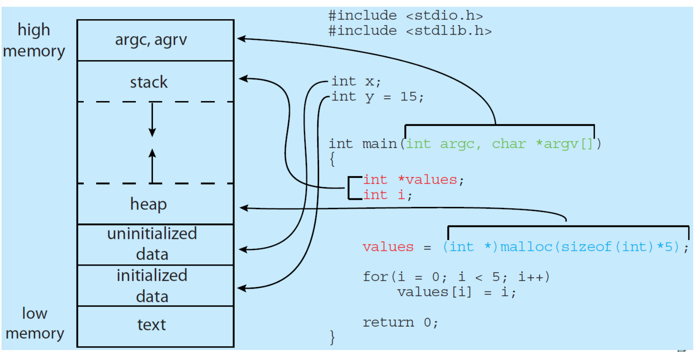

# 进程状态

## 五种状态概览

进程在执行时会不断改变状态，主要包括五种基本状态：新建、运行、等待（阻塞/睡眠）、就绪、终止。

- 新建：刚创建，未进入就绪队列，又称创建状态

- 就绪：已获得除 CPU 以外的所有资源，一旦分配了处理机就可以立即执行。

- 等待（阻塞、睡眠）：由于发生某事件（如等待 I/O）而暂时无法执行，即使分配 CPU 也无法运行。

> 挂起状态 \(Suspended\)
> 
> - 挂起也称静止状态，是被外界（OS 或其它进程）强制剥夺执行权的被动状态。
> 
> - 挂起的原因包括：系统故障修复、检查中间结果、资源不足、内存不足（换出到外存）。
> 
> 


## 进程状态转换图

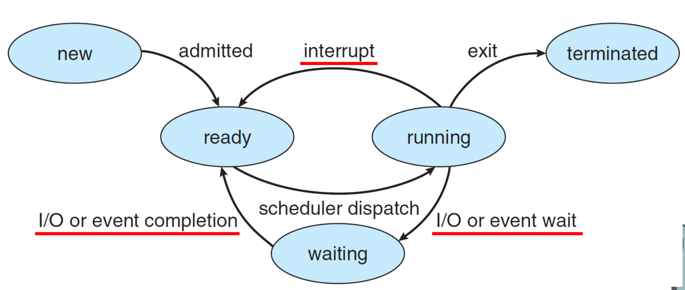

以下是三种引起状态转换的主要原因。

### running\-\>ready ：中断

时钟、鼠标等中断，或者单纯超时。CPU 暂停当前正在执行的程序，强行跳去执行操作系统内核中的一段代码（中断服务程序）。但并不总引起进程切换。如鼠标移动，触发内核中断服务，但处理完成后决定回到原进程，不切换。

### running\-\>waiting ：IO 与等待

1. 阻塞式 IO \(Blocking IO\) —— “我去睡觉，好了叫我”

    阻塞不是硬件强加的，而是软件（程序员/库函数）选择的一种“策略”。

    1. 发起动作：当你要从硬盘读数据，CPU 执行了一条特殊的指令（系统调用，如 syscall），从用户态陷入内核态。

    2. 内核检查数据：阻塞模式下，内核不会让 CPU 干等着。

        - 保存现场：把当前程序的寄存器值、程序计数器（PC）存到你的进程控制块（PCB）里。

        - 修改状态：把进程状态从 运行态 \(Running\) 改为 阻塞态 \(Blocked/Sleeping\)。

        - 加入队列：放进一个特定的等待队列，比如“磁盘等待队列”或“网络接收等待队列”。在这个队列里，你只是一个链表节点，没有任何代码在运行。

    3. 调度切换：CPU 去执行别的进程。

在等待队列中，进程代码已经完全停止执行。连“时间片轮转”都轮不到你，因为你根本不在“就绪队列”里，而在“阻塞队列”里沉睡。程序指针也停在那一行 `read()` 上，纹丝不动。

2. 非阻塞 IO \(Non\-blocking IO\) 、“自旋”、“轮询”—— “没好我就一直问”

    1. 发起动作：同样调用 read\(\)，但文件描述符被设为了 O\_NONBLOCK。

    2. 内核检查数据：还没好。立即返回一个错误码（通常是 EAGAIN 或 EWOULDBLOCK），绝不让你睡眠，也绝不把你放进等待队列。你的进程依然处于 运行态 或 就绪态。

既然内核不叫你，通常会写一个循环（轮询）：

```C++
while (true) {
    if (read() == success) break;
    // 或者稍微睡一小会儿避免占满 CPU，但这依然是你在主动控制
}
```

这就是“自旋”或“轮询”。进程没有阻塞，它一直在跑，一直在问“好了吗？好了吗？”。

### waiting\-\>ready ：IO 与等待完成

Syscall 结束之后，由OS感知并处理。（此时进程处于阻塞态，不可能感知处理任何事情）

1. 查找等待队列：内核拿着“硬盘读取完成”这个事件，查找等待队列，找到某个正在等待这一部分数据的进程。（每个阻塞的进程在阻塞前，都把自己的 PCB 挂在了特定事件的链表上）

2. 唤醒：

    1. 状态变更：内核将进程 A 的状态从 阻塞态 \(Blocked\) 改为 就绪态 \(Ready\)。

    2. 移队操作：把进程 A 的 PCB 从“磁盘等待队列”移动到“就绪队列 \(Ready Queue\)”。此时进程 A 并没有立即运行！它只是获得了“比赛资格”，回到了起跑线（就绪队列）排队。如果当前 CPU 空闲，调度器可能立刻选它运行。如果当前有其他高优先级进程在跑，进程 A 就得继续等，直到轮到它。

3. 恢复执行：当调度器最终选中进程 A 时：

    1. 上下文恢复：内核从 PCB 中取出之前保存的寄存器值、程序计数器 \(PC\)。

    2. 重返现场：进程 A 的代码从它当初调用 `read()` 陷入内核的那一行继续执行，仿佛什么都没发生过，只是 `read()` 函数现在返回了读取到的数据。

阻塞式IO全过程：

进程主动说“我没数据，先睡了，有事去队列里找我”（阻塞 \+ 登记）；

硬件干活完后大喊一声“数据好了！”（中断）；

操作系统听到后，去队列里把那个进程捞出来：“别睡了，起来干活”（唤醒 \+ 入就绪队列）；

最后调度器安排它重新上台表演（调度运行）。

## 进程之间的相互影响

如果一个进程的状态变化 A 的发生，会引起另一个进程的状态变化 B 的发生，则称 A、B 之间是因果变迁。

### 挂起

进程挂起也称为 静止状态，是相对于正常 活动状态 的一种特殊表现。挂起通常意味着被换出到外存（磁盘），释放物理内存。其核心特征包括：

- 被动性：由外部（如 OS 或其他进程）强制剥夺执行权，且不改变进程原有的就绪或阻塞逻辑状态。

- 维度共存：就绪/阻塞反映进程的“健康状态”（执行逻辑），而挂起/活动反映进程的“人身自由状态”（资源调度）。两者互不冲突，可并存。

挂起诱因：

1. 系统维护：发生故障或功能受损时，挂起进程以进行修复。

2. 中间检查：为观察或调试目的，挂起进程以检查中间运行结果。

3. 资源调配：资源不足时，挂起部分进程以腾出系统资源。

4. 内存优化：内存告急时，将进程挂起并对换至外存（Swap），释放内存空间。

### 带有挂起的进程状态转换图

挂起的引入会让之前的进程图变得越来越复杂。

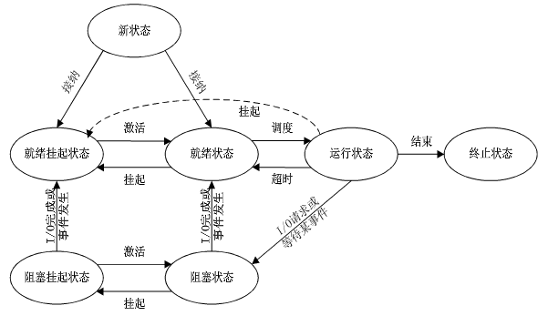

运行状态\-\>就绪挂起状态：客户在程序正在运行时直接挂起程序。箭头单向，结束后激活进入就绪状态。

阻塞状态\-\>阻塞挂起状态：内存紧缺时，把阻塞态进程换出，腾空间给更需要内存的程序。PCB 存入外存。因为现在这个进程不能进入就绪状态，这个程序在内存中没有作用。

阻塞挂起状态\-\>就绪挂起状态：当阻塞状态等待的IO事件或其他事件到来的时候状态发生改变。属于“被动唤醒”，但尚未获得执行资源（内存\+Cpu）。

就绪挂起状态\-\>就绪状态：内存无就绪进程时调入；或高优先级就绪挂起进程优于低优先级就绪进程时调入。

就绪状态\-\>就绪挂起状态：通常操作系统更倾向于挂起阻塞态进程而不是就绪态进程，因为就绪态进程可以立即执行，而阻塞态进程占用了内存空间但不能执行。但如果释放内存以得到足够空间的唯一方法是挂起一个就绪态进程，那么这种转换也是必需的。并且，如果操作系统确信高优先级的阻塞态进程很快就会就绪，那么它可能选择挂起一个低优先级的就绪态进程，而不是一个高优先级的阻塞态进程。


# 进程控制块 Process Control Block（PCB）

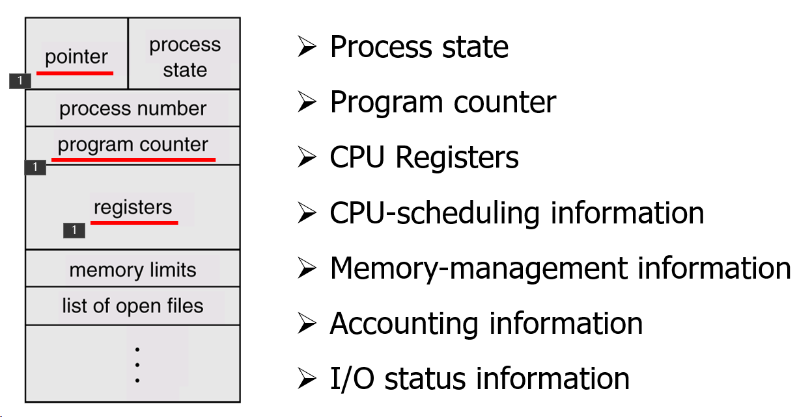


## 定义与结构

PCB 是操作系统为管理进程而专门定义的一种数据结构，记录了进程执行时的全部动态信息。

- 地位：PCB 是进程存在的 唯一 标志。系统通过感知 PCB 来感知进程，而非程序代码。

- 生命周期：创建进程时申请 PCB，进程结束时释放 PCB。

操作系统通常将多个 PCB 以特定的数据结构组织起来：

- 链接方式：按状态将 PCB 分为多个队列（如就绪队列、阻塞队列）。

- 索引方式：按状态建立索引表，表项指向 PCB 的起始地址。

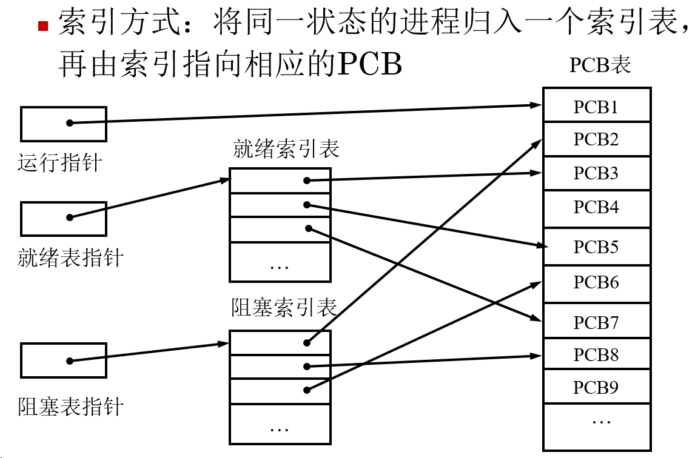

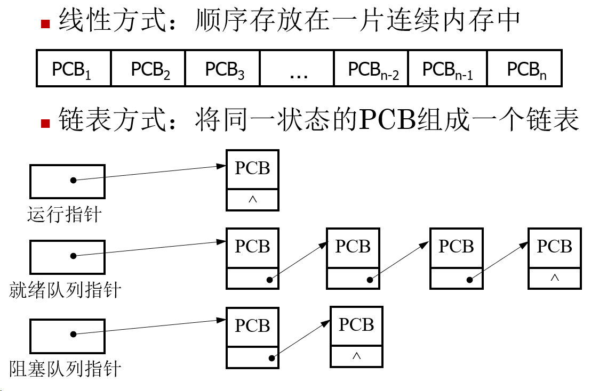

PCB 的作用总结

- 独立运行：使多道程序环境下，程序能作为独立单位并发执行。

- 间断执行：保存 CPU 现场，支持进程在切换后能从断点继续运行。

- 资源管理：记录进程所需资源，防止系统资源冲突。


## 进程调度

进程调度的本质是：当当前进程无法继续运行（阻塞/时间片到）或主动放弃运行时，操作系统接管 CPU 控制权并选择下一个进程的过程。


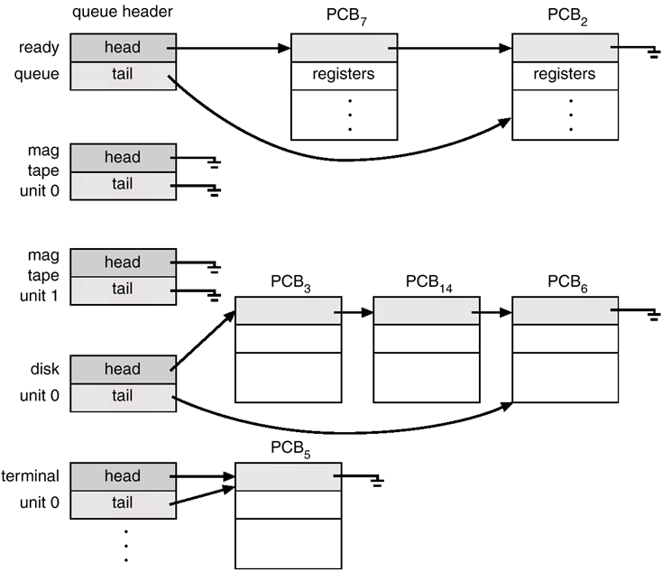

队列里存的不是进程的代码或数据，而是 PCB。

- 就绪队列 \(Ready Queue\)：

    - 定义：所有处于“就绪态”进程的 PCB 集合。

    - 这些进程万事俱备（内存已加载、资源已申请），只欠东风（CPU）。只要调度器选中它，它就能上 CPU 运行。

    - 图示：上方的 ready queue，通过 head 和 tail 指针，把 PCB\_7 和 PCB\_2 串在了一起。

- 阻塞队列 \(Blocked / Wait Queue\)：

    - 定义：所有处于“阻塞态”（等待态）进程的 PCB 构成的队列。

    - 这些进程因为某些原因（比如等待 I/O 完成、等待信号量）暂时无法运行，必须让出 CPU 去排队等待。

    - 每种阻塞原因都有一个阻塞队列。如果所有等待 I/O 的进程都挤在一个巨大的“阻塞队列”里。当磁盘读写完成了，操作系统需要唤醒进程时，它就得遍历整个大队列找出等待磁盘的进程。

    - 图示：下方的 wait queue，把 PCB\_3、PCB\_14 等串在了一起。你可以看到下面分出了 mag tape unit 0（磁带机 0）、disk unit 0（磁盘 0）、terminal unit 0（终端 0）等多个队列。

### 长程调度 \(Long\-term Scheduling / Job Scheduling\)

- 核心职能：从外存的后备队列（如磁盘上的作业池）中选择一批作业，加载到内存中，创建为进程，放入就绪队列。

- 控制参数：控制 多道程序度 \(Degree of Multiprogramming\)，即内存中同时存在的进程数量。

- 任务差异：

    - 只有计算任务接受作业调度（排队入场）。

    - 交互任务不经过此阶段，必须立刻启动。

- 系统分布：多道批处理系统必备；分时系统（如现代 Linux/Windows）可能存在，但通常较弱。

长程调度与激活的区别

> 长程调度面对的是“新生儿” —— 它还没有 PCB，没有地址空间，没有父进程，是一个“待孵化的蛋”。
> 
> 激活面对的是“老居民” —— 它的 PCB 还在内核链表里挂着，只是身体（代码/数据）被搬到了硬盘上，现在要搬回来继续生活。
> 
> 

### 短程调度 \(Short\-term Scheduling / CPU Scheduling\)

- 从 就绪队列 中选择下一个获得 CPU 执行权的进程。CPU 的“分配器”。

- 频率：极高（毫秒级），必须非常精简高效。

- 系统分布：所有 类型的操作系统（批处理、分时、实时）都必然存在。

## 上下文切换

为了提高处理器的利用率，操作系统需要让处理器足够忙，即让不同的程序轮流占用处理器来运行。如果一个程序因某个事件而不能运行下去时，就通过进程上下文切换把处理器占用权转交给另一个可运行程序。

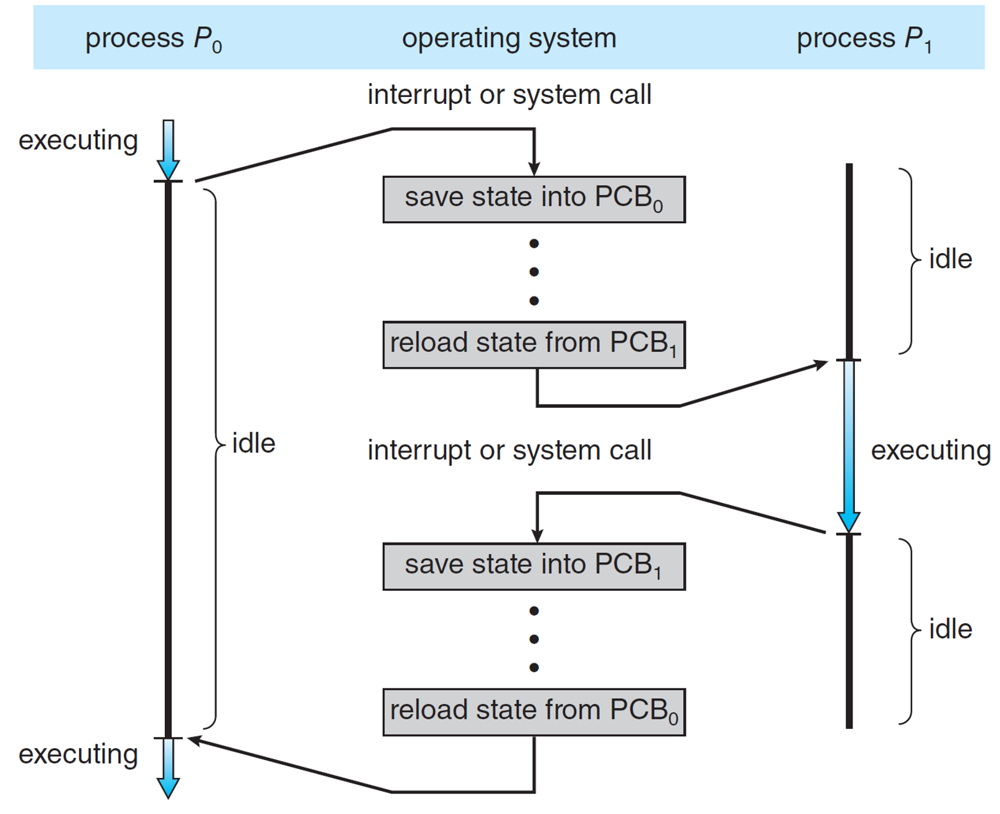

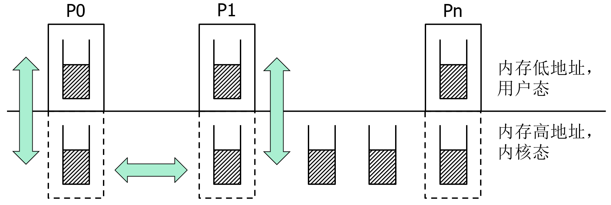

两种切换的讨论

> OS 在内核中为每个进程准备了一个栈，称为该进程的内核栈。
> 
> 用户栈：进程在用户态运行时（比如你在写代码、玩游戏），用的是用户栈（通常在内存低地址）。
> 
> 内核栈：当进程因为系统调用（比如请求读写文件）或者中断（比如时间片到了）进入内核态时，CPU 会切换到这个进程专属的内核栈（通常在内存高地址）上来运行操作系统的代码。
> 
> 两种切换都导致程序的跳转。纵向：内核态与用户态的切换。横向：进程间的切换。
> 
> 

只要能从内核态回到用户态，那么内核栈一定是空的。

> - 当你准备离开内核态，回到用户态继续干活时，这次进入内核态所产生的一切“临时数据”都必须清理干净。
> 
> - 例如，进程 P0 在用户态运行得好好的，突然发生了一个中断（比如键盘输入）。CPU 必须暂停 P0 的用户程序，跳转到内核代码去处理。CPU 把当前的程序计数器（PC）、寄存器值等“现场信息”压入 P0 的内核栈中保存。
> 
> 

只有在内核态才会发生横向的切换。

> - 用户态不能直接横向跳到 P1（红色叉叉），因为用户程序没权限。
> 
> - P0 的用户态也不能直接跳到 P1 的内核态（红色叉叉），因为那是非法的入口。
> 
> - 唯一的路径：P0 用户态 \-\> \(纵向\) \-\> P0 内核态 \-\> \(横向，可选\) \-\> P1 内核态 \-\> \(纵向\) \-\> P1 用户态。
> 
> 

纵向切换是由 **异常（Exceptions）** 和 **中断（Interrupts）** 触发的；横向切换（P0 内核态 $\rightarrow$ P1 内核态）发生在进程调度（Scheduling）时。

**纵向切换**的上下文（User ↔ Kernel）保存在**内核栈**中。**横向切换**的上下文（Process A ↔ Process B）保存在 **PCB** 中。

# 进程的操作与原语

创建、撤消、阻塞、唤醒等，一般由操作系统内核原语实现。仅适用于单 CPU，多 CPU 时，其他 CPU 仍可同时访问共享资源 → 需要自旋锁 \+ 原子指令解决。

## 原语实现：开头关中断，完成后再开中断

关中断是特殊指令，使 CPU 不理会外部中断。中断仍然会产生，只是 CPU 不理会；能屏蔽的中断仅限外部中断（包括定时器），内部异常（如除零错误、页故障）通常不受影响，因为它们与当前指令执行直接相关，必须立即处理。

开关中断是特权指令 → 只能在内核态执行。

## 进程原语的具体行为

### 创建

通过创建进程系统调用可以创建新进程，创建方称为父进程，被创建方称为子进程。进程的创建需要 OS 执行，但多数进程都是在现有进程的要求下创建的。例如 Linux 的 bash 进程创建 vim 进程。

|**类别**|**细分项**|**详细说明/示例**|
|---|---|---|
|1\. 触发原因|用户登录|用户成功登录后，系统为其创建初始 Shell 进程。|
||作业调度|批处理系统中，调度程序为提交的作业分配资源并创建相应进程。|
||OS 服务|操作系统自身需求，创建守护进程（如 cron, spooler 等）。|
||应用需求|运行中的父进程调用 fork\(\) 系统调用来创建子进程（例如：在 bash 中启动 vim）。|
|2\. 创建过程<br>\(原语步骤\)<br>*\(按顺序\)*|第一步|申请空闲 PCB：从空闲链表获取一个进程控制块结构。|
||第二步|分配资源：为新进程分配必要的内存空间、文件句柄、I/O 设备等。|
||第三步|初始化 PCB：填入进程名、唯一标识符 \(PID\)、优先级、程序计数器地址、寄存器状态、地址空间映射等。|
||第四步|插入就绪队列：将新进程的状态置为“就绪”，并链接到相应的就绪队列中等待调度。|
|3\. 资源策略|共享所有资源|父子进程完全共享同一地址空间和资源（较少见，风险高）。|
||共享子集|最常见策略。例如 Linux 的 fork\(\) 采用写时复制 \(Copy\-On\-Write, COW\) 技术，初始共享物理页，修改时才复制。|
||无共享|子进程拥有完全独立的资源副本（如某些实现中的 vfork 后紧跟 exec，或显式指定不共享）。|
|4\. 执行方式|并发执行|默认行为。父进程和子进程同时（或交替）独立运行。|
||父等待子|父进程调用 wait\(\) 或 waitpid\(\) 阻塞自己，直到子进程结束。|
|5\. 结构关系|进程树|父进程创建子进程，子进程又可创建孙进程，形成层级化的进程树结构（根进程通常为 init 或 systemd）。|

“进程创建 = 申请 PCB \+ 分配资源 \+ 初始化 \+ 入队；父子可共享资源，也可独立；通过系统调用触发”

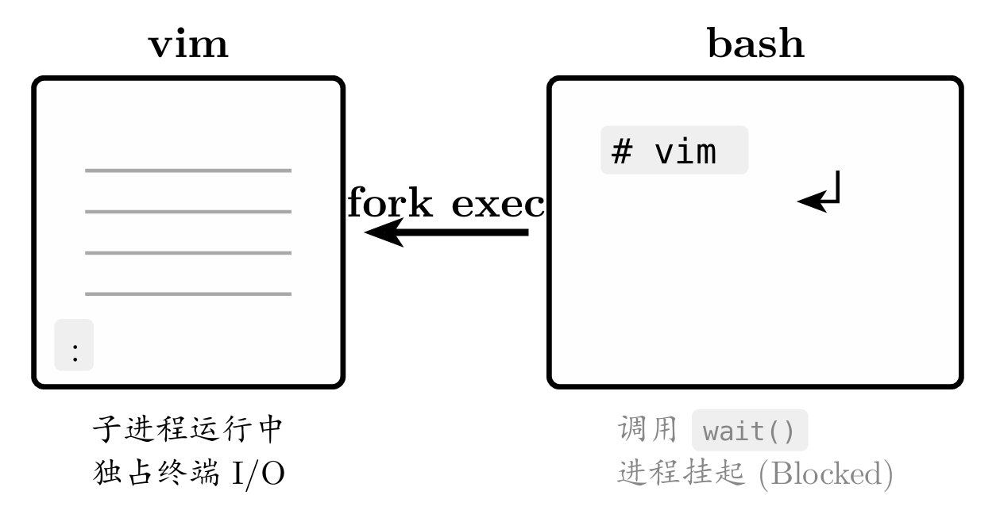

注意：有些系统中，若父进程终止，不允许子进程继续 \(这被称为级联终止\)。

#### Linux 案例：进程树

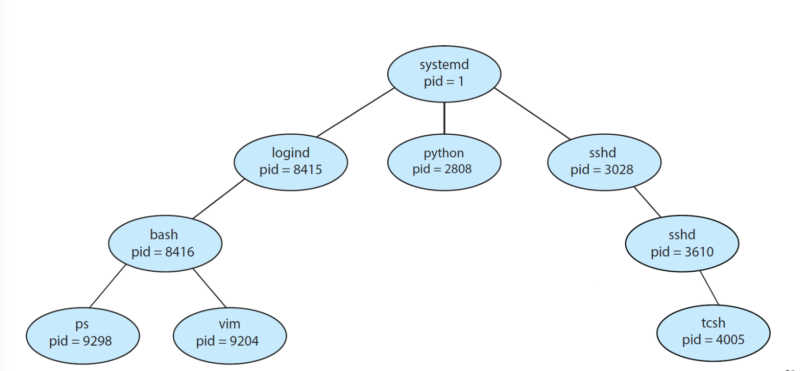

### 终止

**进程终止/进程撤消**：当进程使用系统调用请求操作系统删除自身时，其中所有进程资源由操作系统回收

**撤销的原因：**

1. 正常结束

2. 异常结束：超时、内存不足、地址越界、算术错、I/O故障、非法指令等

3. 外界干预：包括操作员或系统干预，父进程请求

**父进程终止子进程的原因：**

1. 子进程超量使用分配的资源

2. 赋予子进程的任务不再需要

3. 父进程退出

- **级联终止**：有些系统中，若父进程终止，不允许子进程继续。

**撤消的两种策略**

1. 撤消指定标识符的进程

2. 撤消指定进程及其所有子孙进程

**撤销原语：**

- 从系统的PCB表中找到被撤消进程的PCB

- 检查被撤消进程的状态是否为执行状态，若是则立即停止执行，设置重新调度标志

- 检查被撤消进程是否有子孙进程，若有子孙进程则一起撤消

- 回收该进程占有的全部资源并回收其PCB

### 阻塞与唤醒

**引起进程阻塞及唤醒的事件：**

1. 请求系统服务：

e\.g 请求打印机：忙就阻塞，闲就唤醒

2. 启动某种操作并等待操作完成：

e\.g 启动I/O操作，进程阻塞；I/O完成则唤醒进程

3. 等待合作进程的协同配合

e\.g 计算进程未算完则打印进程阻塞；算完后唤醒

4. 系统进程无新工作可做

e\.g 没有信息可供发送，则发送请求阻塞；收到新的发送请求时，应唤醒

当进程等待的事件发生时，由发现者将其唤醒,发现者:

- 可能是进程\(计算完成\)

- 也可能是系统\(收到设备中断\)

**唤醒原语:**

- 将被唤醒进程从相应的等待队列中移出

- 将进程状态改为就绪，并将该进程插入就绪队列

- 转进程调度或返回

### 挂起和激活

**挂起**：自身、具有指定标识符的进程、某进程及其子孙进程

**激活**：具有指定标识名的进程、某进程及其子孙进程

**挂起原语:**

- 到PCB表中查找该进程的PCB

- 检查该进程的状态，若为执行则停止执行并保护CPU现场信息，将该进程状态改为挂起就绪

- 若为活动阻塞，则将该进程状态改为挂起阻塞

- 若为活动就绪，则将该进程状态改为挂起就绪；若进程挂起前为执行状态，则转进程调度，从就绪队列中选择一个进程投入运行

**激活原语:**

- 到PCB表中查找该进程的PCB

- 检查该进程的状态。若状态为挂起阻塞，则将该进程状态改为活动阻塞

- 若状态为挂起就绪，则将该进程状态改为活动就绪，可能需要转进程调度


