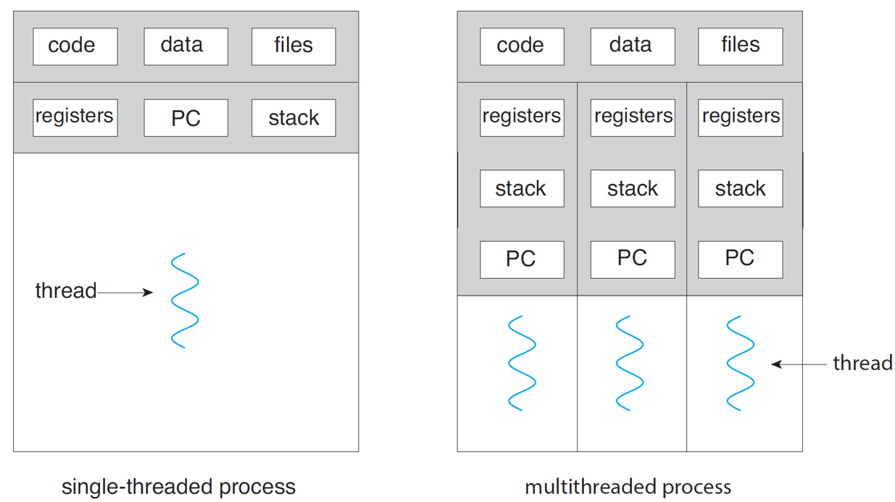
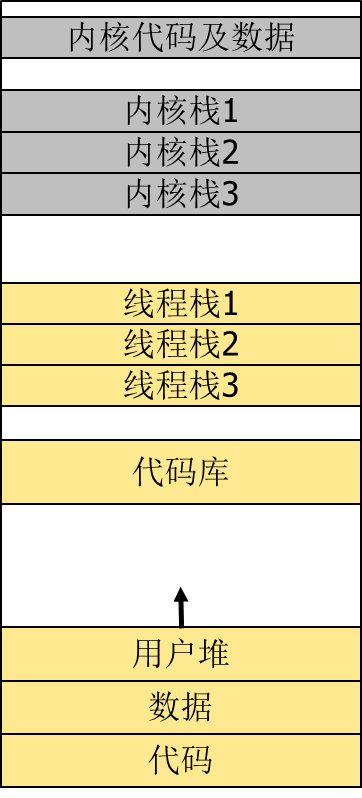
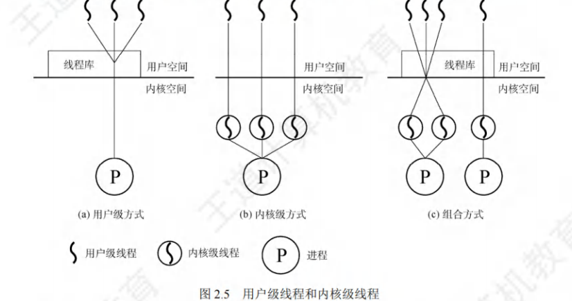
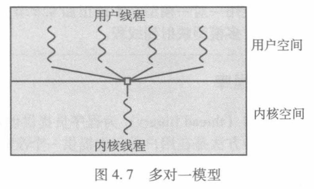
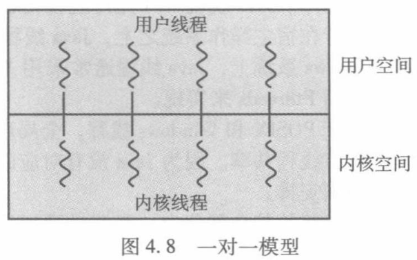
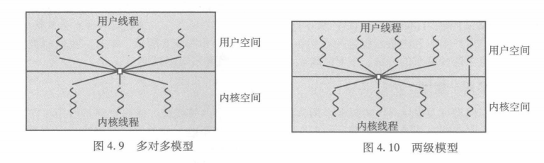

# Chapter4 线程

# 概述

## 动机

### 仅有进程的缺陷

1. 基本问题：内存空间独立

每个进程有自己独立的地址空间。

fork\(\) 创建的子进程与父进程“天然互不可见”，即使它们逻辑上相关（比如一个Web服务器处理多个请求），也无法直接共享变量或数据结构。

👉 这是设计上的安全机制，但也是协作的障碍。

2. 操作开销大

创建/销毁/切换进程涉及大量资源管理（尤其是内存映射、文件描述符复制等）。

上下文切换成本高（保存/恢复整个PCB \+ 地址空间切换）。

👉 “时空开销较大” = 时间慢 \+ 占用内存多。

3. 协作不方便

要想让两个进程共享数据？必须用 IPC（进程间通信）：

管道（pipe）

消息队列

共享内存（需手动同步！）

信号量、套接字等

👉 复杂、易错、性能差。

（先放在这）

### 引入线程概念

拥有资源的单位仍叫 进程 或 任务，所有资源（内存、文件、设备等）归进程所有，由其内部的所有线程共享

例如，启动应用程序 = 启动一个含单线程的进程：默认从 main\(\) 函数开始执行的是主线程。程序运行中可动态创建更多线程（如后台下载、UI响应、计算任务等）。

重型进程：等价于只有一个线程的任务。

线程不是取代进程，而是细化了进程的角色 —— 让进程专注“管资源”，让线程专注“跑代码”。这样既保留了资源隔离的安全性，又实现了高效并发和便捷共享。

### 多线程的优点

1. 响应性：进程在某个部分被阻塞的情况下被允许继续执行，对于用户界面尤其重要

2. 资源共享：天然共享资源，比进程通信方便，免除系统调用

3. 经济性：不涉及内存资源管理，创建开销小，切换开销低

4. 可扩展性：使单个进程可以利用多核架构的优势

## 线程定义

1. 线程是CPU使用的一个基本单元，包括：

    - 线程标识（TID）：唯一编号，类似 PID。

    - 程序计数器（PC）：指向当前要执行的指令。

    - 寄存器集：保存当前运算状态（如累加器、栈指针等）。

    - 栈（Stack）：存放局部变量、函数参数、返回地址等。

2. 同一进程内的所有线程共享：

    - 代码段（Text Segment）：程序指令本身。

    - 数据段（Data Segment）：全局变量、静态变量。（甚至借用全局指针也可互相访问局部变量）

    - 堆（Heap）：动态分配的内存（malloc/new）。

    - 打开的文件描述符：如 socket、文件句柄。

    - 其他 OS 资源：信号处理方式、当前工作目录、用户ID等。

线程拥有最少的私有状态（足以支撑独立运行），能与兄弟线程共享绝大部分资源 —— 这正是它比进程更高效、更适合协作的原因。

||进程|线程|
|---|---|---|
|调度|每次调度需上下文切换，开销大|- 同一进程中，线程切换不会引起进程切换 - 不同进程中，线程切换会引起进程切换|
|并发性|不同进程可并发|- 一个进程中多个线程可并发 - 不同进程中的线程也可并发|
|资源|进程是系统中拥有资源的基本单位|**不拥有**系统资源，但可以访问其隶属进程的系统资源|
|独立性|进程由独立的地址空间和资源|统一进程中的不同线程可共享进程的地址空间和资源，自高并发性|
|系统开销|开销大|开销小|

## 线程的状态

1. 线程状态：创建、就绪、运行、阻塞、终止；进程只剩创建、撤销、活动、挂起等状态。进程的挂起及终止将影响到其中的所有线程。

2. 进程有PCB，线程有TCB，TCB中包括线程标识符、状态、CPU寄存器值、优先级、指向PCB的指针等。

3. 线程的同步与通信与进程类似，但免除了很多通信的必要。

# 多线程进程

## 地址空间布局

1. 独立：内核栈和用户栈。每个线程都有自己的栈，用于存放临时数据；相应的，每个线程有内核栈。

2. 共享：其它区域。除栈以外的其它区域，进程内的所有栈共享；多个线程需要动态分配内存时，将在同一个堆上完成。在同一个进程中，各个线程共享绝大部分地址空间，并不拥有各自独立的地址空间。

## 多线程模型

操作系统如何管理线程？

1. 内核线程:由OS内核创建并管理（让操作系统内核亲自管 → 内核线程）

2. 用户线程:应用进程利用**线程库**提供创建、 同步、调度和管理\(不依赖系统调用,维护由应用进程完成\)

- 用户线程是“逻辑任务”，不能直接被 CPU 执行；

- 内核线程是“物理执行者”，数量有限（受硬件和内核限制）；CPU 只认识并调度“内核线程”（或叫“轻量级进程”，LWP）

- 所以我们需要一种机制，把大量的“逻辑任务”合理地安排给少量的“物理执行者”去完成，这就是“映射”或“挂靠”。“映射” = 用户线程通过某种机制（库\+系统调用）与内核线程建立绑定关系，从而获得被执行的机会。

下面来看不同的映射/挂载方式。

### 多对一

每个进程只被分配一个内核级进程。

仅当用户线程需要访问内核时，才将其映射到一个内核级进程，一次只允许一个线程映射。

优点：

1. 效率极高：线程切换完全在用户态完成，无需系统调用

2. 创建成本低：可以创建成千上万个用户线程，不消耗内核资源。

缺点：

1. 无法利用多核 → 内核只看到一个线程（KT1），所以即使有 8 核 CPU，也只能跑在一个核心上。

2. 阻塞即全死 → 如果 UT1 执行了阻塞系统调用（如 read\(\)），整个进程（包括 UT2\~UT4）都会被阻塞。

### 一对一

将每个用户级线程映射到一个内核级线程。

这两个线程数量相同，线程切换由内核完成。

优点：

1. 真正并发：多个线程可同时在多核上运行。

2. 阻塞安全：一个线程阻塞，不影响其他线程。

3. 简单直观：程序员不用关心底层映射，行为符合预期。

缺点：

1. 开销大：每创建一个用户线程，就要创建一个内核线程 → 占用内存、增加调度负担。

2. 数量受限：内核能支持的线程数有限（通常几千到几万），不适合超大规模并发场景。

### 多对多

将n个用户级线程映射到m个内核级线程**（n≥m\)。**

两级模型：多对多模型上允许绑定某个用户线程到一个内核进程

特点：克服多对一中模型并发度不高、一对一中一个用户线程开销大的缺点，同时拥有上面两者的优点。

