# Chapter5 CPU调度

本章重点是进程调度。

# 基本概念

## CPU\-IO突发周期

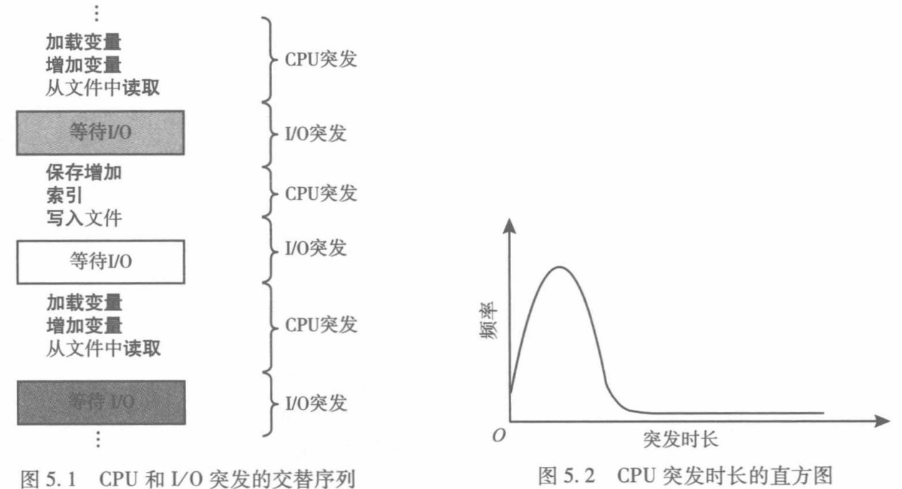

进程不是持续占用 CPU 的，而是“跑一会儿 → 等 I/O → 再跑一会儿 → 再等 I/O……”这样交替进行的。

统计表明，大多数CPU burst时间都比较短。

## CPU调度程序

进程执行:由CPU执行和I/O等待周期组成 ，考虑CPU调度\.当CPU空闲的时候，CPU调度程序从就绪队列中选择一个进程来执行。

CPU调度可能发生在下述四种情况下：

- 从运行状态转到等待状态

- 从运行状态转到就绪状态

- 从等待状态转到就绪状态（此进程完成了阻塞，进程被唤醒）

- 进程终止

## 抢占和非抢占调度

不论是抢占还是非抢占，运行\-\>等待以及程序终止时一定会触发调度。如果调度只能发生在第一种和第四种情况下，称为抢占式；否则称为非抢占式。

抢占有不同力度。对于分时系统：

- 只在定时器中断，时间片到期的情况下重新调度（从运行转就绪）

- 除了定时器中断，进程创建、唤醒等情况下，也借机重新调度（从等待转就绪）

- 甚至利用每次中断（或系统调用）的机会重新调度（从运行转就绪）

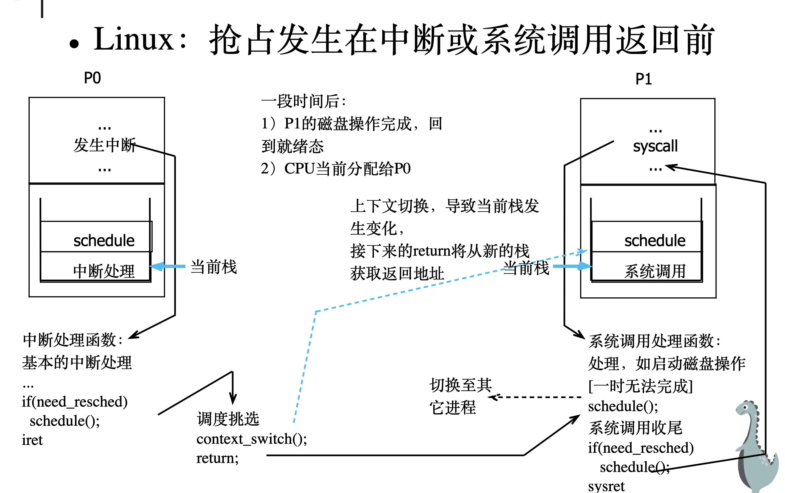

场景背景：进程 P0 正在运行，突然时间片到了（或者发生了其他硬件中断）。

1. 发生中断：

    - CPU 正在执行 P0 的代码，硬件定时器响了，CPU 暂停 P0，跳转到中断处理程序（Interrupt Handler）。

    - 进行的是**纵向保护**。CPU 把 P0 在**用户态**的现场（用户栈指针、用户 PC 等）压入了 P0 的**内核栈**中保存。

2. 中断处理与标记：

    - 内核执行基本的中断服务（比如更新系统时间）。

    - 关键判断：`if (need_resched)`。

        - 这是 Linux 的一个全局标记。如果调度器发现 P0 的时间片用完了，或者有更高优先级的进程（比如刚才睡醒的 P1）准备好了，就会把这个标记设为 `true`。

3. 调用 schedule\(\)：

    - 在中断返回前（`iret` 之前），内核检查到这个标记，于是调用 `schedule()` 函数。这就是分派程序的核心。`schedule()` 会运行调度算法，选出下一个该跑的进程（假设是 P1）。

4. 上下文切换 \(Context Switch\)：

    - 执行 `context_switch()`，图中虚线箭头指向右侧：

        1. 保存 P0 的内核现场到 P0 的 PCB： 此时 CPU 还在 P0 的内核态运行。内核会把当前 CPU 的各种关键寄存器（其中最核心的就是当前 P0 的内核栈指针 ESP/RSP，以及内核态的指令指针 PC 等）统统保存到 P0 的 PCB（在 Linux 中是 task\_struct 结构体）内部的特定字段中。

        2. 从 P1 的 PCB 加载内核现场： 接着，内核去调度队列里找到 P1 的 PCB。从 P1 的 PCB 中，读出 P1 上一次被挂起时所保存的寄存器状态（这其中就包含了 P1 当时的内核栈指针 ESP/RSP 和指令指针 PC）。

        3. 完成栈切换： 将刚才从 P1 的 PCB 里读出的内核栈指针，写到物理 CPU 的硬件栈指针寄存器（ESP/RSP）里。就在这覆写的一瞬间，所谓的“栈指针从 P0 的内核栈切换到了 P1 的内核栈”就真实发生了

    - CPU 的栈指针（ESP/RSP）从 P0 的内核栈切换到了 P1 的内核栈。这意味着，接下来的代码将从 P1 的视角继续执行。

5. 返回用户态：

    - 中断处理程序执行 `return` \(实际上是 `iret`\)。

    - 因为栈已经换了，这个 `return` 会从 P1 的栈 里弹出返回地址。

    - 结果：CPU 直接跳到了 P1 的用户空间代码 继续执行。P0 被挂起了。

> 💡 “被动剥夺”。P0 并没想放弃 CPU，是被定时器中断强行打断，并在中断退出前被“偷梁换柱”换成了 P1。
> 
> 

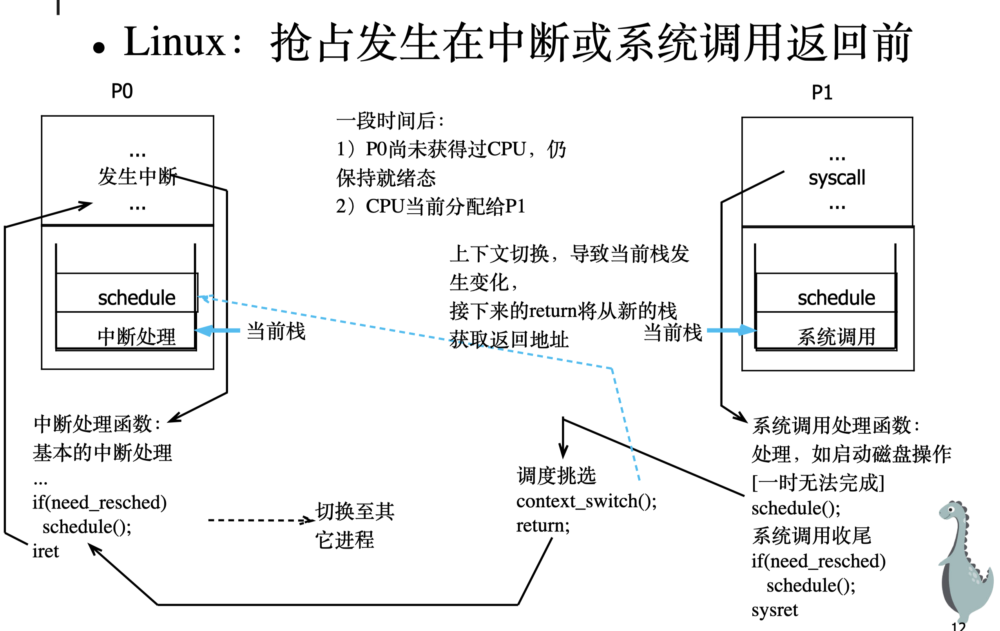

对于批处理系统：

- 进程创建、唤醒等情况下，可借机重新调度（从等待转就绪）。

## 分派程序

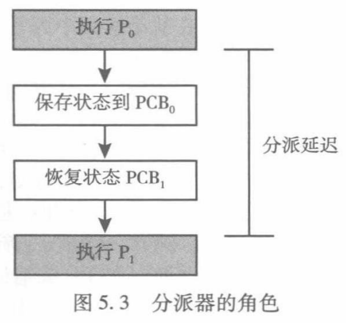

分派程序是一个模块，用来将 CPU 核控制交给由 CPU 调度程序选择的进程。这个功能包括：

- 切换上下文。

- 切换到用户模式。

- 跳转到用户程序的合适位置，以便继续执行程序。

分派程序应尽可能快，因为在每次上下文切换时都要使用。分派程序停止一个进程而启动另一个所需的时间称为**分派延迟**（dispatch latency），如图 5\.3 所示。

# 调度准则

CPU利用率：使CPU尽可能的忙碌

吞吐量：单位时间内运行完的进程数

周转时间：进程**从提交到运行结束**的时间间隔

- 平均周转时间（Ti为作业i的周转时间）T = \(T1 \+ T2 \+ \.\.\. \+ Tn\) / n

- 带权周转时间：作业**周转时间与实际运行时间的比**，平均带权周转时间（Wi为作业i的带权周转时间）W = \(W1 \+ W2 \+ \.\.\. \+ Wn\) / n

等待时间：进程在就绪队列中等待调度的时间总和

响应时间：等待时间\+估计运行时间

# 调度算法

## 先到先服务，First\-Come Fiset\-Served， FCFS（非抢占）

先请求CPU的进程优先分配到CPU。

缺点：

1. 平均等待时间很长。护航效果：所有进程都在等待一个大进程释放CPU，导致CPU和设备利用率降低。

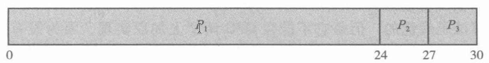

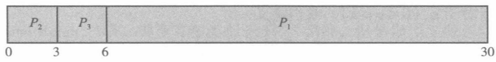

平均等待时间：\(0\+24\+27\)/3=17ms; \(6\+0\+3\)/3=3ms。

2. 所有其他进程都在等待一个大进程释放CPU，被称为护航效果。

## 最短作业优先，Shortest\-Job\-First， SJF（非抢占）

CPU变为空闲时，会被赋予给具有最短CPU突发的进程。对于给定的一组进程，SJF的平均等待时间最短。

但它不能在CPU调度上实现：短任务可能源源不断到来，对长作业不利，未考虑作业的紧迫程度。且无法知道每个进程的实际运行时间，只能靠估计。

非抢占的SJF，在新的需要更短时间的进程到来时，会允许需要更长CPU突发的进程执行完。而抢占的SJF，被称为最短剩余时间优先\(SRT\)。

## 最短剩余时间优先，Shortest\-Remaining\-Time\-first， SRT（抢占）

在新进程到达就绪队列的时候，检查一下剩余作业的剩余时间，选择需要最短CPU突发的进程

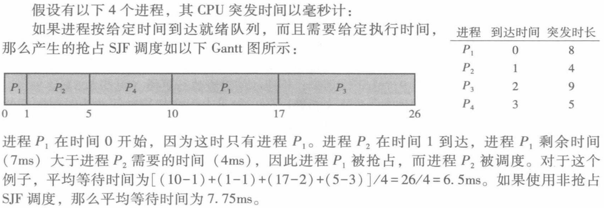

注意，跟踪此过程极其易错。

## 时间片轮转调度，Round\-Robin， RR（抢占）

> 到了一个时间段，就滚到队列末尾，下一个先上\.——ysz
> 
> 

在FCFS基础上引入时间片机制，通过定时器强制抢占CPU，实现进程公平轮流执行。

每个进程最多运行一个时间片（通常10\~100ms），若未完成则被中断并移至就绪队列尾部；若提前结束则立即切换下一进程。该机制确保响应性，适用于分时系统。

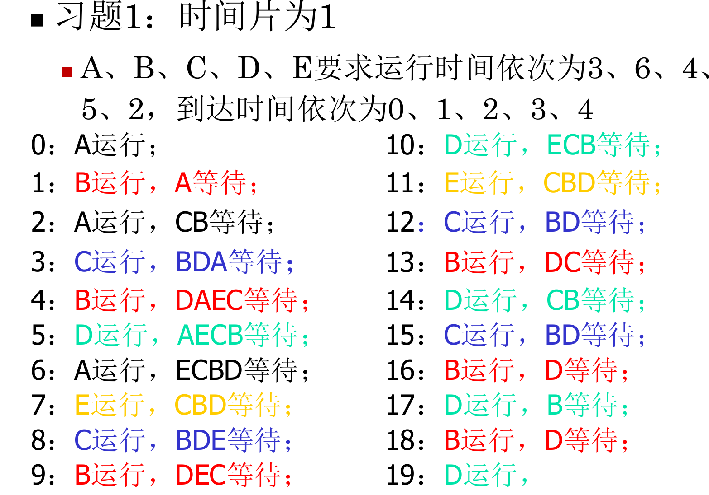

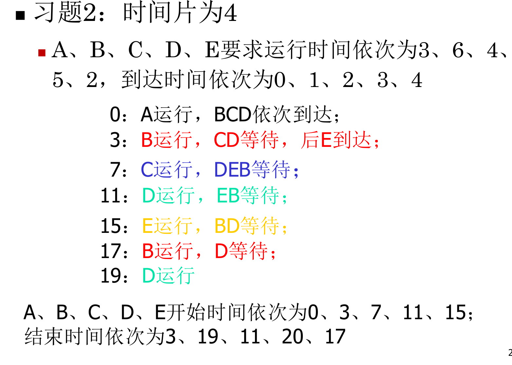

如果时间片太大，就退化成FCFS；太小，会导致频繁的上下文切换。

## 优先级调度，Priority\-scheduling（抢占/非抢占）

每个进程都有一个优先级与之关联，具有最高优先级的进程会分配给CPU；相同优先级的进程按FCFS调度，或者时间片轮转调度。

SJF算法也是优先级调度算法的特例，其优先级为下次预测的CPU突发的倒数。

优先级调度算法分为两种：

1. **非抢占式优先级调度算法：**一个进程运行时，即使有优先级更高的进程进入就绪队列，仍继续运行，直到因任务完成或等待时间让出CPU时间

2. **抢占式优先级调度算法：**一个进程运行时，若有优先级更高的进程进入就绪队列，立即暂停正在运行的进程，CPU分配给高优先级进程

问题：无穷阻塞/饥饿。某个低优先级进程会无穷等待CPU。一种解决方案是老化，逐渐增加在系统中等待很长时间的进程的优先级。

也就是说，优先级调度可以动态确定\.例如，可以通过CPU使用时间来创建衰减函数来动态调整。

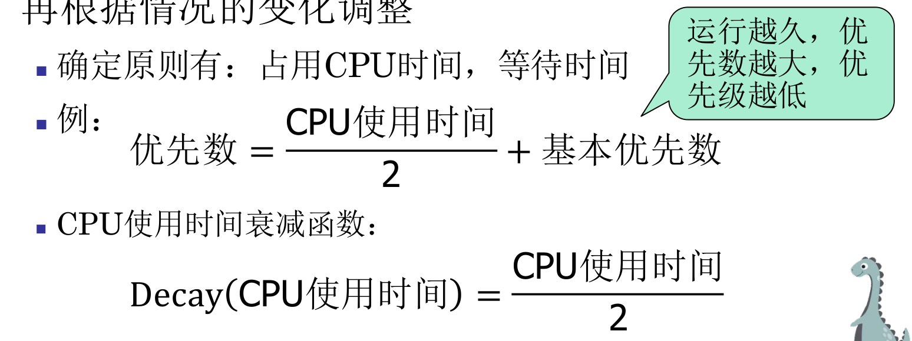

### 高响应比优先调度

## 多级队列调度，multilevel queue，MQ

为每个不同的优先级设置单独的队列，优先级调度只是将进程调度到最高优先级队列中。也常与循环结合。每个队列可能有自己的调度算法。

每个队列与低优先级队列相比具有绝对的优先级。

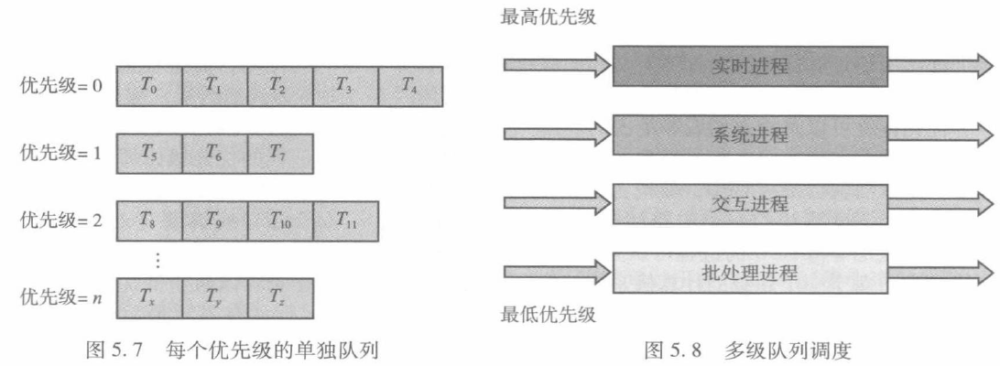

## 多级反馈队列调度，multilevel feedback queue，MFQ

MQ和MFQ的区别：前者的进程一辈子都在一个队列里，而后者允许进程在队列之间迁移。

使用CPU时间过多，会被移到更低级队列；在低级队列中等待过久，会被移到更高级队列。进程也会时不时离开就绪队列然后回来，这也可能导致优先级的变化。

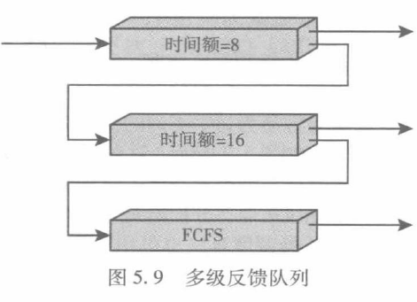

> 进程首先被添加到队列0内。队列0内的每个进程都有8ms的时间配额。如果一个进程不能在这一时间配额内完成，那么它就被移到队列1的尾部。
> 
> 如果队列0为空，队列1头部的进程会得到一个16ms的时间配额。如果它不能完成，那么将被抢占，并添加到队列2。
> 
> 只有当队列0和队列1为空时，队列2内的进程才可根据FCFS来运行。为了防止饥饿，在低优先级队列中等待太久的进程可能会逐渐移至高优先级队列。
> 
> 每个婴儿都是最爽的，年纪越大越tm死得惨。——KRS
> 
> 

高优先级队列都是RR，最低优先级队列才是FCFS：高优先级队列里装的是交互型、I/O密集型进程，它们的核心需求是快速响应，而不是高吞吐量；RR 配合短时间片，能保证每个进程在极短时间内得到 CPU。

# 多处理器调度

## 多处理器调度的方法

**非对称多处理器**：不同CPU有不同的任务。一些专用于内核态（调度决定、IO处理等），一些专用于用户态（执行用户代码）。缺点：只有一个处理和访问系统数据结构，无法数据共享。主服务器可能降低整体系统性能。

**对称多处理器（Symmetric Multi\-Processing，SMP）**：CPU都是对等的，每个处理器自调度：让每个处理器的调度程序检查调度队列并选择需要运行的线程。

都可执行任何一个任务，所有CPU共享内存和I/O设备。

提供了两种策略：

1. 所有线程可能在一个共同就绪队列。可能出现竞争，带来性能瓶颈。

    解决方法：使用某种形式的锁定保护公共就绪队列免受竞争影响。

    问题：对队列的所有访问都需要锁定所有权，访问共享队列有性能瓶颈。

2. 每个处理器可能有自己的私有进程队列，解决了潜在性能问题的影响\(支持SMP的系统上最常用的方法）

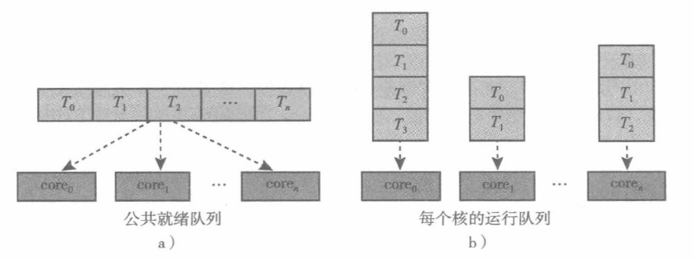

## 负载平衡

仅限各CPU有专属就绪队列的情况。负载平衡设法将负载平均分配到SMP系统的多有处理器。

两种方法（通常同时采用）：

1. 推迁移：系统周期性检查各CPU负载，发现不平衡则迁移

2. 拉迁移：CPU空闲则去忙碌CPU队列中拉取

平衡的判别标准各不相同。队列中进程数量的平衡，队列中进程优先级的平衡，其它。

## 处理器亲和性

### Warm cache

当一个进程运行在一个特定处理器上，进程最近的数据更新了处理器的缓存。因此，线程的后续内存访问通常通过缓存来满足（warm cache）。如果调度器为了“负载均衡”盲目把它拉到其它CPU，进程就面临“冷缓存”，必须花费巨大代价从主存重新拉取数据。

大多数SMP系统试图避免进程在处理器之间的转移，而是同一进程优先安排在统一CPU。

“试图”（但不保证）这么做时，称为软亲和性；负载平衡期间该进程也可迁移到其他处理器。硬亲和性则是死限制，通过系统调用实现。许多系统同时提供这两种。

### 内存架构的影响

CPU 越来越多，引出了 NUMA（非统一内存访问） 架构。在 NUMA（非统一内存访问）架构下，内存是物理上分布在不同 CPU 旁边的。

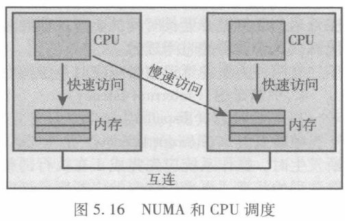

- 本地内存 vs 远程内存：

    - 快速访问：CPU 访问本地内存，速度很快。

    - 慢速访问：如果 CPU 需要访问“隔壁邻居 CPU”那边的内存（远程内存），必须通过“互连”线路，速度会变慢。

- 亲和性的作用：如果调度程序和内存分配算法能够识别NUMA并协同工作，它会把线程分配给离它需要的数据最近的 CPU，从而实现最快的内存访问。

## 案例

- 多级反馈队列调度（BSD）。

- 基于优先级的抢占式多任务调度（in Windows）。

- 多种调度方法结合（Solaris）。

- Linux：每个 CPU 一个就绪队列，对外提供公共框架，公共框架通过严格规定好的借口连接很多调度器。不同调度器有不同的优先级，比如 stop \> deadline \> realtime \> \.\.\.
操作系统会在一个特定的时机对进程进行检查，检查内容为当前进程是否运行时间过久。

