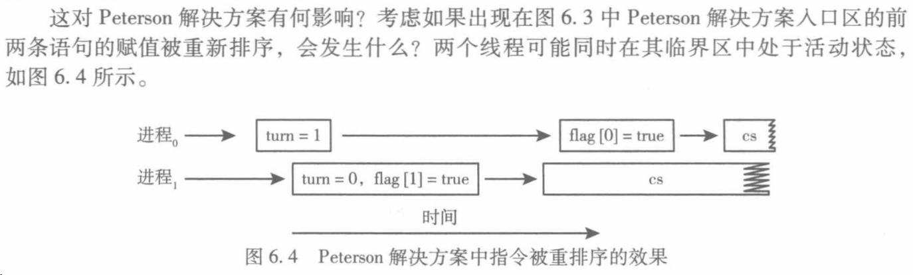
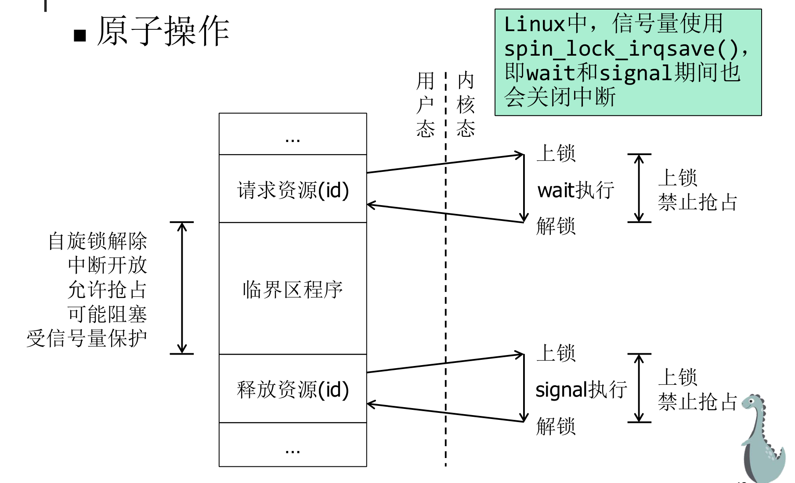

# Chapter6 同步工具

# 临界区

## 临界区的定义

临界区：多个需要共享数据的进程中，程序会读取、修改那些跟别人共享的数据（比如上一节的 `count` 变量，或者是共享文件、数据库记录）的代码段。

进入临界区前，每个进程应请求许可。实现这一请求的代码称为进入区（例如申请锁），临界区之后可以有退出区（例如释放锁）。其他代码称为剩余区（只属于自己的、私有的、不影响别人的安全代码）。

## 临界区问题解决方案的要求

临界区问题是要设计协议，以同步活动、共享数据。其解决方案应满足如下三点：

- 互斥：假定进程P在其临界区内执行，那么其他进程就不能在其临界区内执行

- 前进：如果没有进程在其临界区内执行，且有进程需要进入临界区，那么只有不在剩余区执行的进程可以参与决策，以选择下一个进入临界区的进程，且选择不能无限推迟

> （说人话，正在剩余区的进程不能阻止别人申请锁，也不能互相谦让导致死锁）
> 
> 

- 有限等待：在一个进程提出进入临界区的请求和该请求得到允许的时间内，其他进程进入临界区的次数必须是有限的


另一种说法：

- 空闲让进：若无进程处于临界区时，应允许一个进程进入临界区

- 忙则等待：当已有进程进入临界区，其他进程必须等待

- 有限等待：应保证要求进入临界区的进程在有限时间内进入临界区

- 让权等待：当进程不能进入自己的临界区时，应释放处理机


# 基于软件的解决方案：Peterson

## 方案

适用于两个进程交替地执行临界区与剩余区。

精髓在于“既表达意愿，又懂得谦让”。 它使用了两个关键道具：

1. **意愿牌 ****`flag`**** 数组**：用来向对方宣告“我**想**进卫生间”。

2. **谦让牌 ****`turn`**** 变量**：用来决定在两人同时想进时，“**谁优先**”。

代码里的第二句话：在自己表达完意愿后，立刻把优先权让给对方 \(`turn = j`\)。 如果双方同时让步，最后修改 `turn` 的人会覆盖前一个人的修改，从而打破僵局。

```C
enum boolean {false, true};
     boolean flag[2] = {false, false}; int turn;
P0： do {
        flag[0] = true; turn = 1;//宣告“我现在想用，但如果你也想用你先来”
        while (flag[1] && turn == 1); //对方也想用，而且谦让牌上也是对方的名字，就等着
        //P0的临界区代码CS0;
        flag[0] = false;
        //P0的其他代码;
    } while (true);
P1： do {
        flag[1] = true; turn = 0;
        while (flag[0] && turn == 0);
        //P1的临界区代码CS1;
        flag[1] = false;
        //P1的其他代码;
    } while (true);
```

## 局限性：乱序执行

如本节开头所述，Peterson 解决方案不能保证适用于现代计算机体系结构，主要原因是：  

为了提高系统性能，处理器和/或编译器可能会重新排序没有相互依赖的读写操作。

对于单线程应用程序，就程序正确性而言，这种重新排序并不重要，因为最终值与预期一致（这类似于平衡支票簿：执行贷方和借方操作的实际顺序并不重要，因为最终的余额仍然相同）。  

但是对于具有共享数据的多线程应用程序，指令的重新排序可能会导致不一致或意外的结果。


假设你写了这样两行非常简单的代码（对应图中线程 2 的逻辑）：

```Plain Text
x = 100;      // 步骤A：把重要数据写入内存
flag = true;  // 步骤B：举起旗子，告诉别人数据写好了
```

在你的逻辑里，A 永远在 B 前面发生。但在物理层面，CPU认为这两句话互不影响，就会在物理上先执行 B，再执行 A。这就叫**指令重新排序（Instruction Reordering）**。

现在，加入另一个 CPU 核心（线程 1）：

```Plain Text
while (!flag) ; // 步骤C：死等，直到旗子举起来
print x;        // 步骤D：打印重要数据
```

如果 CPU 偷偷打乱了线程 2 的顺序（先执行了 B `flag = true`，还没来得及把 `x = 100` 写回内存）：

1. 线程 1 瞬间看到了 `flag` 变成了 `true`，跳出死循环。

2. 线程 1 去内存里读 `x`。

3. 此时真正的 `x=100` 还在线程 2 的缓存里没写回内存，线程 1 读到了一个错误的旧数据（比如 0）！



# 基于硬件的解决方案

## 内存屏障

可以强制将内存中的任何修改传播到其它处理器的指令，确保内存修改对其他处理器上的运行进程可见。

```C
x = 100; 
memory_barrier(); // ⚠️ 硬件强制命令：停下！前面的指令没写完，后面的不准动！ 
flag = true;
```

当 CPU 执行到 `memory_barrier()` 时，它必须把 `x = 100` 强行刷新到所有 CPU 都能看见的主内存中，确保万无一失后，才允许执行 `flag = true`。 同理，线程 1 也要加屏障，确保是先看到旗子，再去看数据。

## 硬件指令

TAS \(`test_and_set`\) 和 CAS \(`compare_and_swap`\) 都是由 CPU 晶体管物理级别提供支持的特殊机器指令。

本质是“原子性”（Atomicity）。

### TAS指令

不管锁没锁，都把锁锁住。

```TypeScript
boolean test_and_set(boolean *target) {
    boolean rv = *target; // 1. 记住门现在的状态（rv）
    *target = true;       // 2. 毫不犹豫地把门锁死（设为true）
    return rv;            // 3. 告诉你刚才门的状态
}
```

```C
do {
    while (test_and_set(&lock))
        ; /* do nothing */
    /* critical section */
    lock = false;
    /* remainder section */
} while (true);
```

假设门一开始没锁（`lock = false`）。

- 线程 A 来了：执行 TAS，记住没锁（返回 false），然后瞬间把锁设为 true。因为返回了 false，`while(false)` 不成立，A 成功进入临界区！

- 就在同时，线程 B 也来了：B 必须等 A 的指令执行完。B 执行 TAS 时，门已经被 A 锁了。所以 B 记住的是锁了（返回 true），并再次设为 true。因为返回了 true，`while(true)` 成立，B 只能在门外疯狂原地打转（这叫**自旋锁 Spinlock**），直到 A 出来把 `lock` 改回 false。

### CAS指令，compare and set

```Java
int compare_and_swap(int *value, int expected, int new_value) {
    int temp = *value;                   // 1. 记住真实值
    if (*value == expected)              // 2. 核对：和我的预期一样吗？
        *value = new_value;              // 3. 一样才换成新值
    return temp;                         // 4. 返回真实值
}
```

### 有限等待互斥

代码有一个致命缺陷：可能饿死老实人（不满足有限等待）。谁抢到锁完全看运气，可能有的进程一直抢不到。


**解决：**

为了同时满足临界区问题的三个要求（互斥、进步、有限等待），出了一种改进的基于 CAS 硬件指令的算法。

```C++
while (true) {
    waiting[i] = true;
    key = 1;
    /* 进入区：尝试获取锁或等待别人传递权限 */
    while (waiting[i] && key == 1)
        key = compare_and_swap(&lock, 0, 1);
    waiting[i] = false;
    
    /* critical section (临界区)...... */
    
    /* 退出区：寻找下一个等待的进程 */
    j = (i + 1) % n;
    while ((j != i) && !waiting[j])
        j = (j + 1) % n;
    /* 如果没有其他进程在等待，则直接释放锁 */
    if (j == i)
        lock = 0;
    /* 否则，将权限直接传递给找到的下一个等待进程 */
    else
        waiting[j] = false;
    /* remainder section (剩余区) */
}
```

**`lock`**：公共锁（0=空闲，1=占用）。

**`waiting[n]`**：排队数组，记录每个进程是否在等待。

**解释：**

普通 CAS 算法会导致饥饿，是因为退出的进程直接把锁扔掉，大家重新无序哄抢。这个算法改变了解锁方式：

- 进程$P_i$离开临界区时，**不直接释放锁**。而是从自己身后的位置（$i+1$）开始，环形查看 `waiting` 数组。

- 找到排在自己后面**第一个**正在等待的进程$P_j$，直接把 `waiting[j]` 改为 `false`。这相当于把进入临界区的权限作为接力棒，直接给$P_j$免去了它再次抢锁的过程。

- **为何有限**：因为是按固定顺序单向“点名”，任何一个在排队的进程，最坏情况下只需等另外$n-1$个进程各进一次临界区，就绝对会轮到自己。**彻底杜绝“饥饿”**。

### 原子变量

提供对基本数据整形的原子操作。这些操作一般通过TAS CAS指令实现。例如对int类型变量实现原子的\+\+：

```C
void increment(atomic_int *v){
    int temp;
    do {
        temp = *v; // 读出原值
    } while(temp != compare_and_swap(v, temp, temp + 1));
    // 防止在读之后、CAS指令执行之前，temp又发生了改变
}
```

## 互斥锁\-自旋锁

### 自旋锁的实现原理与特点

经过封装的原子指令，比如 `acquire(lock)` 和 `release(lock)`。自旋锁是指当一个线程试图获取已经被别人拿走的锁时，它不会去睡觉等待，而是**死死盯着那把锁，在一个 ****`while`**** 循环里疯狂打转（自旋）**，直到锁被释放。

缺点：忙等待。等待期间会消耗CPU资源。所以临界区代码必须非常短。

优点：不必上下文切换。可避免在循环中使用原子指令从而频繁锁内存总线。

用途：保护临界区的资源，如变量或数据结构。

对于不同的CPU架构，可能也有不同的锁实现。


> 实例：“票据自旋锁”（Ticket Spinlock）。
> 
> **核心原理**：将一个 32 位整数拆成两半。**高 16 位是“取号机”**（发出的下一个号码），**低 16 位是“叫号显示屏”**（当前正在服务的号码）。
> 
> **上锁过程**：进门先领一个号（高 16 位加 1），然后坐在位子上盯着屏幕（低 16 位）。当屏幕上的数字等于你的号码时，你才能进去。
> 
> **解锁过程**：办完事出来，按一下按钮让屏幕数字加 1（低 16 位加 1），叫下一位。
> 
> 
> 
> **初始状态**：`lock = 0000 | 0000` \(Next=0, Owner=0\)。
> 
> - 这表示：0号窗口空闲，谁来谁就是0号。
> 
> **CPU A 领号**：
> 
> - 它读取 `Next` 发现是 0，于是给自己存下 `my_ticket = 0`。
> 
> - **原子操作**：将 `Next` 加 1。此时 `lock = 0001 | 0000`。
> 
> - **比对**：`my_ticket(0) == Owner(0)`。**匹配成功！** CPU A 直接进入临界区。
> 
> **CPU B 领号**（此时 A 还没出来）：
> 
> - 它读取 `Next` 发现是 1，于是存下 `my_ticket = 1`。
> 
> - **原子操作**：将 `Next` 加 1。此时 `lock = 0002 | 0000`。
> 
> - **比对**：`my_ticket(1) != Owner(0)`。**匹配失败。** CPU B 开始自旋等待。
> 
> **CPU A 释放锁**：
> 
> - 它完成工作，执行 `Owner++`。
> 
> - 此时 `lock = 0002 | 0001`。
> 
> **CPU B 获权**：
> 
> - CPU B 在自旋中再次读取 `Owner`，发现变成了 1。
> 
> - **比对**：`my_ticket(1) == Owner(1)`。**匹配成功！** CPU B 停止自旋，进入临界区。
> 
> 

### 空转的隐患与解决——持锁期间禁止抢占

隐患：如果进程拿着自旋锁时被其他进程抢占会怎样？

```Plain Text
进程A持有锁，正在临界区执行
  → 时间片到，CPU切换到进程B
  → 进程B也想acquire锁；但锁没开，进程B一直 while 空转
  → 直到时间片耗尽，再切回进程A
  → 进程A释放锁
```

**后果：**

- 互斥逻辑没有被破坏（正确性OK）

- 但进程B白白空转了整个时间片，**CPU被严重浪费**


改进方案：持锁期间禁止抢占。Linux 引入了抢占计数器 `preempt_count`：

Linux 的 CFS 调度器在**中断或系统调用返回时**才执行调度决策，而调度（中断返回）时会同时检查两个条件：

```Assembly language
need_resched == true    （有进程需要被调度）
AND
preempt_count == 0      （当前允许抢占）
```

只要持有自旋锁，`preempt_count` 就不为0，调度器就不会切走当前进程，从而**临界区期间不会发生进程切换**。

**仅限内核**：用户态程序没有权限调用 `preempt_disable()`，所以这个优化只在内核自旋锁中有效。

`preempt_count` 是CPU私有的,不存在保护。


### **中断处理程序引发的自我死锁与解决——持锁禁止中断**

一个进程正在 CPU 上拿着锁干活，突然来了一个硬件中断。CPU 被迫停下进程去处理中断。巧合的是，中断处理程序也想要这把锁。

**后果（死锁）**：中断程序在原地“自旋”等锁，而唯一能放锁的进程却被这个中断程序压在身下，根本没机会运行。

改进方案：如果临界资源会在中断上下文被访问，自旋锁需要同时禁止本CPU上的中断。


### 单CPU下的自旋锁——只需要禁止抢占

在单核机器上，如果进程 A 开始“自旋”等进程 B 释放锁，那就会 A 占着唯一的 CPU 在转圈，B 根本没机会运行去释放锁。

故单核时自旋锁只剩下：禁止抢占。只要 A 拿了锁且不被切走，它就是这块土地上唯一的王，数据自然是安全的。


## 信号量

### 定义

信号量S是个整型变量，除了初始化，只能通过标准原子操作`wait()`和`signal()`来访问。信号量计数代表可用资源的数量。

> wait操作最初称为P，signal操作最初称为V。在操作系统中，P、V操作是一种低级进程通信原语。
> 
> 

- 当进程需要申请资源时执行`wait`，从而减少计数

- 当释放资源时执行`signal`，增加计数

- 当计数变为0，已无可用资源，之后，执行`wait`的进程将阻塞，直到计数大于0

信号量分为计数信号量和二元信号量。计数信号量的值不受限制；二元信号量的值只能在0和1之间变化，也称为互斥锁。

```Assembly language
wait(S){
    while(S<=0);
    S--;
}

signal(S){
    S++;
}
```


### 信号量的实现

进程自己没有权限修改信号量，所有的数字加减都发生在受保护的内核态。

进程之间是互不信任且无法直接通信的。所以必须由 OS 在内核里记一个数（信号量），并给每个进程发一个“收据”（ID/句柄）。多个进程想访问同一个临界区，统一用**同一个Key**来创建/获取同一个信号量：

```Plain Text
进程A/B/C 都做同样的事：
  1. id = 创建信号量(预定义Key)   ← 通过Key找到同一个信号量
  2. 请求资源(id)                 ← 进临界区前"拿票"
  3. 执行临界区程序
  4. 释放资源(id)                 ← 出临界区后"还票"
```

回顾第3章，每种阻塞的原因都要准备一个阻塞队列，所以信号量就成为进程阻塞的原因和队列。信号量在内核里被定义为一个结构体：

```C
typedef struct {
    int value;           // 剩余资源数
    struct process *list; // 被阻塞的进程队列
} semaphore;
```

**`value`****：**

- 初始值 = 资源总数（比如互斥锁就初始化为1）

- `value > 0`：还有资源可用

- `value = 0`：资源刚好用完

- `value < 0`：有进程在等待（\|value\| = 等待进程数）

**`list`****（PCB队列）：**

- 当资源耗尽，来晚了的进程不自旋，而是**被阻塞**，把自己的PCB挂到这个队列上

- 等其他进程释放资源后，再从这个队列里唤醒一个

#### wait

`wait`的定义可以按下述方式理解：

```C++
wait(semaphore *S) {
    S->value--;//一上来就把value减1，必然有减为负的可能
    if (S->value < 0) {
        add this process to S->list;
        sleep();
    }
}
```

如果value\<0，意味着减1之前value\<=0，也就意味着资源枯竭，需要阻塞。

wait的实现依赖自旋锁。为了防止sleep\(\)的时候抱着自旋锁睡觉，约定：持有自旋锁的期间，绝对不能调用任何可能引起进程切换或睡眠的函数。

```C++
wait(semaphore *S) {
  acquire(spinlock);
  S->value--;
  if (S->value < 0) {
    add this process to S->list;
    release(spinlock);// 先释放锁，然后执行阻塞（重调度），进程暂停于此，阻塞期间不占据自旋锁，信号量可被其它进程访问
    sleep();
    acquire(spinlock);// 进程被唤醒，从刚才的暂停处（即重调度处）恢复执行，然后获取锁，与wait结尾处的释放锁对应
  }
  release(spinlock);
}
```


#### Signal

```C++
signal(semaphore *S) {
    S->value++;
    if (S->value <= 0) {
        remove a process P from S->list;
        wakeup(P);
    }
}
```

#### 信号量的保护

信号量用于维护临界区的秩序，但信号量被多个进程访问，自身也需要保护。

单CPU方案：可通过关中断实现。wait和signal执行很快，关中断没问题。

多CPU方案：信号量结构体中除了value、list，还有一个自旋锁。wait和signal执行期间，自旋锁上锁。

临界区的安全依赖信号量，信号量的安全依赖自旋锁，自旋锁的安全依赖特殊硬件指令。

Linux中，信号量不区分单核版本和多核版本，都使用自旋锁。

### 使用信号量

用户程序不能直接定义信号量，必须借助系统调用。（习题中忽略此问题）

信号量取值范围：1，表示没有进程使用临界资源；0，表示只有一个进程使用临界资源；\-n，表示 n 个进程等待使用临界资源。



#### **利用信号量实现进程互斥**

1. 为了让多个进程能够互斥地访问某个临界资源（即同一时刻只允许一个进程访问），我们需要为该资源设置一个**互斥信号量 S**。

- **初值设置**：`S = 1` （表示当前可用的资源数量为 1）。

    - **访问规则**：将各个进程访问该资源的**临界区**代码置于 `P(S)` 和 `V(S)` 操作之间。

2. 

**P 操作 \(Wait / 加锁\)**：进入临界区前执行 `P(S)`。

- 若资源未被访问，P 操作成功，进程进入临界区。

- 若资源已被其他进程占用，P 操作失败，当前进程主动**阻塞**，确保资源互斥。

**V 操作 \(Signal / 解锁\)**：退出临界区后执行 `V(S)`。

- 释放该临界资源。

- 若有其他进程因等待该资源而阻塞，则唤醒它。

## 互斥锁

互斥锁（Mutex）”是一个**抽象概念/目标**，它的意思是“保证同一时间只有一个人能进去”。我们一直在描述的互斥锁类型也称为自旋锁。

**工业界的视角（实战派）**：在真实的操作系统（如 Linux）和编程语言（如 C\+\+ pthreads）中，为了区分底层机制，人们把术语彻底分开了：

- **Spinlock \(自旋锁\)** 专指“忙等待”的锁。

- **Mutex \(互斥锁\)** 专指内部带有等待队列、拿不到就“去睡觉”的锁。

## 条件变量

互斥锁只解决了“互斥”问题（同一时刻只有一个线程能访问共享资源），但没有解决“同步”问题（线程之间如何按特定条件先后执行）。

**条件变量的作用**：解决“**线程等待某个特定条件成立**”的问题。它允许线程在条件不满足时挂起（阻塞），并释放 CPU，直到其他线程改变了状态并发出信号唤醒它。

> 条件变量必须和互斥锁配合使用喵
> 
> 

奇妙小比喻喵：

互斥锁是**试衣间的门锁**（保证里面只有一个人）。 条件变量是试衣间里的**缺货登记本**。如果进去发现没有你的尺码（条件不满足），你不能一直占着试衣间（死锁）或反复进出看有没有货（忙等待），而是应该把钥匙还回去，去旁边的**等待区**坐着（阻塞），等售货员把衣服拿来了（发出信号），你再重新排队拿钥匙进试衣间。


Remark 题目

对信号量S执行V操作**后**，下述选项正确的是\_\_B\_\_\_。

A\.  当S小于0时唤醒一个阻塞进程

B\.  当S小于等于0时唤醒一个阻塞进程

C\.  当S小于0时唤醒一个就绪进程

D\.  当S小于等于0时唤醒一个就绪进程

> 它之所以被唤醒，就是因为已经**成功获得了刚才你释放的那个名额**。
> 
> 

## 管程（monitor）

管程是一个把共享资源、操作函数和初始化代码封装好的软件模块，通过互斥访问保证管程内只有一个活跃线程运行。管程的互斥是通过编译器/解释器实现的，不需要再代码中手动操作信号量，使得并发代码更易于阅读和编写。

例：Java 中的 `synchronized` 关键字。


