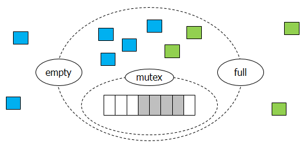
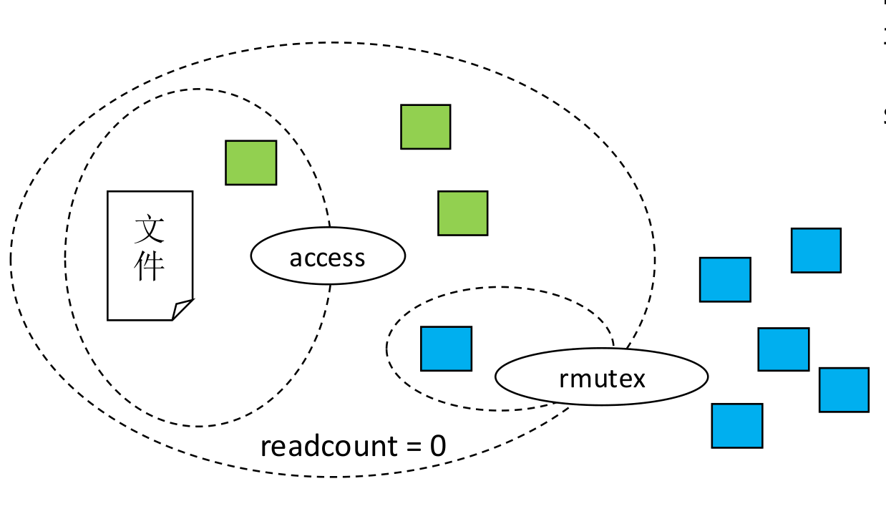
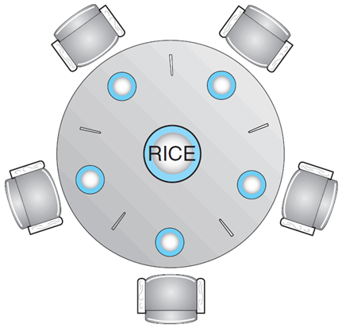
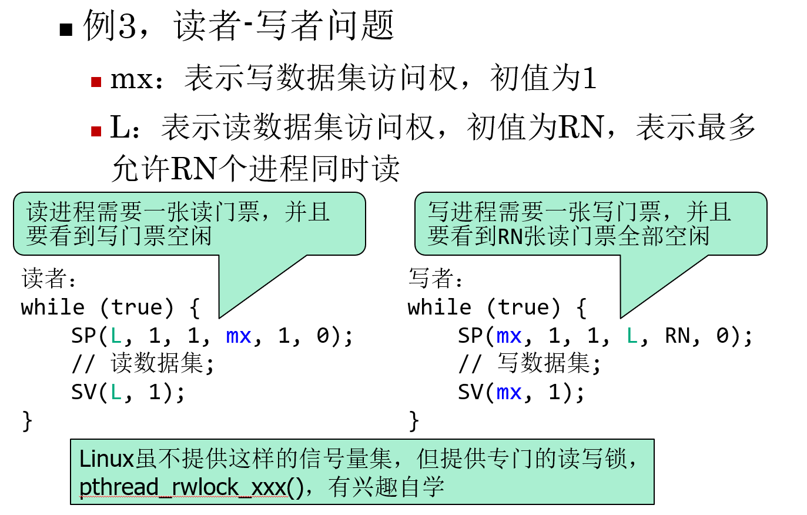
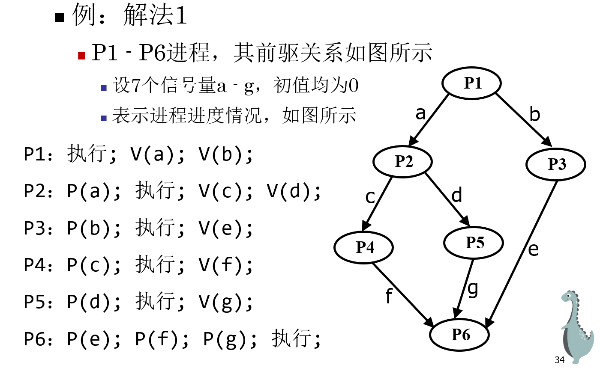
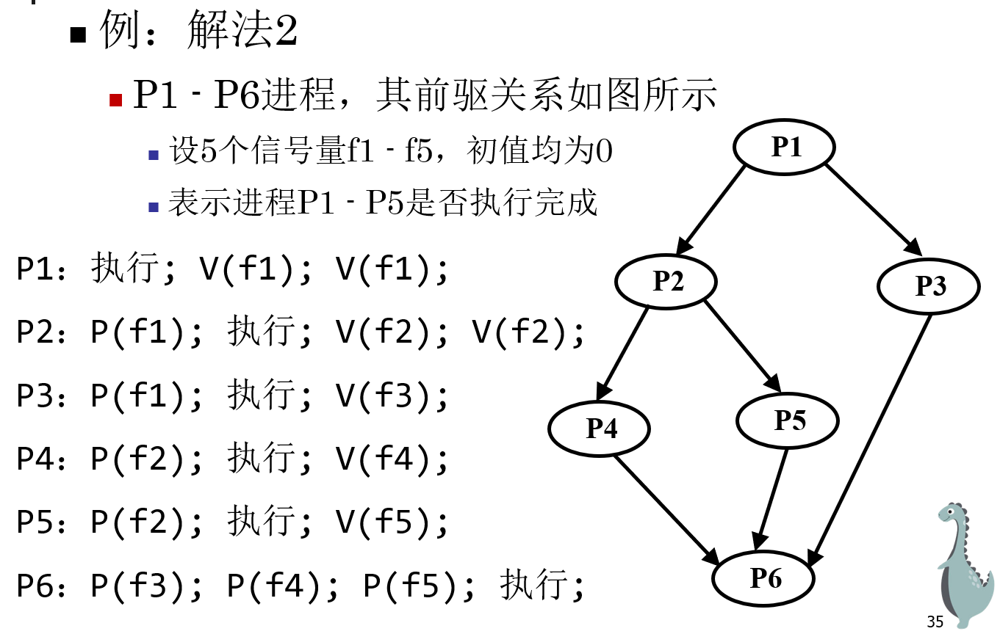

# Chapter7 同步实例

> mutex只有需要抢夺一个缓冲区的时候使用\.
> 
> 题型分两大类:
> 
> 1\.生产者消费者,生产者需要V信号提醒消费者干活;
> 
> 2\.读者写者,读者需要维护一个count,在最先count\+\+的时候开门,P一个信号;在最后count\-\-的时候关门,V这个信号\.
> 
> 

# 有限缓冲区问题

更知名的称谓：生产者\-消费者问题

一组生产者进程，一组消费者进程，共享n个有界缓冲区，池中每个缓冲区可存放一个产品。

生产者不断生产产品并放入缓冲池，消费者不断从缓冲池取出产品并消费。

解决方案：定义三个信号量。

`empty` 意为空缓冲区的数量，初值为 n；

`full` 意为已装货缓冲区的数量，初值为 0；

`mutex` 保证同一时间只有一个进程进入缓冲区，初值为 1。

若是处理不好，则容易造成死锁。

```C++
// producer
while(true) {
/* 生产一个产品 */
    wait(empty);
    wait(mutex);
/* 产品放入下一个缓冲区 */
    signal(mutex);
    signal(full);
}
// consumer
while(true) {
    wait(full);
    wait(mutex);
/* 从下个满缓冲区取出产品 */
    signal(mutex);
    signal(empty);
/* 消费产品 */
}
```



> 直观地看：
> 
> **蓝色块（生产者）想要进入缓冲区：**
> 
> 1. 生产者去问 `empty` 领一张票（`wait(empty)`）。如果缓冲区满了，`empty` 就没有票，生产者就在这里排队。
> 
> 2. 拿 `mutex` 这把唯一的钥匙（`wait(mutex)`）。
> 
> 3. 填充一个缓冲区。还回 `mutex` 钥匙（`signal(mutex)`）。`full` 桶加一（`signal(full)`）。
> 
> 

> Q\&A：（请zxz深入理解）
> 
> kiwiizzz：这个意思是不是,full记录了完成了多少个? 
> 
> xhkzdepartedream：就是n是货架数量，full是有几个填满的货架，empty是有几个空的；消费者会wait full，wait的实现里面就有\-\-的操作
> 
> 

无论生产者还是消费者，如果先请求mutex，可能造成死锁。

例如，此时缓冲区已经满了（`empty = 0`）：

- 生产者拿到了 `mutex` 锁，然后发现没位子了，于是它在 `wait(empty)` 处阻塞挂起。注意，此时它手里还紧紧攥着 `mutex` 锁没放。

- 消费者：看到有货，想去取货。它执行 `wait(mutex)`，但发现锁被生产者拿着呢，于是消费者也阻塞挂起，等待 `mutex` 释放。

为了避免这种“拿着锁等资源”的情况，正确的逻辑必须是：**先看资源，再抢锁。**（先`wait empty&full` ,然后再`wait mutex`）

# 读者写者问题

问题详情：一个数据集被多个进程共享；允许多个进程同时读，但写进程必须独占数据集。

规则：

读\-读 \(Read\-Read\)：允许。大家一起看文件没问题。

读\-写 \(Read\-Write\)：互斥。有人在读，写者不能动；有人在写，读者不能进。

写\-写 \(Write\-Write\)：互斥。防止数据写乱。

两种策略：读者优先/写者优先。

## 读者优先



1. **`access`**** \(或称 ****`wmutex`****\)**：控制对数据集的访问（写者和第一个读者抢这把锁）。

2. **`rmutex`**：专门保护 `readcount` 这个全局变量的互斥锁。

3. **`readcount`**：记录当前有多少个读者正在读。

```C++
while (true) {//读者
    wait(rmutex);
    readcount++;   
    if (readcount==1) wait(access);   
    signal(rmutex);   
    // 执行读操作   
    wait(rmutex); readcount--;   
    if (readcount==0) signal(access);   
    signal(rmutex); 
} 
while(true){//写者
    wait(access);
    signal(access);    
}
```

> 读者侧解读：
> 
> **Step 1:** 先抢 `rmutex`。因为我们要修改 `readcount`，不能让其他读者同时改。
> 
> **Step 2 \(第一个读者\):** 如果 `readcount == 1`，说明我是第一个来的。我要负责执行 `wait(access)`，把门锁死，不让写者进来。
> 
> **Step 3:** 释放 `rmutex`，开始**快乐地**阅读。
> 
> **Step 4 \(退场\):** 读完后再抢 `rmutex`，执行 `readcount--`。
> 
> **Step 5 \(最后一个读者\):** 如果 `readcount == 0`，说明我是最后一个走的。我要负责执行 `signal(access)`，把门打开，让写者可以进来。
> 
> 

只要有一个读者在读，后续源源不断来的新读者都可以通过 `readcount > 0` 的判断直接进入（不需要抢 `access`）。 这就导致：**只要读者队列不空，****写者就永远拿不到 ****`access`**** 锁****。** 

## 写者优先

目标：只要有一个写者想写，它就应该能阻止后续新来的读者进入，直到它写完。

在外面再套一层rqentrance。核心变量：

- `rqentrance` \(信号量\)：初始为 1。它像是一个走廊的入口。

- `access` \(信号量\)：初始为 1。代表数据集的最终访问权。

- `readcount`：依然记录当前有多少读者在里面。

```C++
while (true) {//读者
  wait(rqentrance);
  wait(rmutex);
  readcount++;
  if (readcount==1) wait(access);
  signal(rmutex);
  signal(rqentrance);
  // 执行读操作
  wait(rmutex);
  readcount--;
  if (readcount==0) signal(access);
  signal(rmutex);
}
 
while (true) {//写者
  wait(rqentrance);
  wait(access);
  // 执行写操作
  signal(access);
  signal(rqentrance);
}
```

核心区别一览:

# 哲学家进餐问题

问题描述：五个玉手镯坐在一个圆桌前吃饭，每人左手侧和右手侧各有一根筷子，故整张桌子上只有五根筷子。当某个玉手镯感到饥饿时，他会拿起左右两侧各一根筷子，只有两根筷子都被拿起时才开始吃饭，吃饱了就放回原处。



> Q：为什么 ppt 上说最多支持四个玉手镯同时吃饭？
> 
> A：这是一个补丁式的解决方案。为了防止所有人同时拿起左侧的筷子而导致死锁，规定在此规则下，最多只能有四个人同时请求进餐（拿起筷子），防止第五根筷子也被同时拿起。
> 
> 还有更多解决方案：
> 
> 1. 规定**奇数号**的哲学家：先拿左手，再拿右手；规定**偶数号**的哲学家：先拿右手，再拿左手。\(特殊的,**我们可以只规定第n个哲学家反向即可,但一定需要一个人反向**\)
> 
> 2. 加一把全局的**大锁**（互斥信号量 `mutex`）。哲学家饿了，先抢 `mutex` 锁住整个桌子。检查左手和右手**同时**有筷子吗？如果有，同时拿起两根；如果没有，就把 `mutex` 放开，继续等。
> 
> 

# 更多信号量

## AND型信号量

将进程需要的多类资源，一次性全部分配给进程，使用完后再一起释放。只要有一个资源无法分配，所有资源都不分配。

AND型信号量的P原语为SP或Swait。

```C++

SP(S1, S2, ..., Sn) {
  if(S1>=1 && S2>=1 && ... && Sn>=1)
  for(i=1; i<=n; i++) Si=Si-1;//表示成功占用资源
  else {
  // 将进程插入第一个小于1的信号量的等待队列;
  // 将进程的程序计数器置为SP的第一条指令(goto SP)
  }
}
```

Goto SP的意思是重新检查所有的信号量，保证了进程要么处于“没有拿到任何资源”的状态，要么处于“拿到了全部所需资源”的状态。

> 例如，进程需要资源 A 和 B。此时 A=1 但 B=0（被别人占了）。执行 SP：
> 
> 

> - `if(A>=1 && B>=1)` 判断为 False。
> 
> - 进程进入 `else` 分支。
> 
> 挂起与阻塞：进程被放入资源 B 的等待队列。
> 
> 唤醒：当别人释放了 B，系统把该进程唤醒。
> 
> - 如果进程醒来后直接往下走（跳过 SP），那它其实并没有扣减资源，逻辑就乱了。
> 
> - 如果进程醒来后只检查 B，它可能没发现此时 A 已经被别人抢走了。
> 
> - 所以必须把 PC 拨回到 SP 的开头，重新检查所有的信号量。
> 
> 

```C++

SV(S1, S2, ..., Sn) {
  for(i=1; i<=n; i++) {
  Si=Si+1;
  //唤醒Si等待队列上的所有进程，插入就绪队列;
  }
}
```

唤醒所有进程：一个进程可能同时需要多种资源，如果只唤醒一个，它可能检查后因为其它资源仍被占用而再次睡眠。而其它进程只差这一个资源就可运行了，可能导致明明有资源却没进程运行，导致资源浪费。

## 一般信号量集

是AND型信号量的扩充。

基本思想：

1. 可以一次申请多类资源，每类资源可以申请多个

2. 申请时可以要求资源的数量不低于某个下限值

3. 不满足申请要求时，不进行分配

d\_i \(Demand\)：申请量。这是你真正要从仓库里拿走的数量。

t\_i \(Threshold\)：下限值/阈值。这是仓库里至少得剩下的数量。只有当资源 Si≥ti 时，系统才允许你进行分配。

```C++
SP(S1, t1, d1, S2, t2, d2, ..., Sn, tn, dn) {
  /*ti为下限值，di为资源申请量*/
    if(S1>=t1 && S1>=d1 && … && Sn>=tn && Sn>=dn)
        for (i=1; i<=n; i++)
            Si = Si - di;
    else {
    //将进程插入第一个不满足要求的信号量的等待队列;
    //将进程的程序计数器置为SP的第一条指令;
    }
}
SV(S1, d1, S2, d2, ..., Sn, dn) {
  for (i=1; i<=n; i++) {
    Si=Si+di;
    //唤醒Si等待队列上的所有进程，插入就绪队列;
  }
}
```



# 睡眠理发师问题

有一位理发师，一把理发椅，N把等候的椅子。如果没有顾客，理发师睡眠，当一个顾客到来时叫醒理发师。若理发师正在理发时又有顾客来，那么有空椅子就坐下，否则离开。

信号量的定义：

customer，表示等候理发的顾客（不包括正在理发的），初值为0

barber，表示理发师是否空闲，初值为1

变量count，非信号量，表示等候的顾客数量，初值为0

mutex，用于互斥访问count，初值为1

> custermor和count总是需要同时操作，但OS 需要 `count` 来让顾客做“决策”（进还是走），需要 `customer` 来让理发师做“休息”（睡还是醒）。
> 
> 


# 使用信号量实现前驱关系

使用信号量实现前驱关系（形成 DAG）：用于处理不同进程间存在依赖关系的情况。





# 习题

## 

三个进程P1、P2、P3互斥使用一个包含N（N\>0）个单元的缓冲区。

P1每次用`produce()`生成一个正整数并用`put()`送入缓冲区某一空单元中；

P2每次用`getodd()`从该缓冲区中取出一个奇数并用`countodd()`统计奇数个数；

P3每次用`geteven()`从该缓冲区中取出一个偶数并用`counteven()`统计偶数个数。

请用信号量机制实现这三个进程的同步与互斥活动，并说明所定义的信号量含义。要求用伪代码编写。

```C++
semaphore empty = N;    // 缓冲区空位
semaphore odd = 0;      // 缓冲区中的奇数数量
semaphore even = 0;     // 缓冲区中的偶数数量
semaphore mutex = 1;    // 互斥信号量

main() {
    cobegin
    {
        // 进程 P1: 生产者
        Process P1() {
            while(true) {
                number = produce();
                P(empty);      // 等待空位
                P(mutex);      // 进入临界区
                put();         // 将数字放入缓冲区
                V(mutex);      // 退出临界区
                if (number % 2 == 0) V(even); // 通知偶数消费者
                else V(odd);                  // 通知奇数消费者
            }
        }

        // 进程 P2: 奇数消费者
        Process P2() {
            while(true) {
                P(odd);        // 等待奇数
                P(mutex);      // 进入临界区
                getodd();      // 从缓冲区取奇数
                V(mutex);      // 退出临界区
                V(empty);      // 释放一个空位
                countodd();
            }
        }

        // 进程 P3: 偶数消费者
        Process P3() {
            while(true) {
                P(even);       // 等待偶数
                P(mutex);      // 进入临界区
                geteven();     // 从缓冲区取偶数
                V(mutex);      // 退出临界区
                V(empty);      // 释放一个空位
                counteven();
            }
        }
    }
    coend
}
```

## 

某办公楼旁有一个共享电动自行车停车场，停车场分为 A 区和 B 区（假设两个区域容量足够大）。

三类操作如下：

1. 停车者（Parker）：有人骑车到达后需要停车。

    - 若车辆剩余电量 \> 0\.3，则停入 A 区；

    - 否则，停入 B 区。

2. 取车者（Picker）：有人需要从 A 区取走一辆电动车骑走。

    - 若 A 区有车可取，则取走；

    - 若 A 区没有车，则等待，直到有车为止。

3. 管理员（Administrator）：当有车被停入 B 区时，管理员会监测 B 区的车辆数量。

    - 当 B 区车辆数达到 10 辆时，管理员对这 10 辆车进行充电（共 10 个充电桩）；

    - 充电期间不再监测 B 区的停车数量；

    - 充电完成后，将这 10 辆车送往 A 区；

    - 之后管理员继续监测 B 区的停车和数量。

**要求：**

请为以上三类操作编写**同步程序**，注意停车场的所有操作必须**互斥**执行（即同一时刻只能有一个操作在进行）。


```C++
// ysz
SIGNAL: mutex,AE,full
parker():
  P(mutex);
  if(bat > 0.3){
      V(AE);
    }
  else{
    count++;
    if(count == 10){
        V(full);
      }
     }
  V(mutex);
  


picker():
  P(AE);
  P(mutex);
  getcar();
  V(mutex);


admin():
  P(full);
  P(mutex);
      count -= 10;
      charge();
      n = 10;
      while(n--){
        V(AE);
        }
      V(mutex);
      return;
    }
  V(mutex);
```

```C++
// yyl
// 全局信号量与变量
sem_t op_mutex;
int b;
sem_t cnt_a;
sem_t need_charge;

Process Parker(float battery){
        wait(op_mutex);
        if(battery > 0.3){
                park_to_a();
                signal(cnt_a);
        }
        else{
                park_to_b();
                b++;
                if(b % 10 == 0) signal(need_charge);
        }
        signal(op_mutex);
}

Process Picker(){
        wait(cnt_a);
        wait(op_mutex);
        get_bike_from_a();
        signal(op_mutex);
}

Process Administrator(){
        wait(need_charge); // 只处理请求，但不signal增加请求，那是Parker的事
        wait(op_mutex);
        b -= 10;
        signal(op_mutex); // 防止充电的时候别人都动不了
        
        charge_the_bikes();

        wait(op_mutex);
        return_the_bikes();
        for i in range(10) signal(cnt_a);
        signal(op_mutex);
}
```

> claude说charge\(\)在mutex的外面,并且不需要count\_mutex,why?
> 
> 


# 代码题总结

1. 你需要做数学运算或逻辑判断吗？ → 选变量 \(int\)。**信号量不可读。**

2. 你需要让进程“因为没有东西而睡着”吗？ → 选信号量 \(sem\_t\)。

3. 永远先拿“资源”，后拿“互斥锁”。互斥锁保护的范围尽可能小。

4. **确认资源 \-\> 加锁 \-\> 办事 \-\> 解锁 \-\> 释放信号告诉别人资源来了**

