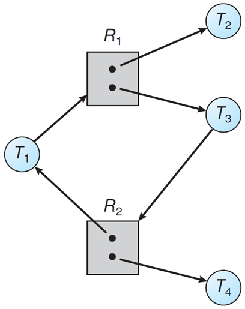
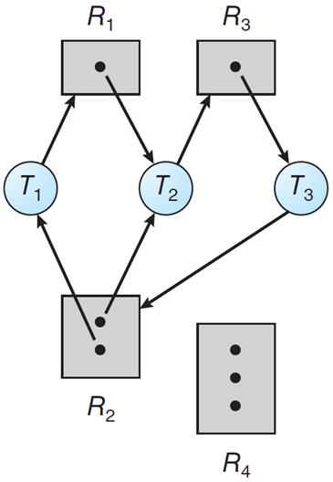
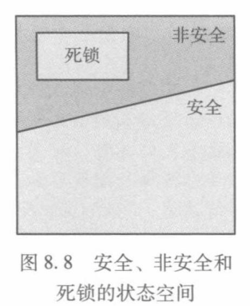
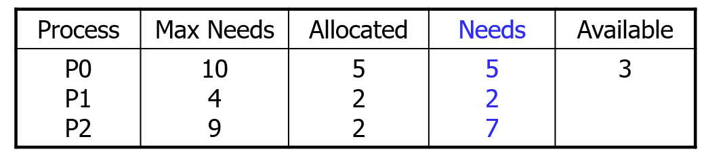
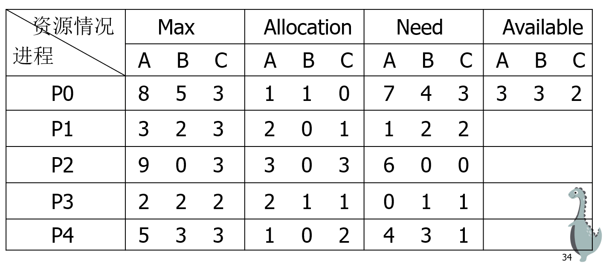

# Chapter8 死锁

# 系统模型

计算机系统中的资源种类繁多：CPU周期，内存空间，I/O设备，文件，共享数据，程序进展状态……

资源分为物理资源/逻辑资源。每个进程按申请 \- 使用 \- 释放方式利用资源。

按照是否可剥夺分类：

- 可剥夺：某进程获得后，该资源可被其他进程或系统剥夺，如CPU，存储器

- 不可剥夺：分配后不能强行收回，只能等进程用完主动释放，如打印机、读卡机

可剥夺资源不会导致死锁，本章仅关注不可剥夺资源。

按有效期分类：

- 永久性：可重复使用的资源，如打印机

- 临时性：程序运行过程中产生，被短暂使用后便无用，如消息

永久性和临时性资源都可能导致死锁。

# 死锁的特征

死锁的基本概念：因资源竞争而形成的僵局，你等我、我等你，从而卡死。

资源分类：

- **可剥夺**：某进程获得后可被其他进程或系统剥夺、打断，如 CPU、Memory，不会导致死锁；

- **不可剥夺**：分配后只能等待进程主动释放的资源，如打印机、读卡机，有可能会导致死锁。在讨论死锁时，本章只考虑后者。

永久性（外设）和临时性（消息）资源都有可能导致死锁。

死锁产生的原因：多个进程竞争资源，且申请资源与释放资源的顺序不当，一定是因为代码存在问题。

死锁的必要条件：互斥、占有并等待、非抢占、循环等待（等待资源的进程之间存在环）。

## 资源分配图

E被分为两个部分

请求边：有向边Ti → Rj

分配边：有向边 Rj → Tbi

> 如果图中没有（有向）环，那么系统就没有进程死锁；如果图中有环，那么可能存在死锁。
> 
> 

# 处理死锁

## 忽略

鸵鸟策略，视而不见。由于检测死锁开销太大，现代通用操作系统（如 Linux、Windows）处理用户态死锁通常采用此法，让用户自己杀进程 。

- **为什么？** 代价问题。在操作系统底层实现死锁预防或检测的开销极高，会严重拖慢系统吞吐量。而实际上死锁发生的频率相对较低。

- **谁来擦屁股？** 内核把防范死锁的责任直接推给了**应用程序开发者**和**内核驱动开发者**。如果你在写并发程序（比如在内核中写系统调用或者修改文件系统），你需要自己通过规范的加锁逻辑来避免死锁，系统不会帮你兜底。

## 预防

通过破坏产生死锁的必要条件来防止发生死锁。

对应：

- “一次性申请所有资源”破坏了“占有并等待”

- “有序资源分配法”破坏了“循环等待”

“死锁预防”的核心逻辑：**破坏产生死锁的四个必要条件之一**。

### 破坏“互斥” \(Mutual Exclusion\)

- 做法：让资源可以共享。

- 现实：基本行不通。像打印机、临界区变量、硬件寄存器这种资源，天生就是排他的。

### 破坏“占有并等待” \(Hold and Wait\)

- 做法：

    - *静态分配*：进程在运行前，一次性申请（声明）好所有需要的资源（一个局部时间窗口），或者只有没占用资源时才能分配资源。只要差一个，就什么都不拿，乖乖等着。

    - *无占有申请*：进程在申请新资源前，必须先释放掉手里所有的资源。

- 代价：资源利用率极低，非常容易导致饥饿（一个需要很多资源的进程可能永远凑不齐）。

### 破坏“非抢占” \(No Preemption\)

- 做法：如果一个进程占有资源并申请另一个不能立即分配的资源，那么其现已分配的资源都可被抢占。

- 适用场景：只适用于状态可以被轻易保存和恢复的资源（比如 CPU 寄存器上下文、内存页）。

- 局限：

    - 能造成死锁的本就是不可剥夺资源，要将原本认为不可剥夺的资源改造为可剥夺，对于大多数资源并不适用

    - 实现较复杂，释放已获得资源可能造成前一段工作的失效，不可接受

    - 重复申请和释放资源会增加系统开销，降低系统吞吐量

### 破坏“循环等待” \(Circular Wait\) —— Lock Ordering

- 有序资源分配法：给系统里的所有资源排个序（编号 1, 2, 3, \.\.\. , N）。规定所有进程必须严格按照序号递增的顺序去申请资源。

- 为什么有效：如果大家都必须先拿小号再拿大号，就绝对不可能出现“A拿了2等1，B拿了1等2”的环路。

- 局限性：

    - 要求资源序号相对稳定，限制了新资源的增加

    - 若使用资源顺序与规定顺序不同，造成浪费

    - 使用资源的次序限制用户编程

> 这正是底层系统编程（比如 Linux 内核或 xv6 开发）中最常见的防死锁规范——Lock Ordering（锁排序）。只要在整个内核中约定好获取锁的层级顺序，就能从根本上阻断循环等待。
> 
> 

## 避免

允许动态申请资源，但在分配前通过算法预判，如果分配后系统为安全状态则同意，反之让进程等待。

死锁的避免是一类算法。在资源动态分配的过程中，通过特定的算法分配各项资源，防止系统进入不安全状态以避免死锁。其产生的时代背景是软件系统非常落后，没有进程间合作、同步、通信，也没有诸如信号量的逻辑资源，条件非常恶劣，所以不得不通过算法避免资源的不合理分配。

触发时机：申请资源时。

> 死锁的避免实现有难度，仅限特定年代特定场合的计算机。
> 
> 

### 安全状态

只要系统能找到**至少一条**让所有进程都能顺利执行完毕的路径（即**安全序列 Safe Sequence**），系统就是安全的。

形式化地，线程序列 $\langle T_1, T_2, \cdots, T_n \rangle$ 在当前分配状态下为安全序列是指：

对于每个 $T_i$ ，$T_i$  仍然可以申请的资源数 小于 当前可用资源加上所有线程 $T_j$（其中 $j < i$）所占有的资源。

在这种情况下，线程 $T_i$ 需要的资源即使不能立即可用，线程 $T_i$ 可以等待直到所有线程 $T_j$ 释放资源。当它们完成时，$T_i$  可得到需要的所有资源，完成给定任务，返回分配的资源，最后终止。

当 $T_i$ 终止时，$T_{i+1}$ 可得到它需要的资源，如此进行。如果没有这样的序列存在，那么系统状态就是非安全的（unsafe）。

> 例如：某资源一共12份，三个进程P0\-P2
> 
> 
> 
> 还剩3个，如果先给P1，那它不仅要把我给的2个还回来，它还可以把已经拿了的2个吐出来。——KRS
> 
> 

### 银行家算法

每一个进程必须事先声明资源最大使用量。当用户申请一组资源时，系统必须确定这些资源的分配是否仍会使系统处于安全状态，如果是就可分配资源，否则等待。

基于前述安全状态判别，前面的安全状态判别是在当前局面下，盘算可能的活路。银行家算法假定同意用户申请，对假想的分配后的局面执行安全状态判别。

#### 数据结构

需要提供如下信息。例：系统中有5个进程P0 \- P4，三种类型的资源A、B、C，数量分别为12、5、9。

形式化地，系统需要维护四个核心变量来记录当前的资源分配状态。假设有 n 个进程（线程），m 种资源类型：

- Available（可用资源向量）：长度为 m。系统当前手里还剩多少闲置资源。

- Max（最大需求矩阵）：$n \times m$ 矩阵。每个进程“声明”的最多需要的资源量。

- Allocation（已分配矩阵）：$n \times m$ 矩阵。每个进程当前已经拿到了多少资源。

- Need（需求矩阵）：$n \times m$ 矩阵。每个进程还差多少资源才能完工。

数学关系：$\text{Need}_{i,j} = \text{Max}_{i,j} - \text{Allocation}_{i,j}$

#### 算法运转的两步走策略

当一个进程发起一个资源请求向量 $\text{Request}_i$ 时，系统会严格按照两步来处理。

- 第一步：合法性与可用性校验（资源请求算法）

    系统收到请求后，先做两次基本的拦截检查：

    1. 查超额：检查 $\text{Request}_i \le \text{Need}_i
$。如果你申请的资源超过了你最初声明的“最大需求”，系统直接抛出异常（报错）。

    2. 查库存：检查 $\text{Request}_i \le \text{Available}$。如果系统现有的空闲资源根本不够你这次申请的量，那你只能阻塞等待。

如果这两步都通过了，系统进入第二步：沙盒推演。

- 第二步：沙盒推演找安全序列

    系统不会立刻真的把资源分配给你，而是先在内存里做一次“预分配”的模拟，更新账本：

    $\text{Available} = \text{Available} - \text{Request}_i\\
\text{Allocation}_i = \text{Allocation}_i + \text{Request}_i\\
\text{Need}_i = \text{Need}_i - \text{Request}_i$

    更新完虚拟账本后，系统开始执行安全状态检查（就是我们上一节讲的找安全序列）：

    1. 系统设立一个工作向量 $\text{Work} = \text{Available}$（用来模拟未来不断回收的资源）。

    2. 在所有还没执行完的进程中，寻找一个进程 $T_k$，满足：它现在的需求 $\text{Need}_k \le \text{Work}$（即当前剩下的资源够它吃饱）。

    3. 如果找到了，就假设 $T_k$ 顺利执行完毕，并把它的资源全部回收：$\text{Work} = \text{Work} + \text{Allocation}_k$。然后标记 $T_k$已完成。

    4. 重复步骤 2 和 3，直到所有进程都被标记为完成。

    最终判决：

    - 如果在沙盒里能找到一条序列让所有进程都跑完，说明这个预分配方案是安全的，系统就把虚拟账本变成真实账本，把资源给你。

    - 如果在推演过程中卡死了（找不到能满足的进程，且还有进程没跑完），说明这个预分配会把系统带入不安全状态。此时，系统会回滚（Rollback）虚拟账本，并让进程 $T_i$ 阻塞等待。

## 检测

允许系统进入死锁状态，然后检测它并加以恢复。

资源分配图检测法：本质：把银行家算法中的安全状态判别，拿来对现状进行计算。

解除的方法通常是**撤销进程**或**剥夺资源。**

### 撤销进程

1. 终止所有死锁进程：代价大

2. 一次只终止一个进程直到消除死锁：开销大。因为每终止一个进程就要检测死锁

- 影响中止进程选择的因素：

    - 进程的优先级 

    - 进程已经计算了多久，还需要多长时间完成

    - 进程使用的资源，进程完成还需要多少资源

    - 多少个进程需要被终止

    - 进程是交互的还是批处理

### 剥夺资源

逐步从进程中抢占资源给其他进程使用，直到死锁环被打破为止

使用抢占来处理死锁，有三个问题需要处理：

- 选择一个牺牲：最小代价

- 回退：返回到安全状态，然后重新启动进程

- 饥饿：同一进程可能总是被选中

## 恢复

一旦系统检测出死锁发生，必须采取措施打破僵局。

常用的解除方法：撤销进程法资源剥夺法。

### 撤销进程法 

通过强行终止进程来释放资源

- **终止所有死锁进程 ：** 简单粗暴，但代价高，因为进程之前做的所有计算都作废

- **一次只终止一个进程：** 系统开销极大，因为每终止一个进程就要重新运行一次死锁检测算法，直到死锁消除。

**影响中止进程选择的因素 ：**

- 进程的优先级。

- 进程已运行的时间及还需多长时间完成。

- 进程已使用的资源及完成还需多少资源。

- 进程是交互式还是批处理（优先保全交互式进程以保障用户体验）。

### 资源抢占法 

不终止进程，而是逐步强行夺走某些进程已占有的资源分给其他进程，直到死锁环被打断。

- **三个难点：**

    1. **选择牺牲品：** 需要评估抢占成本，找最小代价

    2. **回退：** 被剥夺资源的进程必须退回到之前的安全状态重新执行。在实际系统中，很多操作（如修改文件）不可逆，剥夺资源极易导致系统混乱，实现难度极大。

    3. **饥饿：** 必须确保同一个进程不会每次都被选作牺牲品，否则它将永远无法执行完成。

# 综合方法

在复杂的真实系统中，没有任何一种单一的方法（预防、避免、检测）能完美解决所有死锁问题。

- **核心思想：** 将系统资源按层次分类，对每一类资源使用最适合的策略。这样即使发生死锁，也被限制在特定层次内，不会导致整个系统崩溃。

- **典型分层案例：**

    - **内部资源** \(如操作系统的 PCB\)：采用**有序资源分配法**（死锁预防）。

    - **主存资源：** 采用**资源剥夺法**（利用虚拟内存机制，内存页可以被强行换出）。

    - **作业资源** \(外设和文件\)：采用**死锁避免法**。

    - **交换空间：** 采用**静态分配法**。

