# Chapter9 存储器管理

# 背景

内存即存储器、主存，分为两大部分：

系统区：供操作系统使用

用户区：划为一个或多个区域，供用户进程使用

> 第1章讲过，32位用户态只能访问低地址2\-3GB，这是现代的、常见的做法
> 
> 

本章涵盖早期到现代，始终都有系统区、用户区的划分，但并非全部按照上述方法

存储器管理的主要目标：为用户提供方便、安全和充分大的存储器

存储器管理的基本问题：多任务如何共存

程序开发最终要生成二进制指令，指令中必须给出确切地址，但不同机器，不同时间，内存中的空闲状况不一样。如何协调？

存储器管理的功能

地址变换：将逻辑地址变换为物理地址

存储保护：防止因用户程序错误破坏系统或其他用户，防止程序之间的相互干扰

存储扩充：在逻辑上为用户提供一个比实际内存更大的存储空间

先放这儿 *逻辑=虚拟*

## 基本硬件

CPU能直接访问的存储器：主存、高速缓存和寄存器

CPU无法直接访问磁盘，没有一条指令以磁盘地址为参数。如果数据不在内存中，则必须先将其移至内存中，CPU才能访问。

> CPU怎样访问外部设备？通过接口芯片提供的端口寄存器，算是广义的寄存器；通过把显存的一部分映射到主存地址空间，以访问显存，算是广义的主存。
> 
> 这部分知识不影响本章的学习，暂时忽略
> 
> 

基本硬件必须提供保护隔离：保护操作系统免受用户进程的访问；保护用户进程之间互不干扰。

保护只能由硬件提供。用户模式下执行的程序试图访问操作系统内存或其他用户内存时，会触发trap，OS会将其当作fatal error处理。

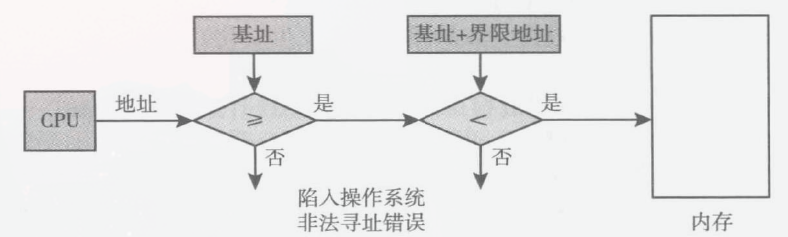

编译时（逻辑地址）： 编译器在编译代码时，并不知道这个程序未来会被加载到物理内存的哪个确切位置。所以它一律假设程序从地址 0 开始运行（生成相对地址/逻辑地址）。

运行时（地址转换）： 程序启动并被加载到内存时，操作系统会给它分配一块真实的物理内存（确定了实际的 base），在运行过程中由硬件配合完成地址的映射。

进程切换： 当操作系统进行进程调度，将 CPU 从进程 A 切换到进程 B 时，只需要把 CPU 里的 base 和 limit 寄存器的值更新为进程 B 的值，内存隔离的上下文也就随之切换了。

## 地址绑定

CPU 发出的是逻辑地址（Logical Address）；而内存条（Memory）接收的是物理地址（Physical Address），也就是真实的“现实”地址。

从源代码到最终的二进制地址，这个转换过程称为地址绑定。

取决于不同的操作系统，编译时、加载时、执行时都有可能发生地址绑定。

### 编译与链接

编译：针对单个源文件的行为，把源代码编译成二进制文件，符号名（symbol）变成二进制地址。但总会引用外界符号，对于外界符号，由于不了解其地址故留空。

对于内部的变量，它分配一个相对于 `0` 的地址。如果你的代码里调用了别的库里的函数（比如 `printf`），编译器不知道它的地址，只能**暂时留空**。

链接：针对多个源文件的行为，把空缺的外部引用补全，形成逻辑自洽的完整代码。链接分为静态链接与动态链接：

> 静态链接：紧接着编译执行，生成可执行文件
> 
> 动态链接：链接发生在装入内存后
> 
> 

编译、链接产生的二进制地址内存中的空闲状况不匹配。

### 生成实际地址

1. 编译时绑定（绝对代码 \- 远古时代）

    写代码编译的时候，就死死规定好这个程序将来一定要放在物理内存的 0x10000 位置。

    > 只有像 MS\-DOS 这种单任务系统才能这么干。在多任务系统里，那个位置如果被别的程序占了，程序就直接崩溃，完全没有灵活性。
    > 
    > 

2. 装入时绑定（可重定位代码 \- 软件填坑）

    编译时依然假设从 0 开始。

    当操作系统把程序装入（Load）内存时，看看哪块物理内存有空位（比如分配了基址 10000）。操作系统用软件扫描一遍程序的代码，把所有地址都加上 10000。

    > 极慢。每次运行程序都要由软件“当场扫描并修改代码”。而且如果程序运行到一半，因为内存紧张需要被换到别的地方，地址就全乱了。
    > 
    > 

    **缺点**：装入后不能在内存中移动，难以申请连续新空间。

3. 执行时绑定（现代 OS 方案 \- 硬件兜底）

    编译器和加载器彻底摆烂，程序装进内存后，里面的代码还是从 0 开始逻辑地址。

    装载时，MMU（内存管理单元）确定起始地址。

    CPU 取出一条指令准备执行时，由MMU总线上完成 逻辑地址 \+ Base寄存器 = 物理地址 的计算。

    优点： 完美隔离。程序在内存中可以随意移动位置（只需改一下硬件里的 Base 寄存器），程序本身的代码毫无察觉，完全不知道自己被挪了窝。这就是现代操作系统（包括你接触过的 Linux 系统和 RISC\-V 架构）的做法。

先放这儿

### 逻辑地址空间与物理地址空间

内存管理单元（MMU）：运行时把虚拟地址映射到物理地址的电路。MMU通常集成在CPU内。

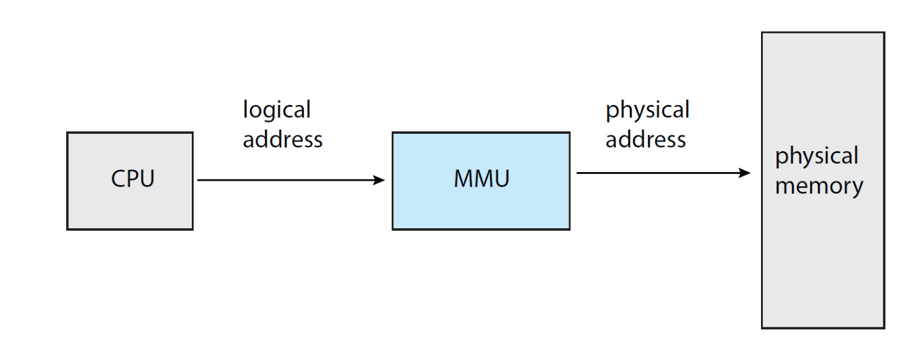

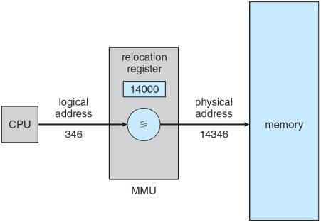

用户进程所产生的地址（即逻辑地址）在送交内存前都被MMU加上重定位寄存器的值；

进程切换时须修改MMU中的重定位寄存器。

### 动态链接与共享库

> 动态链接（Dynamic Linking）是现代操作系统中极其精妙的设计，它解决了程序体积膨胀和库更新困难的问题。
> 
> 
> 
> 这三张 PPT 实际上在回答一个终极问题：**“既然编译时不知道外部函数的真实内存地址，那程序跑起来后，怎么才能准确地调用到它？”**
> 
> 操作系统的解决方案是引入两个中间层：
> 
> 1. **GOT（Global Offset Table，全局偏移表）：** 充当“地址通讯录”。它是一个指针数组，存放着外部变量和函数的真正内存地址。
> 
> 2. **Stub（存根，在 Linux ELF 格式中常被称为 PLT）：** 充当“代理人”。它是编译器在你的代码里硬塞进去的一小段跳板代码。
> 
> **核心运作逻辑是：** 你的代码不直接调外部函数，而是去调“代理人”（Stub）。“代理人”去查“通讯录”（GOT）获取真实地址，然后把调用转发过去。
> 
> 
> 
> ### 完整的动态链接流程
> 
> 我们以你的 C 代码调用外部共享库中的 `printf` 函数为例：
> 
> #### 第一步：编译期（留下空白与代理）
> 
> - **代码隔离：** 编译器在编译你的 `.c` 文件时，发现你调用了 `printf`。但 `printf` 在外部的动态库里，编译器不知道它的地址。
> 
> - **生成 GOT 与 Stub：** 编译器不会报错，而是在你的可执行文件内部建了一个空的 `GOT` 表，并在代码区生成了一个 `printf_stub`（存根）。
> 
> - **偷梁换柱：** 编译器把你代码里所有调用 `printf` 的地方，全部修改为调用 `printf_stub`。此时，`GOT` 表里关于 `printf` 的那一项是空的（或者指向一个默认的解析函数）。由于 GOT 表就在你的程序内部，程序是知道 GOT 表的相对地址的。
> 
> #### 第二步：装入与加载期
> 
> - **分散装入：** 当你运行这个程序时，操作系统的加载器（Loader）首先把你的主程序装入内存。
> 
> - **发现依赖：** 加载器发现你的程序依赖了外部的动态库（比如 C 标准库），于是操作系统介入，把这个动态库也装入物理内存的某个空闲位置。
> 
> #### 第三步：运行与链接期（填写通讯录）
> 
> 这里有两种常见的策略，PPT 里描述的是基础的**装入时或运行时的动态链接**：
> 
> - **填表（Slide 18）：** 动态链接器（也是操作系统的一部分）根据刚刚装入内存的外部动态库的实际物理基址，计算出 `printf` 函数在当前内存中的绝对地址。
> 
> - **更新 GOT：** 链接器将计算出的真实的 `printf` 地址，填入你程序中 `GOT` 表对应的那个槽位里。
> 
> #### 第四步：真正执行（通过代理调用）
> 
> 现在，CPU 终于执行到了你代码里原本应该调用 `printf` 的那一行：
> 
> 1. **调用存根：** 代码实际上跳转到了 `printf_stub`（存根代码）。
> 
> 2. **查表跳转（Slide 19）：** 这个存根代码非常简单，它的逻辑就是：“去 GOT 表的第 N 项把地址取出来，然后无条件跳转（Jump）过去”。
> 
> 3. **到达真身：** 因为 GOT 表在第三步已经被操作系统填入了正确的绝对地址，所以 CPU 顺着这个地址，成功跳转到了外部动态库中真实的 `printf` 代码去执行。
> 
> ### 为什么非要搞这么复杂？
> 
> PPT 17 中强调了“可执行文件非单体”。如果采用静态链接（直接把 `printf` 的机器码塞进你的 xv6 实验代码里），每个程序都会自带一份库的拷贝，内存和硬盘会瞬间被撑爆。
> 
> 通过 **Stub \+ GOT** 的动态链接机制：
> 
> - **内存共享：** 物理内存里只需要保留一份动态库的代码，所有运行的进程都可以通过各自的 GOT 表指向同一块物理内存。
> 
> - **位置无关：** 无论动态库被加载到内存的哪个犄角旮旯，主程序的代码都不需要修改任何一个字节（因为代码只负责调固定的 Stub），只需要让操作系统在启动时更新一下 GOT 表即可。这就完美契合了上一节讲的“执行时地址绑定”的理念。
> 
> 

先放着

# 连续内存分配

每个进程占用一段连续的物理内存；多个进程占据的物理内存相邻。

> 早期方法，已被淘汰
> 
> 

## 内存保护

### 核心硬件寄存器

- **基址寄存器\(重定位寄存器\)**：存放该进程在物理内存中的**起始绝对地址。**

- **界限寄存器 **：存放该进程**逻辑地址空间的最大长度**。

### 硬件越界检查流程

当CPU执行指令，给出一个虚拟地址时，MMU\(内存管理单元\)的硬件会立刻执行：

1. **越界检查**：将该 `逻辑地址` 与 `界限寄存器` 的值进行比较。

- 如果 `逻辑地址 >= 界限寄存器`，判断为发生越界。硬件产生**地址越界中断**，操作系统接管并通常会终止该进程。

2. **地址转换**：如果 `逻辑地址 < 界限寄存器`（即合法地址），则将`逻辑地址`加上 `基址寄存器` 的值，得到最终的**物理地址**，然后将其送往内存总线。

## 内存分配

### 单一分区分配

也称单一连续分配。DOS，单任务，非现代OS。管理简单，只需很少的软硬件支持；各类资源的利用率不高。

内存分为系统区和用户区；用户区仅容纳一道用户作业。

内存状况清楚、恒定，无所谓分配、保护

### 固定分区

最早的多道程序存储管理方式；不能充分利用内存，存在内存碎片。

将内存划分为若干固定大小的分区，每个分区中可以装入一道程序。分区的位置大小在运行期间不能改变。

系统需要建立一张分区使用表，记录各分区大小、起始地址及状态。

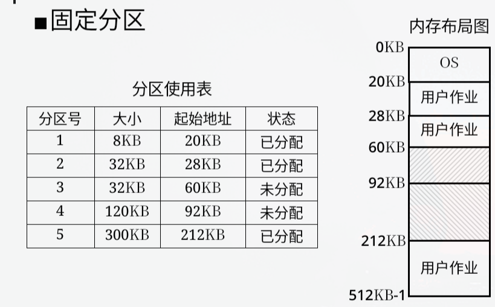

- 分配：当有用户程序要装入时，检索分区使用表，找出一个能满足要求的空闲分区，修改表中相应表项的状态。若找不到大小足够的分区，则拒绝分配。

- 回收：将分区的状态置为未分配。

### 动态分区存储管理

又称可变分区存储管理。根据作业大小动态地建立分区，分区大小正好适应作业的需要。分区的大小不固定，数目也是可变的。

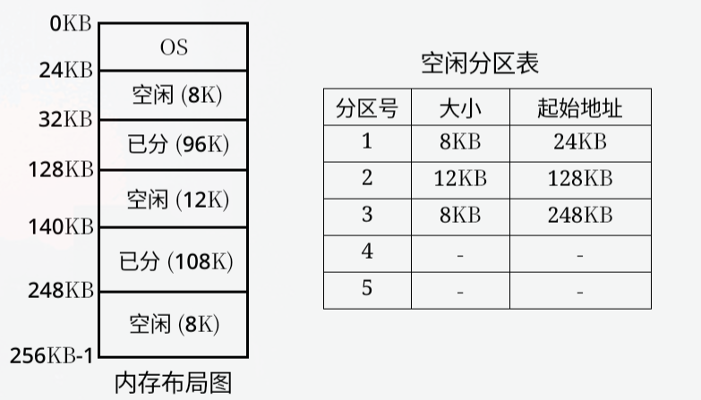

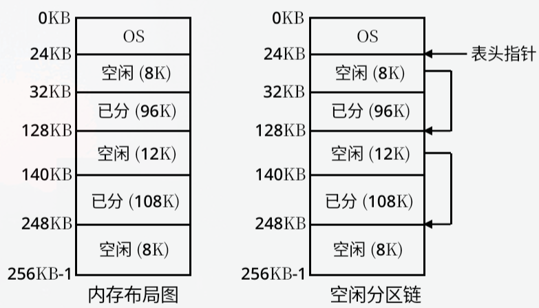

分配策略：所有的内存分配策略都是只要找到一个比请求的内存大的分区，就直接分配给请求的进程。

- 首次适应算法：空闲分区按地址递增的次序排列

- 循环首次适应算法：要求空闲分区按地址递增的次序排列。每次分配时，从上次找到的分区的下一个空闲分区开始查找（不是每次从头）

- 最佳适应算法：空闲分区按容量大小递增的次序排列

- 最坏适应算法：空闲分区按容量大小递减的次序排列

### 碎片

分区存储管理中，必须把作业装入一片连续的内存空间，存在碎片问题。

- 内部碎片：分配给作业，但未被作业利用的部分，固定分区分配会产生内部碎片。

- 外部碎片：未分配，系统保留，但尺寸太小无法利用部分，动态分区分配会产生外部碎片。

拼接（Compaction）：针对外部碎片，也称为紧缩或紧凑。通过移动把多个分散的小分区拼接成一个大分区，要耗费大量处理机时间。

拼接的时机：回收分区时分配时/找不到够大的空闲区但空闲总量够

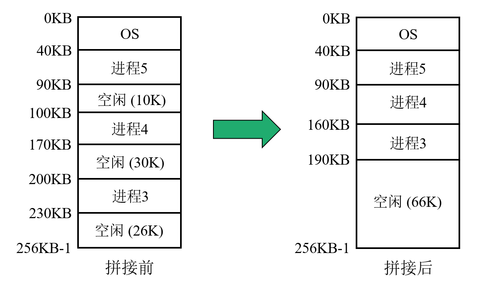

> 这一段好像也没那么重要
> 
> 

### 伙伴系统

伙伴系统的本质是为了在“连续内存分配”中寻找一个平衡点：既不像固定分区那样死板，又不像纯动态分区那样容易产生大量的外部内存碎片。

1. **万物皆为 **$2^k$**：** 系统中所有空闲块的大小，必须是 2 的整数次幂（比如 64KB, 128KB, 256KB）。如果你申请的内存不是 2 的幂，系统会强行“向上取整”。

2. **“伙伴”的严格定义：** 只有由**同一个大块对半切开**产生的两个小块，才互为“伙伴”。两个相邻且大小相等的块，如果不是伙伴，不能合并。

- 内存分配：当进程申请大小为 $n$ 的空间时：

    1. **向上取整：** 找到最小的 $i$，使得 $2^{i-1} < n \le 2^i$。

        - *举例：* 进程 A 申请 `200KB`。它大于 $2^7 (128)$，小于 $2^8 (256)$。所以系统必须分配 $256\text{KB}$ 给它。

    2. **分裂寻找：** 如果当前没有 256KB 的空闲块，系统就会找更大的块（比如 512KB、1024KB），找到后**不断对半劈开**，直到切出 256KB 为止。

- 释放与合并：释放内存时，应检查其伙伴是否空闲，是则合并。合并后的空闲块也可能存在空闲伙伴，重复该过程。

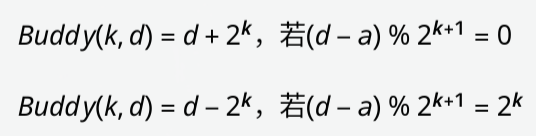

- **优点（消灭外部碎片）：** 幻灯片原话“相当于把外部碎片转移到内部”。因为每次释放都会尽最大努力合并，物理内存中不会到处散落几 KB 无法利用的碎块，大块内存的连续性得到了极好的保证。

- **缺点（产生内部碎片）：** 这是强迫症的代价。进程 A 只要了 200KB，系统非要给 256KB。这多出来的 56KB 在分配期间谁也用不了，被白白浪费在块的内部了。

- 这也是为什么引入分页（Paging）机制，用更细粒度（通常是 4KB）来缓解这种浪费。

# 分页

## **分页的基本方法与总体机制**

### 基本方法

- 将物理内存分为固定大小的块，称为帧（或称物理块、页框、物理页面）

- 并将逻辑内存也分成同样大小的块，称为页（逻辑页面）

- 在为进程分配存储空间时，总以块为单位，可以将进程的某一页存放到主存的某一空闲块中

Q：分页系统中有碎片吗？

A：没有外部碎片。进程的数据段、代码段、堆栈段等，总有末尾部分用不完，形成内部碎片。

### 总体机制

- 程序\-编程：编程在逻辑地址空间中，自认为占据整个地址空间（当然不能全占，OS要占据内核态高地址部分；用户态部分全由我支配），生成的可执行文件中，也使用逻辑地址。

- 程序\-运行：运行时，OS根据物理内存状况，把程序、数据装载到空闲处，此时程序中的地址仍是逻辑地址。

- 操作系统\-管理：逻辑地址和物理地址，不再按字节（学生）为单位管理，而是按页面（班级）为单位管理，其中连续的程序、数据，不必放到连续的物理页面。OS记录逻辑页面与物理页面的映射关系（页表），运行期间逻辑地址实时转换为物理地址

> 例如：三班六号的逻辑地址是003006，实际的物理地址就要去305（被替换成教室）006找
> 
> 不会的去问czh。——xhkz
> 
> 

## 逻辑地址结构

### 页码、页偏移

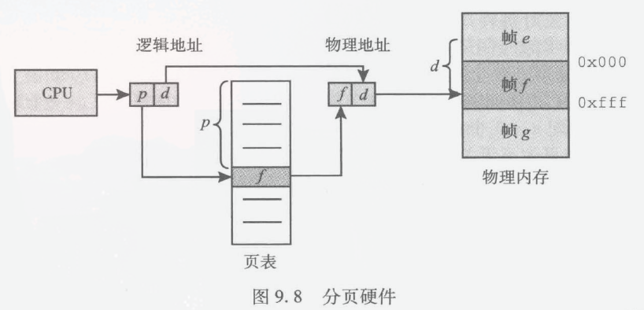

- **页码 \(**$p$**, Page Number\)**：逻辑地址的高位部分。告诉系统，数据在哪一张“逻辑页”上，也是“有几个页

- **页偏移 \(**$d$**, Page Offset\)**：逻辑地址的低位部分。告诉系统，数据在该页内部的第几个字节。

假设逻辑地址为 $A$，页面大小为 $L$：

- **页码** $p = A / L$ （取整）

- **页内偏移** $d = A \% L$ （取余）

1. **切割**：逻辑地址空间被切分成固定大小的“页”。

2. **分配**：CPU 生成的地址不再是一个连续的数值，而是被一分为二：

3. **映射**：逻辑页（$p$）和物理帧（$f$）大小完全一致，因此**页内偏移量 **$d$** 在物理地址中保持不变**。

> 我们需要确定 $p$ 和 $d$ 各占多少个比特位（Bit）。
> 
> - $n$** \(页偏移位数\)**：因为页大小是 $2^n$，所以在页内寻址只需要 $n$ 位。
> 
> - $m$** \(逻辑地址总位数\)**：整个逻辑地址的长度。
> 
> - $m-n$** \(页码位数\)**：剩下的高位自然就是页码 $p$ 的位数。
> 
> $\text{Logical Address} = \underbrace{p}_{m-n \text{ bits}} \quad | \quad \underbrace{d}_{n \text{ bits}} $
> 
> **32位系统示例**（假设4KB页，即 $2^{12}$ 字节）：页内位移占低 12 位。页号占高 20 位（意味着一个进程最多有 $2^{20}$ 即100多万个页）。
> 
> 

### 页表

页表：系统为每个进程建立一张页表，记录页面在内存中对应物理块；本质上是个数组（映射表），下标是页号，元素内容是块号。（可以用箭头表示）

为了给每个进程营造独占整个逻辑地址的假象，每个进程的页表是不同的。

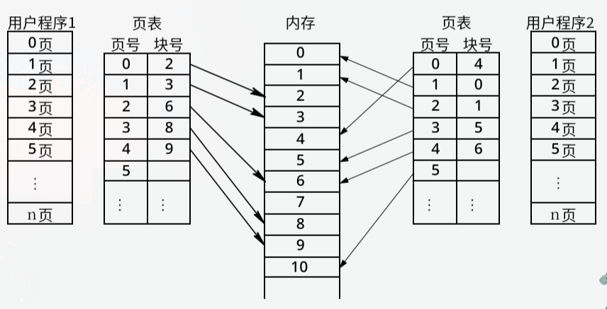

> 在这个教室里，页表可被看作 PCB 的一部分；离开教室后这句话自动作废。页表与 PCB 都是操作系统管理进程的重要数据结构，保存在物理内存中。
> 
> 

每个进程独占完整的逻辑地址空间，不知其它进程的存在，也不必考虑冲突问题。但并不等于进程要把逻辑地址空间用完，绝大多数进程只占用很少，大部分逻辑地址空间被荒废。

### 内核态的逻辑地址

OS控制页表，实现进程间的隔离。页表决定了CPU的视野范围，切换进程，切换页表，将使CPU看到不同的物理页面。

> 这是说同样的逻辑地址 `0x1000`，在进程 A 下指向物理内存的“房间 5”，在进程 B 下可能指向物理内存的“房间 102”。
> 
> 

**内核映射共享（Kernel Space Mapping）：**每个页表的后面一半（操作系统的这一部分）都一模一样。（内核态）切换进程会改变CPU低地址部分的视野，但高地址部分仍看到同样的风景。

> 因为操作系统内核只有一份。
> 
> 

CPU 释放的地址都是逻辑地址，经过页表的校正才会映射到具体的物理地址。

> 问题9\.1：为什么说“CPU”支持多种页大小，尺寸是CPU决定的吗，不是操作系统定义的？
> 
> 问题9\.2：4KB为什么这么好，被如此普遍的采用？
> 
> 问题9\.3：中断本身很久，该怎么办
> 
> 

> **第 1 步：内核栈的物理位置分布** 正如图片所示，所有进程的内核栈，都被分配在**内存的高地址区域（内核态）**。因为我们上一节明确了“所有进程页表的高地址部分映射的都是同一块物理内存”，这意味着：在物理内存中，P0的内核栈、P1的内核栈、Pn的内核栈是**并排挤在一个巨大的全局内核空间里**的。
> 
> **第 2 步：陷入内核（Trap into Kernel）** 当 CPU 正在运行 P0 进程（处在低地址的用户态）时，突然发生了一个系统调用。硬件机制会做两件事：
> 
> 1. 权限提升到内核态。
> 
> 2. 强制将 CPU 的栈指针寄存器（如 $sp$）从 P0 的用户栈地址，瞬间切换到 **P0 的内核栈地址**。 此时，CPU 开始在红框内部的左侧第一个栈（P0内核栈）中压入数据。
> 
> **第 3 步：上帝视角的“看”与“切”** 这就是幻灯片底部文字的核心：“P0进程使用P0的内核栈，不妨碍内核程序‘看得到’所有其它的内核栈”。
> 
> - **为什么能“看得到”？** 因为此时 CPU 处于内核态，拥有最高的 Ring 0 权限。而在 P0 的页表里，整个内核空间（包含所有其他进程的内核栈）都是合法映射的。只要内核代码知道地址，它完全可以读取 P1 或 Pn 内核栈里的数据。
> 
> - **怎么实现“切换到”？** 这就是进程调度的本质！像在 xv6 这样经典的操作系统内核中，进程切换（`swtch`）的核心动作，其实就是**把当前 CPU 的寄存器状态（包括旧的 **$sp$**）全部保存进 P0 的内核栈，然后把 P1 内核栈里保存的旧状态恢复到 CPU 寄存器中（把 **$sp$** 指向 P1 的内核栈）**。
> 
> - 栈指针 $sp$ 换了，正在执行的上下文也就换了。当内核执行 `return` 或 `iret` 指令退回用户态时，它就会顺着 P1 的状态，回到 P1 的用户空间继续执行，从而完成了从 P0 到 P1 的无缝切换。
> 
> 先放这
> 
> 

## 补充讨论：系统调用的执行过程

上下文 \(Context\)： CPU 执行代码时的“人设或身份”。

- 进程上下文： CPU 知道自己现在是在为“进程 A”打工。如果需要等硬盘数据，它可以“睡一觉（阻塞/睡眠）”，OS 会把 CPU 切给别人用。

- 中断上下文： 这是一个紧急救援队的身份。当硬件中断（比如网卡来数据了）或软中断（系统调用触发瞬间）发生时，CPU 被强行拉入内核。在这个身份下，CPU 绝对不能睡觉（不能阻塞）！因为紧急救援一旦停下来，整个系统可能就卡死了。

**硬中断 \(Hardware Interrupt\)：**

- **来源：** 外部硬件（键盘敲击、网卡收到数据包、时钟滴答）。

- **特点：** **异步的、不可预测的**。CPU 根本不知道什么时候会来硬中断，所以每执行完一条指令，都要“回头看一眼”有没有硬中断信号。

**软中断 \(Software Interrupt / Trap\)：**

- **来源：** 软件代码主动执行了一条特定的机器指令（比如除以零产生的异常，或者主动发起的系统调用）。

- **特点：** **同步的、有预谋的**。它是程序执行到特定代码行时必然发生的事情。系统调用就是一种最典型的、被蓄意触发的软中断。

接下来讨论的传统方案中，系统调用和中断的入口是一致的。

**第 1 步：触发软中断**

- **动作：** 用户程序执行了特殊的指令（传统 x86 的 `int 0x80`，现代 x86 的 `syscall`，或者你在 RISC\-V 中用过的 `ecall`）。

- **状态改变：** 硬件立刻接管，CPU 特权级从用户态飙升到内核态，并强行跳转到内核预设的服务入口。

**第 2 步：进入中断上下文**

- **动作：** 刚进入内核的这一瞬间，CPU 处于“中断上下文”。

- **精妙设计：** 中断处理程序没有自己的栈，它会直接“借用”当前被中断进程的内核栈。

- **自我约束：** 此时，虽然用着进程的栈，但它在逻辑上**不属于**该进程。必须“自我约束”，不能触发阻塞操作。

**第 3 步：转为进程上下文**

- **动作：** 内核代码从寄存器得知“这是进程 A 主动发起的一个 `read()` 系统调用。”

- **解开束缚：** 此时，内核它会**重新开启硬件中断的响应**（允许其他紧急事件打断它），并正式以进程的身份运行，转为进程上下文。

> - 只有切换到了进程上下文，内核在读取磁盘慢得要死的时候，才能合法地把自己“阻塞”掉（让出 CPU），而不会导致系统崩溃。
> 
> - 处理消耗的 CPU 时间也能准确地记在进程 A 的账上，也便于把数据送回进程 A 的用户缓冲区。
> 
> 

**第 4/5 步：原路返回**

- 如果一切顺利，系统调用执行完毕，通过 `sysret` 或 `sret` 指令，CPU 降级回用户态，回到用户程序的下一条指令继续执行。

**如果是普通中断：** 内核在第 2 步处理完按键后，**不会**经历第 3 步的身份转换。它始终保持“自我约束”的紧急身份，处理完立刻原路返回。

## 补充讨论：系统中存在哪些上下文

### 进程上下文

每个进程可以有**2**套上下文，分别是用户态、内核态

### 主程序上下文

- 开机启动，完成最初的初始化后，每个CPU都会执行main\(\)，因此每个CPU一套上下文，一个栈，内核态

- main\(\)执行到末尾，启动完成，进入无限循环

    - Linux在无限循环中只是让CPU进入省电休眠状态

- CPU不被任何进程需要时，则回到此处

### 中断上下文

- 独立简短的执行路径和上下文（寄存器状态），内核态

- 附着于（借用）当前进程的内核栈或主程序栈

    - 发生中断时:

        - 如果CPU正处于main\(\)的末尾的无限循环中，则会借用该CPU的主程序内核栈

        - 如果处于某进程的用户态或内核态，会借用该进程的内核栈

    - 注意“借用”，虽然使用进程的栈，但执行时并不具备进程的身份，比如不可以阻塞

## 存储分块表

也称为帧表（frame table），用来记录物理块的使用情况及未分配物理块总数。

- 位示图：利用一个bit表示一个物理块的状态

- 空闲存储块链：将所有的空闲存储块用链表链接起来，利用空闲物理块中的单元存放next指针

如前述，Linux使用伙伴系统。

> **分页机制**：作用于**逻辑层**。通过页表将离散的物理帧映射为连续的虚拟地址，为进程提供“连续内存幻觉”。
> 
> **伙伴系统**：作用于**物理层**。以 阶结构管理物理帧池，高效分配/回收连续物理块，为底层硬件与性能优化提供实体支撑。 
> 
> 二者通过页表（翻译字典）无缝衔接。
> 
> 为什么物理层必须不能碎片化？
> 
> 1. **DMA \(Direct Memory Access\) 强约束：**传统外设控制器无 MMU，**仅识别物理地址**。
> 
>     - 传输  KB 数据  必须分配物理连续的  个帧。物理碎片化将直接导致 I/O 缓冲分配失败，系统瘫痪。
> 
> 2. **大页 \(Huge Pages\) 性能基座：**
> 
>     - 标准 4KB 页在 TB 级内存下导致页表庞大、TLB 容量饱和，TLB Miss 延迟激增。
> 
>     - 2MB 大页需物理连续  个帧。伙伴系统是内核高效产出大块连续帧的唯一算法。
> 
> 3. **外部碎片治理：**
> 
>     - 简单位图/链表分配会使物理内存“沙化”。伙伴系统通过  动态合并，将零散空闲帧重新聚合，从根本上压制外部碎片。
> 
> 

物理块的分配与回收时，页表和帧表都要改，须保持一致性。

## 硬件支持

### 地址变换机构

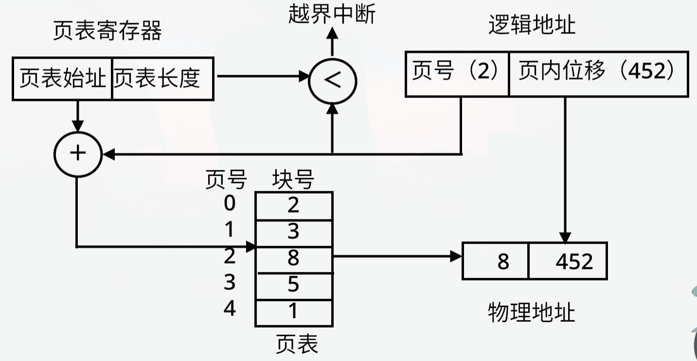

设置页表寄存器，存放页表起始地址和长度。进程未执行时，页表的起始地址和长度存放在PCB中；进程执行时，才将页表始址和长度存入页表寄存器中。

每当收到CPU送来一个逻辑地址：

- 自动将逻辑地址分为页号和页内位移

- 将页号与页表长度比较，超过则产生地址越界中断

- 由页表始址和页号计算出相应页表项的位置，从中得到该页的物理块号

- 将物理块号与逻辑地址中的页内位移拼接在一起，形成物理地址

以上过程由CPU硬件自动完成。CPU了解页表结构，知道如何查表，或者说，页表的结构是CPU定义的，OS按要求实现。

### TLB

如果按照最原始的分页机制：当 CPU 想要执行一条指令或读取一个变量时，它必须**先访问一次内存**去查页表获取物理块号，然后**再访问一次内存**去拿真正的数据。

在地址变换机构中增设高速缓冲存储器，缓存当前访问的那些页表项。

命中则只访存一次，未命中则访存两次。

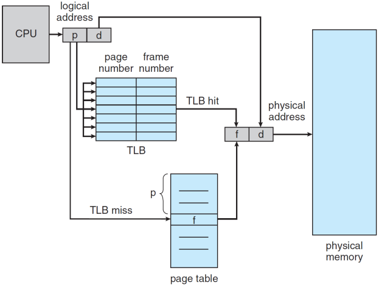

一旦切换进程和页表，当前TLB全部作废？

> 是的，新进程必须在不断的TLB未命中过程中重建缓存，由此体现出多线程比多进程的优势。
> 
> 但也有改进手段：
> 
> TLB会引入第三个字段\-地址空间ID（address\-space identifiers，ASIDs，可简单理解为进程ID）。进程B切换到A，TLB中留下许多B的表项，A运行导致A的表项增加，B的被逐渐挤下车，但不至于被清空
> 
> 但如果进程A下个时间片被调度到另一个CPU执行，那就真的只能从头奋斗了
> 
> 

**有效存取时间 **假设内存一次存取时间是m，TLB的查找时间是n，命中率为p，则有效存取时间（Effective Access Time）：EAT = p \* \(n \+ m\) \+ \(1 \- p\) \(2m \+ n\)

### 存储保护

以32位系统为例，一个页表项需要记录块号（高20位物理地址），剩余12位可记录额外信息，如：

如是否有效、读写权限、是否允许用户态访问等。通过设置内核占据的页“允许用户访问”为0，实现操作系统内核不允许用户态程序访问。

## 共享页

传统 `fork()` 如果把父进程的**全部内存**都复制一份，代价极高——尤其是 `fork()` 之后立刻 `exec()` 的情况，复制的内容根本用不上。

**写时复制：****"先假装复制，等真正需要修改时再实际复制"**

1. **fork\(\) 刚调用完****，**只复制了 **PCB** 和 **页表**，物理内存页面**一份都没复制****。**两个进程的页表都指向**同一批物理页****，**所有共享页面标记为 **只读**

2. **某进程尝试写入****，但这个页面是只读，MMU拦截，触发Page Fault（缺页/保护异常）。**

3. **异常处理程序执行 CoW****：**

    1. OS 赶紧在物理内存中找一个**全新的空闲帧，**把原页面里的数据**复制**到新帧里。

    2. 修改子进程的页表，让它指向这个新帧，并把读写权限**恢复为“可写”**。

    3. （可选）如果父进程现在是唯一指向老帧的人，老帧也会被恢复为“可写”。

    4. OS 把控制权交还给子进程，指令顺利通过，写入了新的物理内存中。

此后两个进程的这一页**彼此独立**，互不影响。

### 为什么高效？

- `fork()` 后若两进程都**只读**数据 → 永远不需要复制，零额外开销

- 只有**真正发生分歧**的页面才会被复制

- `fork()` \+ `exec()` 的场景几乎不复制任何数据页【

这也是为什么 Linux 上 `fork()` 速度极快的根本原因。

# 页表结构

## 多级页表

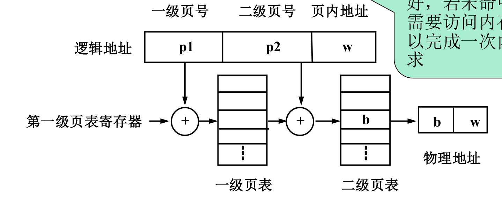

每个二级页表内部依然是严格连续的 4KB 数组，但不同的二级页表不需要连续（它们通过一级目录中的物理指针（帧号）被动态链接在了一起）。

## 哈希页表

hash表每项包含散列到相同哈希值的页表项链表指针。

拿到一个逻辑地址 `p | s`，取出高位逻辑页号`p`算hash值，在对应的hash值下遍历链表；

节点结构通常包含三部分：`[该节点的逻辑页号q | 对应的物理帧号s | 下一个节点指针r ]`。用 p 和 q 比对，p==q则找到物理帧号。

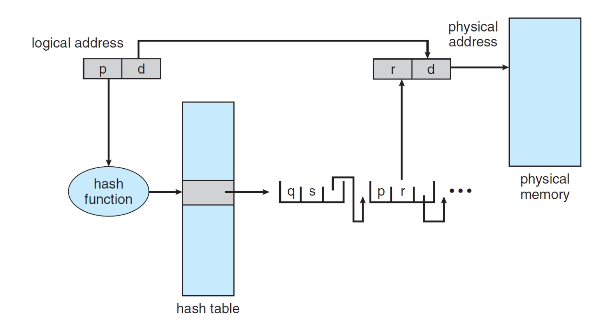

## 反向页表

以“物理帧”为索引。相当于问：**“物理内存的第 8 个房间里，现在住着哪个进程的第几页？”** 

（全系统**只有唯一的一本**字典，物理内存有多少个房间，字典就只有多少行）。

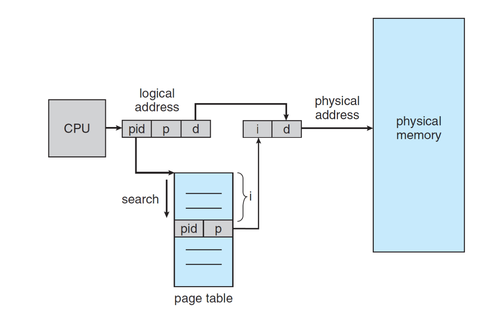

进程标识号及页号检索反向页表，若找到相应的页表项，则将其物理块号（下标）与页内地址拼接。

转换时，对页号算哈希值，查哈希表找到链表入口。

> 本质哈希页表
> 
> 

# 其它

## 分段

分页与分段的区别：

- 分页同时发生在逻辑空间和物理空间，分段只发生在逻辑空间，二者都是CPU提供的机制

- 页是信息的物理单位，大小固定且由系统决定，分页先于编程，程序员（编译器）知道分页情况，并据此决定程序、数据安排在什么地方；段是信息的逻辑单位，分段是编程的一部分，程序员（编译器）需要为程序、数据分段，每个段有特定的含义，长度不定，因而有碎片问题

- 分页的地址空间是一维的，在分段中，地址天生就是**二维**的。程序员（或**编译器**）表达地址时必须给出两个明确的信息：`(段号, 段内偏移量)`。

**段表 \(Segment Table\) 的两大核心要素** 因为段的长度不一，段表里除了记录物理起始地址，还必须多记录一个致命的信息：

1. **基址 \(Base\)：** 这个段在物理内存中从哪里开始。

2. **限长 \(Limit\)：** 这个段到底有多长。

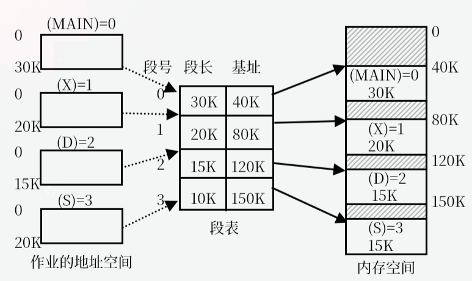

### 段页式

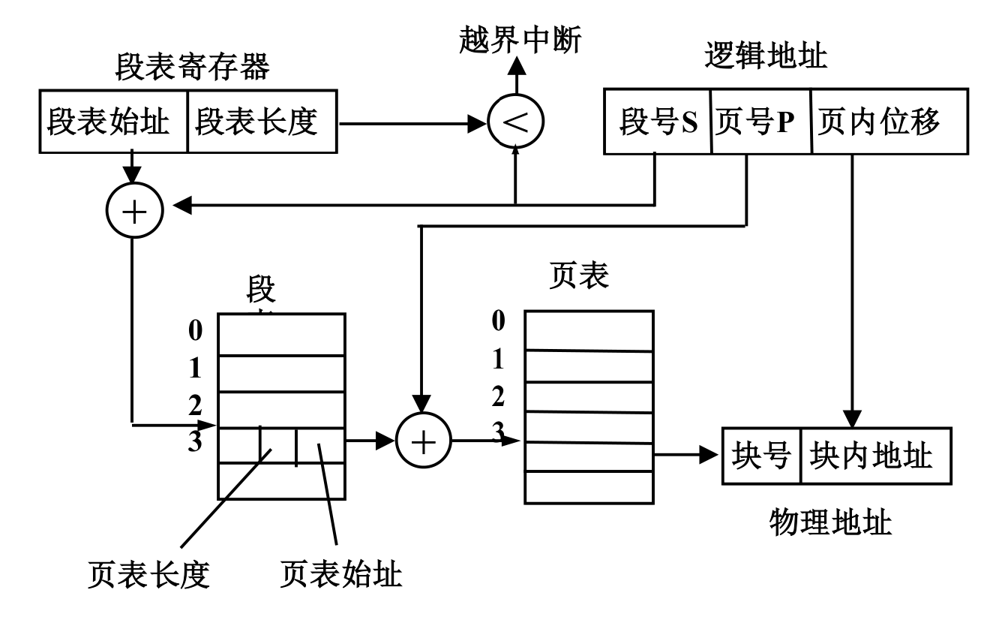

